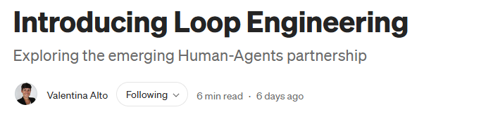

# Loop engineering and the Learning Hub: analysis and alignment

<mark>**Loop engineering**</mark> is an emerging framing that names a shift many teams are already living: from <mark>writing prompts</mark> to <mark>designing the autonomous cycle</mark> that decides *what* to prompt, *when*, and *whether the result is good enough to stop*.  
This analysis captures a working session that compared the concept — as introduced by Valentina Alto and anchored on Addy Osmani's anatomy — against the Learning Hub's existing architecture.

> 
>
> **Source:** [Introducing Loop Engineering](https://valentinaalto.medium.com/introducing-loop-engineering-ac7a6098bb10) by Valentina Alto, June 2026 📒. The article frames loop engineering as the successor to prompt and context engineering, and provides a worked example of a GitHub-native implementation.

The upshot, stated up front: the **Learning Hub** is exactly organized around this idea, across three layers — the **self-updating engine** that provides the loop machinery, the **autonomous streams** that run on it, and the Hub as the system they serve.  

Compared with the article's model, the **self-updating engine** invests more in governance — **risk-calibrated autonomy** and a **metadata-driven self-update meta-loop** — while both treat self-starting triggers as foundational and differ mainly in how much of that trigger vision is already wired.  

This document records that comparison — similarities, differences, and the strengths and weaknesses on each side — so the reasoning doesn't evaporate, and points to a sibling plan for the actions that follow.

## Table of contents

- 📌 [Summary](#summary)
- 🔍 [What loop engineering is](#what-loop-engineering-is)
- 🧭 [Similarities: shared machinery](#similarities-shared-machinery)
- 🏗️ [Strengths of the Hub's approach](#strengths-of-the-hubs-approach)
- ⚠️ [Weaknesses of the Hub's approach](#weaknesses-of-the-hubs-approach)
- 🔁 [Behavior vs self-update: object loop and meta loop](#behavior-vs-self-update-object-loop-and-meta-loop)
- 🧱 [The terminology stack](#the-terminology-stack)
- ⚙️ [A design implication: declarative prompts](#a-design-implication-declarative-condition-driven-prompts)
- 🎯 [Recommended next steps](#recommended-next-steps)
- 📚 [References](#references)

---

## 📌 Summary

The net picture: the Learning Hub is a loop-engineering system built on two critical pillars — <mark>*risk-calibrated autonomy*</mark> and a <mark>*metadata-driven self-update meta-loop*</mark>. Self-starting triggers are foundational in its vision too; the open work there is <mark>*implementation, not design*</mark>.

Everything below expands that sentence. The short version:

- **Shared question.** The Learning Hub's [founding vision](../../06.00-idea/learning-hub/01-learning-hub-overview/01-learning-hub-introduction.md) (dated 2025-08-29) centers on the same question loop engineering asks — "how should work progress autonomously?" — so the two reach a common goal from different starting points.
- **Difference — governance.** The Hub's [self-updating engine](../../06.00-idea/self-updating-engine/20260622.01-self-updating-engine-vision.md) adds a **risk-calibrated autonomy gradient** and **metadata-guarded changes**, where the article keeps autonomy and state deliberately lightweight.
- **Difference — scope.** The Hub separates the **behavior** (the loop that does the work) from the **self-update logic** (the loop that keeps that behavior current as technology changes); the article focuses on the behavior itself.
- **Difference — triggering maturity.** Both treat triggers as foundational; the difference is maturity. The article ships a concrete GitHub-native dispatch, while the Hub's richer ingestion vision — feeds, a conference pipeline, scheduled prompts — is specified but only partly wired.

---

## 🔍 What loop engineering is

Loop engineering is described as an emerging discipline for designing AI-agent workflows that start from a trigger, pursue a verifiable goal, use tools and memory, evaluate progress, and iterate until a stopping condition is met. It's framed as the successor to two earlier disciplines:

| Discipline | Central question |
|---|---|
| Prompt engineering | "What should I ask?" |
| Context engineering | "What should the model know?" |
| **Loop engineering** | **"How should work progress autonomously?"** |

### The execution cycle

The unit of work stops being a single prompt and becomes a self-running cycle:

1. **Finds the work** — discovery and triage.
2. **Acts on it** — an agent does the task.
3. **Checks the result** — a *separate* verifier judges it.
4. **Remembers what happened** — state persists outside the conversation.
5. **Decides the next step** — and repeats.

### The six primitives

The anatomy, credited to Addy Osmani, lists five building blocks plus memory:

| Primitive | Role |
|---|---|
| **Automations** | Scheduled triggers that handle discovery and triage on their own. |
| **Worktrees** | Parallel isolation so multiple agents work without colliding. |
| **Skills** | Codified project knowledge in a `SKILL.md` folder format. |
| **Connectors** | MCP-based reach into real tools (issue trackers, APIs, chat). |
| **Sub-agents** | Separate the maker from the checker — a second agent grades the first. |
| **State** | Memory outside a single conversation (a file, a board, an issue thread). |

### Origins

The term converged in early June 2026 from three voices: Peter Steinberger (OpenClaw), Boris Cherny (Claude Code lead at Anthropic, who said he no longer prompts directly — "writing loops is now my job"), and Addy Osmani, who named the practice and gave it its anatomy. It's presented as domain-general but built out first in software engineering with AI coding agents.

---

## 🧭 Similarities: shared machinery

The two approaches share most of the same machinery. What each adds is different: the article names the practice and gives it a concrete, GitHub-native reference implementation, while the Hub wraps the machinery in governance.

| Loop-engineering concept | Existing Learning Hub artifact | Fit |
|---|---|---|
| Prompt → context → loop evolution | Self-updating prompt-engineering vision | Strong |
| The five-step cycle | The engine's **Detect → Assess → Propose → Execute** loop | Very strong |
| Automations (triggers) | Repository hooks (staleness check, health check) | Partial |
| Skills (`SKILL.md`) | The `.github/skills/` folder and the skills the Hub already ships | Very strong |
| Sub-agents (maker/checker) | Editor–journalist self-critique; the pe-meta builder/validator split | Very strong |
| Connectors (MCP) | MCP usage throughout; the planned IQPilot server | Strong |
| State (memory outside chat) | Dual-YAML metadata, processing state, the memory tool | Strong |
| Verify + done-condition | Hook check scripts and validation tiers | Strong |
| Human gate / plan mode | The task-planner agent and plan-execution rules | Strong |

📖 Grounding docs: the [self-updating engine vision](../../06.00-idea/self-updating-engine/20260622.01-self-updating-engine-vision.md), the [self-updating article-writing vision](../../06.00-idea/self-updating-article-writing/20260428.01-vision.v1.md), and the [automated content lifecycle](../../06.00-idea/learning-hub/03-automated-content-lifecycle/01-automated-content-lifecycle-with-prompts-agents-and-mcp.md).

---

## 🏗️ Strengths of the Hub's approach

Two capabilities distinguish the Hub's self-updating engine from the article's loop:

- **Risk-calibrated autonomy.** The engine routes every change on a gradient — autonomous → notify → human-approval → human-only — scaled by assessed *impact × confidence*. The article describes autonomy more simply, running until a stopping condition.
- **Metadata-driven self-update.** Changes are guarded against each artifact's declared `goal`/`scope`/`boundaries` before they apply and reconciled after. The engine keeps its own infrastructure fresher than the artifacts it manages and fails closed on stale self-knowledge. The article's state is a markdown file or an issue thread, with no metadata contract behind it.

This governance matters most for reader-facing content, where an ungoverned change carries real risk. It's also a cost: the Hub's approach is heavier to build and operate than the article's lightweight loop.

---

## ⚠️ Weaknesses of the Hub's approach

The Hub's weaknesses here are in **implementation and coherence, not design** — its trigger *vision* is at least as rich as the article's.

- **Uneven trigger maturity.** The two trigger classes sit at different stages. The **maintenance loop** — staleness and health-check hooks — runs today. The **creation/ingestion loop** — automated feeds, a conference pipeline, and scheduled dispatch, all specified in the vision — is only partly wired, so in practice you still bring the transcript or article and the machinery helps from there.
- **A fragmented trigger model.** Triggers are specified three times over — the Hub's "Automated Prompts," the engine's "Scheduled" command family plus runtime hooks, and the research vision's scheduled automation — with no single shared taxonomy, which invites drift.

Here the article's packaging is stronger: it ships one concrete dispatch that starts the loop without a human. Wiring the Hub's ingestion triggers and unifying its trigger model is the highest-leverage work available, and it's the reason this analysis exists.

---

## 🔁 Behavior vs self-update: object loop and meta loop

The session surfaced a distinction the article doesn't develop: the separation between the **behavior** and the **logic that keeps the behavior current**.

There are two control loops operating at different levels and cadences:

| | Behavior (object loop) | Self-update (meta loop) |
|---|---|---|
| Acts on | Domain artifacts (articles, docs, code) | *The loop's own definition* — prompts, agents, skills, instructions |
| Trigger | Domain work appears | The world changes (a release, a new capability) |
| Cadence | Frequent | Slower / on-release |
| "Done" means | The task is complete | The behavior matches current best practice |
| Failure if absent | Work doesn't get done | Work gets done the *old* way forever — silent obsolescence |

The load-bearing rule that keeps them separate: **a behavior must never mutate its own definition.** Mutation flows one direction — the behavior emits a signal, the meta loop decides and applies the change under human governance, and the behavior reloads on its next run.

The Hub already encodes this in three principles: the article system *signals* the prompt-engineering engine instead of editing prompt-engineering artifacts itself; the engine never changes its own purpose without human direction; and the engine keeps its own infrastructure freshest so the self-update logic can't rot unnoticed. The `pe-meta` prompt-and-agent family is that meta loop made real, including a release-monitor workflow that adapts the implementation to new technology over time.

The elegant part: self-update isn't a separate mechanism. It's the *same* loop machinery pointed at the loop's own implementation — which is why one domain-agnostic engine can run both levels, with the "keep the updater fresh" rule as the base case that stops the recursion safely.

---

## 🧱 The terminology stack

The concepts aren't competing — they stack. Naming them explicitly prevents drift across the Hub's four vision documents:

| Layer | Term | Role |
|---|---|---|
| Discipline | **Loop engineering** | Build autonomous behavior, not prompts |
| Meta-discipline | **Self-updating strategy** | Keep autonomous behavior current (a layer beyond the article's scope) |
| Machinery | **Self-updating engine** | The shared Detect → Assess → Propose → Execute loop + autonomy gradient |
| Instances | **Autonomous streams / pe-meta** | The object loops and the meta loop that run on that machinery |

In this vocabulary, an *autonomous stream* is the Hub's name for one named pipeline (the product); *loop engineering* is the industry's name for the practice of building them.

---

## ⚙️ A design implication: declarative, condition-driven prompts

A further implication surfaced late in the session: loop engineering suggests a way to *define* Hub prompts and agents, not just run them. The shift is from **imperative** prompts (a written-out procedure — do step 1, 2, 3…) to **declarative** ones (a goal plus the conditions that mean "done"), where the model supplies the steps and a loop closes the gap until the conditions hold. It's the desired-state / reconciliation model — declare the target, let a controller converge — applied to prompts.

The Hub is well placed for this because **the conditions already exist as metadata**: `goal`, `scope`, `boundaries`, `rationales`, the article-writing vision's quality dimensions, and the plan actionability gate are all declarative acceptance criteria. A prompt would *read* those as its exit-conditions instead of *restating* them as prose steps — so the unit of work becomes one unsatisfied condition: **decompose by condition, not by step**.

| Process-based (today) | Condition-based (proposed) |
|---|---|
| A numbered procedure: check headings, verify each reference marker, run readability, fact-check, fix, re-read… | **Goal:** the artifact satisfies its declared contract. **Conditions** read from metadata + instructions. **Loop:** fix the highest-priority unmet condition → re-check → repeat until all pass or the budget is spent → escalate per risk. |
| Long, brittle; changes when any rule changes | Short, durable; a rule change edits the *condition source*, not every prompt |

**Boundaries — this isn't "replace all process with conditions."** Conditions must be decidable, or the loop games them or never stops, so the graded verdict, an iteration budget, and escalation stay load-bearing. Metadata expresses *intent*; currency and accuracy conditions still need external evidence and tools. And conditions decide *done* while the autonomy gradient decides *allowed* — the two axes compose but stay separate.

The tightened thesis: **loop engineering can shift Hub prompts from procedure specs to goal-plus-exit-conditions, drawn primarily from each artifact's metadata contract and supplemented by external evidence and deterministic checks** — shorter, self-verifying, and cheaper to maintain, provided conditions stay decidable and autonomy stays in charge of governance.

---

## 🎯 Recommended next steps

Actions are tracked in an internal working plan (kept under this article's `_analysis/` folder, not published). In brief:

- Capture this architecture (terminology stack + object/meta split) where the engine is defined. (🟡 todo)
- Fill the two empty stubs that should already hold these ideas — this overview and the autonomous-streams definition. (🟡 todo)
- Scope the trigger work — wiring the ingestion triggers the vision already specifies, and unifying one trigger model across the visions. (🟡 todo)
- Design declarative, condition-driven prompts (goal + metadata-derived conditions) in the prompt-engineering vision. (🟡 todo)
- Run analysis sessions over the three foundational visions and over the Hub's prompt-engineering artifacts to reconcile these insights and find restructuring candidates. (🟡 todo)
- Defer parallel worktrees and dispatcher implementation until the scope is agreed. (📌 next steps)

---

## 📚 References

### External sources

**[Introducing Loop Engineering](https://valentinaalto.medium.com/introducing-loop-engineering-ac7a6098bb10)** 📒 [Community]  
Valentina Alto's Medium article that frames loop engineering as the successor to prompt and context engineering. Source of the definition, the five-step cycle, and the worked GitHub example analyzed here.

**[Loop Engineering](https://addyosmani.com/blog/loop-engineering/)** 📒 [Community]  
Addy Osmani's post that named the practice and defined its six-primitive anatomy (automations, worktrees, skills, connectors, sub-agents, state).

**[The Anthropic leader who built Claude Code says he ditched prompting](https://thenewstack.io/loop-engineering/)** 📒 [Community]  
The New Stack's coverage of Boris Cherny's "writing loops is now my job" framing.

**[Anthropic's Boris Cherny: Why Coding Is Solved, and What Comes Next](https://www.youtube.com/watch?v=SlGRN8jh2RI)** 📒 [Community]  
Primary-source interview behind the loops-over-prompts argument.

### Internal references

- [Self-updating engine vision](../../06.00-idea/self-updating-engine/20260622.01-self-updating-engine-vision.md) — the Detect → Assess → Propose → Execute machinery and autonomy gradient.
- [Self-updating article-writing vision](../../06.00-idea/self-updating-article-writing/20260428.01-vision.v1.md) — the signal-don't-fix boundary between article maintenance and the prompt-engineering engine.
- [Learning Hub introduction](../../06.00-idea/learning-hub/01-learning-hub-overview/01-learning-hub-introduction.md) — the 2025 founding vision that first asks the autonomy question.
- [Automated content lifecycle](../../06.00-idea/learning-hub/03-automated-content-lifecycle/01-automated-content-lifecycle-with-prompts-agents-and-mcp.md) — the layered automation architecture.
- [Autonomous streams: documentation-manager design](../../06.00-idea/autonomous-streams/reverse-engineering/00.documentationmanager.design.md) — a concrete, fully-designed autonomous stream.

<!--
validations:
  grammar: {status: "not_run", last_run: null}
  readability: {status: "not_run", last_run: null}
  technical_accuracy: {status: "not_run", last_run: null}
  reference_classification: {status: "not_run", last_run: null}
article_metadata:
  filename: "overview.md"
  created: "2026-07-11"
  last_updated: "2026-07-11"
  content_type: "analysis"
  subject: "loop-engineering"
-->
