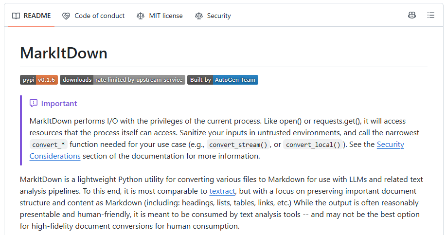

# Analysis A1 — What MarkItDown is

> Standard-depth analysis for the Overview track.

## 🎯 Problem statement

A named tool — "MarkItDown" — surfaced without a working mental model. What is it, who stands behind it, and what problem does it solve?

 
[MarkItDown GitHub repository](https://github.com/microsoft/markitdown)

## 🔍 Additional considerations

- **Publisher and maturity.** MarkItDown is an open-source Python project from **Microsoft**, built by the **AutoGen team**. It is MIT-licensed, ~99.7% Python, with strong adoption signals (~165k GitHub stars, ~11.8k forks, 19 releases, latest `v0.1.6` on 2026-05-27). ([GitHub](https://github.com/microsoft/markitdown) 📘)
- **Stated purpose.** It is a "lightweight Python utility for converting various files to Markdown for use with LLMs and related text-analysis pipelines." ([GitHub](https://github.com/microsoft/markitdown) 📘)
- **Design intent — and its honest limit.** Output is meant to be **consumed by text-analysis tools**, preserving structure (headings, lists, tables, links). The README is explicit that it is **not** the best option for high-fidelity document conversion for human consumption. It positions itself as "most comparable to `textract`," but structure-preserving.
- **Why Markdown.** Markdown is close to plain text with minimal markup, yet preserves document structure; mainstream LLMs "natively speak" Markdown and it is token-efficient.
- **What it converts.** PDF, PowerPoint, Word, Excel, images (EXIF metadata + OCR), audio (EXIF metadata + speech transcription), HTML, text formats (CSV/JSON/XML), ZIP (iterates contents), YouTube URLs, EPub, Outlook messages, "and more."

## 💡 Deductions

1. MarkItDown is an **ingestion / preprocessing** tool for LLM pipelines, not a publishing or human-facing conversion tool. Its value is proportional to how much downstream LLM/RAG work you do.
2. The "token-efficient, LLM-native" framing makes it a natural fit for RAG indexing and prompt-context preparation — exactly the Hub's AI theme.
3. The explicit "not high-fidelity for humans" caveat is a **scoping boundary**, not a weakness: choosing MarkItDown means optimizing for machine consumption.

## ✅ Conclusions

- **What it is:** a Microsoft, MIT-licensed Python CLI + library that converts many file types into LLM-friendly Markdown.
- **Who it's for:** developers building LLM/RAG/text-analysis pipelines who need clean, structured, token-efficient text from heterogeneous documents.
- **When to use:** ingest-and-index scenarios, prompt-context prep, quick document-to-text extraction where structure matters but pixel-fidelity does not.
- **When not to use:** high-fidelity human-facing document conversion (use pandoc or format-native exporters instead).

## Appendix A — Evidence

| Claim | Source | Class |
|---|---|---|
| Microsoft / AutoGen team, MIT, adoption metrics | [github.com/microsoft/markitdown](https://github.com/microsoft/markitdown) | 📘 Official |
| Purpose, "comparable to textract but structure-preserving," human-fidelity caveat | [github.com/microsoft/markitdown](https://github.com/microsoft/markitdown) | 📘 Official |
| Supported formats list | [github.com/microsoft/markitdown](https://github.com/microsoft/markitdown) | 📘 Official |
| Package metadata, "for indexing, text analysis, etc." | [pypi.org/project/markitdown](https://pypi.org/project/markitdown/) | 📘 Official |

## Appendix B — Validation

- Two independent official sources (GitHub README + PyPI) agree on purpose and scope.
- Adoption metrics read directly from the repository page (point-in-time, 2026-07-13).
- The human-fidelity caveat is quoted from the source, not inferred, so the "when not to use" boundary is grounded.
