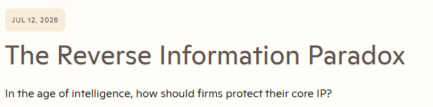

# The Reverse Information Paradox and the Learning Hub: analysis and alignment

<mark>**The Reverse Information Paradox**</mark> is a short economic argument about a quiet cost of using AI: to make a model useful, you must feed it the proprietary knowledge that makes you *you* — and in doing so, you risk handing that knowledge to whoever owns the model. This analysis captures a working session that read the essay closely and compared its prescribed answer against the Learning Hub's existing architecture.

> **Source:**  
  
[The Reverse Information Paradox](https://snscratchpad.com/posts/reverse-information-paradox/) on the *sn scratchpad* blog, attributed to Satya Nadella, July 12, 2026 📒.  
> 
> The essay inverts Kenneth Arrow's classic "Information Paradox" and proposes a five-part answer — Control, Capability, Choice, Cost, and Compound — for keeping an organization's learning inside its own boundary.

The upshot, stated up front: all those considerations apply more than ever to the **Learning Hub** which is an independent arrival at exactly the architecture the essay prescribes for organizations — the same design whether its owner is a single person or a community that grows the knowledge together.  
Its five sibling visions — the **self-updating engine**, **cost control**, **TuneIQ**, **self-updating prompt engineering**, and **autonomous streams** — already describe every mechanism the paradox asks for. What the essay adds isn't a new requirement; it's a sharper *vocabulary and rationale* for the bet the Hub already made, plus one cheap test the Hub doesn't yet state.

This document records that comparison — what the paradox is, how its five parts map to the Hub, where the Hub already embodies the answer, and where the honest gaps are (implementation maturity, not design).

## Table of contents

- 📌 [Summary](#summary)
- 🔍 [What the Reverse Information Paradox is](#what-the-reverse-information-paradox-is)
- 🧭 [The five-part answer: Control, Capability, Choice, Cost, Compound](#the-five-part-answer-control-capability-choice-cost-compound)
- 🧱 [How the five parts map to the Learning Hub](#how-the-five-parts-map-to-the-learning-hub)
- 🏗️ [Where the Hub already embodies the answer](#where-the-hub-already-embodies-the-answer)
- ⚠️ [Where the Hub is exposed](#where-the-hub-is-exposed)
- 💡 [What we can learn from it](#what-we-can-learn-from-it)
- 🚀 [How the Hub could evolve](#how-the-hub-could-evolve)
- 🔧 [What this session changed](#what-this-session-changed)
- 📚 [References](#references)

---

## 📌 Summary

The net picture: the paradox describes a one-way flow of learning — *you* reveal knowledge to use a model, while the model's owner quietly learns from your usage — and argues that the fix is to keep your learning inside a hard **trust boundary** you control. The Learning Hub is built around the same idea — keep the learning inside a boundary its owners control, whether that owner is a single person or a community sharing the knowledge.

The short version:

- **Shared thesis.** The essay's core claim — *"in consuming intelligence, you are creating intelligence, and what you create should belong to you"* — is the same bet the Hub's [self-updating engine](../../06.00-idea/self-updating-engine/20260622.01-self-updating-engine-vision.md) makes: keep the learning loop, and the knowledge it accumulates, under the owner's control.
- **What fits the Hub.** Three of the essay's terms name things the Hub already does: its session traces, corrections, and evals *are* its **learning exhaust**; its public site plus access-controlled private mirror *are* a **trust boundary**; and its evals, metadata contracts, and taxonomy *are* its **particular intelligence** — the encoded judgment of what's worth learning and what "good" means here.
- **What will matter for the Hub.** The essay points at real next moves: bake the *Choice* test (survive a model swap) into the engine's checks, ensure easy support for the **private, authenticated Learning Hub** for access-controlled knowledge, and let the learning loop run on **different engines and private infrastructure** so it never leaves the owner's boundary — see [How the Hub could evolve](#how-the-hub-could-evolve).
- **Honest gaps are maturity, not design.** Owning your traces and model-agnostic orchestration are specified in the Hub's visions; they're only partly wired.

---

## 🔍 What the Reverse Information Paradox is

The essay starts from an idea by Nobel laureate Kenneth Arrow. In the market for information, Arrow noted, a buyer can't know what a piece of information is worth until they've seen it — but once they've seen it, they've effectively acquired it for free. So the **seller** carries the risk: to sell knowledge, they must reveal it and risk giving it away. That's Arrow's *Information Paradox*.

AI inverts the risk. Now the **buyer** carries it:

> You pay for intelligence twice — once with money, and again with something even more valuable: the proprietary knowledge you must reveal to make that intelligence useful. The better you want the model to perform, the more of that knowledge you have to feed it.

Over time the asymmetry compounds. The model's owner learns more and more about you as you use what you bought, while you learn very little about what they learn in return.

### Learning exhaust: the trail your usage leaves behind

To make a model useful you have to interact with it, and every interaction leaves a trail. The essay calls that trail <mark>**learning exhaust**</mark> — borrowing the word from an engine, where *exhaust* is the byproduct that escapes as the engine runs. Here the engine is the model, and the byproduct is everything your usage gives off: the prompts you write, the tools your agents call, the files they open, and — most valuably — the *corrections* you make when the model gets something wrong.

It looks like waste — just session logs — but it's dense with signal. Every correction quietly records what you were trying to do and what "good" looks like to you: tacit judgment you never wrote down anywhere, yet reveal simply by working. That's exactly what a model provider can learn from:

> Every correction is distilled into institutional know-how. It's the kind of knowledge a competitor could never buy, and the kind that leaks almost imperceptibly: trace by trace, correction by correction, eval by eval.

The whole point is *where that byproduct flows*. Let it flow outward and the model's owner learns your method one trace at a time, while you get nothing back. That reframes something the Learning Hub already collects: [TuneIQ](../../06.00-idea/tuneiq/01-tuneiq-design.md) captures exactly this exhaust — session traces, failures, corrections — but keeps it inside the repo to improve the Hub's own stack. The essay's contribution is to insist the exhaust is *the valuable thing*, and that where it goes is a choice, not a default.

### Particular intelligence

The knowledge at stake, the essay argues, is *particular* in Hayek's sense — the knowledge of time, place, and circumstance that no one else can hold. It knows what you think, what you value, and how you measure success. Arrow's paradox has a partial fix (patents let an inventor disclose an idea without giving it away); the reverse paradox, the essay says, needs its own equivalent — a **trust boundary** across which nothing crosses, *not even the intelligence exhaust*, without consent.

---

## 🧭 The five-part answer: Control, Capability, Choice, Cost, Compound

The essay closes with five things it argues every organization must do to keep its learning inside that boundary. They're worth reading as an architecture, not a checklist:

| Part | What it asks for |
|---|---|
| **Control** | Create your own **private evals** — because evals define what "good" means inside your organization — and retain ownership of your memory, traces, decisions, and the right to use model outputs on your own tasks. |
| **Capability** | Build proprietary **learning environments inside your boundary**, where models learn against your real workflows without exposing your knowledge. |
| **Choice** | Keep the **orchestration layer decoupled from any single model**, so removing one model doesn't remove your ability to operate and optimize. |
| **Cost** | Use that decoupling to compose context, models, and tasks in the most **cost-effective** way without sacrificing quality. |
| **Compound** | Bring the four together into a **continuous learning loop** — a "hill-climbing machine" — so your AI investment compounds the value of the firm. |

The framing that ties them together: *"In the cloud era, enterprises accumulated data. In the AI era, they accumulate learning."* The boundary has to evolve from protecting information to protecting the **mechanisms through which you learn**.

---

## 🧱 How the five parts map to the Learning Hub

Here's where the essay stops being abstract for this project. Every one of the five parts corresponds to something the Hub's visions already describe. The table below shows the mapping and, honestly, how mature each one is — separating *design* (the vision covers it) from *implementation* (it's actually wired).

| Paradox part | Where the Hub already does it | Fit | Nature of the gap |
|---|---|---|---|
| **Control** | Evals-as-metadata-contracts in [self-updating prompt engineering](../../06.00-idea/self-updating-prompt-engineering/20260531.01-vision.md); the engine's graded verdict; dual-YAML metadata; [TuneIQ](../../06.00-idea/tuneiq/01-tuneiq-design.md) session capture | Strong (design) | Exhaust isn't *named* as an owned asset; capture is partly wired |
| **Capability** | [TuneIQ](../../06.00-idea/tuneiq/01-tuneiq-design.md) tunes the customization stack against real sessions; the engine's Detect → Assess → Propose → Execute loop | Partial | Tunes *artifacts*, not models — a scope choice, not a flaw |
| **Choice** | The [self-updating engine](../../06.00-idea/self-updating-engine/20260622.01-self-updating-engine-vision.md) is designed domain- and model-agnostic; the cost deck does per-model optimization | Partial (design present) | The "survive a model being removed" *test* is unstated |
| **Cost** | The entire [cost-control vision](../../06.00-idea/prompt-engineering-and-azure-openai-cost-control/20260503.01-slidescontent.md) — token control, context management, Azure billing | Present | Not yet linked to the paradox's "cost via choice" argument |
| **Compound** | The engine's continuous loop plus the [autonomous streams](../../06.00-idea/autonomous-streams/autonomous-streams.md) that run on it | Strong (design) | Framed as *freshness*, not as compounding *particular intelligence* |

The pattern is consistent: the Hub isn't missing the machinery. It's missing the *name and rationale* for two or three parts, and it's further along in design than in wiring for another two.

---

## 🏗️ Where the Hub already embodies the answer

Three of the Hub's design choices line up almost exactly with the essay's boundary argument:

- **Own the loop, not just the data.** The [self-updating engine](../../06.00-idea/self-updating-engine/20260622.01-self-updating-engine-vision.md) is explicitly a loop the owner governs — Detect → Assess → Propose → Execute, under a risk-calibrated autonomy gradient. That *is* the essay's "Compound": a hill-climbing machine kept inside the owner's control, where human-owned vision and thresholds set the bounds.
- **Evals and metadata as the definition of "good."** The Hub already treats each artifact's `goal`, `scope`, `boundaries`, and quality dimensions as the acceptance criteria a change is measured against. That's the essay's "Control": your evals, defining what "good" looks like *for you*, owned by you.
- **A governed boundary, not a wall.** The paradox's boundary lets nothing cross "without consent" — and the Hub already runs exactly that split. It grows learning on two kinds of knowledge: **public** knowledge, shared openly on the published site, and **private** knowledge — full transcripts, decks, recordings, drafts — kept in a separate, access-controlled mirror, read in place and credited but never copied across. Authentication and authorization are what "consent" looks like in practice: the boundary decides what's shared, and with whom.

Read together, the Hub is an independent instance of the architecture the essay prescribes for organizations — its owner might be a single person today or a community that shares and grows the knowledge together, and either way the driver is less about protecting commercial alpha than a quieter motive: **knowledge sovereignty**, keeping the owners' judgment about what's worth learning inside a system they control.

---

## ⚠️ Where the Hub is exposed

Being even-handed: the Hub's weaknesses here are in **wiring and vocabulary, not design**.

- **Exhaust isn't named as an asset.** The Hub collects traces and corrections (TuneIQ) but frames them as fuel for self-improvement, not as the *particular intelligence* the essay says is worth protecting. Naming it would turn "keep the traces" from a storage convenience into a deliberate boundary decision.
- **Model-agnosticism is designed but untested against the essay's question.** The engine is built to be model-neutral, yet no vision states the *Choice* test — *if this model disappears tomorrow, do my evals and my "veteran" capability still work with another?* That's a one-paragraph addition with real diagnostic value.
- **Owning-your-traces is partly wired.** The capture-analyze loop is specified; the continuous, automatic capture is not fully in place. This is implementation maturity — the design already covers it.

None of these are design gaps. The essay's value is that it points a bright light at the two or three places where the Hub's *stated* commitments could be sharper than they are today.

---

## 💡 What we can learn from it

Three durable takeaways for the Hub:

1. **A vocabulary worth adopting.** *Learning exhaust*, *trust boundary*, and *particular intelligence* name things the Hub does but never labeled. Naming them makes the Hub's design choices legible — to its owner and to anyone reading the visions.
2. **The exhaust-as-IP lens.** The most useful reframe: the traces, corrections, and evals a system accumulates aren't just telemetry — they're the accumulated judgment that makes the system yours. Where that flows is a design decision, not a default.
3. **The Choice test as a standing check.** *"If any one model is removed, can you still operate and optimize against your evals?"* is a cheap, repeatable question to ask of any AI system — and a good one to bake into the Hub's model-agnostic claims.

The one caution, kept honest: the essay argues from an *enterprise* motive — competitive IP, contractual terms, economic value capture — that a hub built for learning doesn't share. What transfers isn't the motive; it's the **architecture** — and it's indifferent to who owns it. The same loop serves one person or a community that reasons, compares, and grows the knowledge together, which is what real learning depends on. The mechanisms deliver value whether the driver is competition or sovereignty, and whether the owner is an individual or a community.

---

## 🚀 How the Hub could evolve

The most useful thing the essay offers isn't a vocabulary — it's a set of concrete moves that would make the Hub's "own your learning loop" bet real end to end. Four stand out, cheapest first. All are proposals, not yet designed or wired.

- **Operationalize the *Choice* test** *(self-updating engine — implementation).* Turn the model-swap question into a standing check: a small eval suite the engine runs whenever a model or version changes, confirming the Hub's workflows still pass on an alternate model. Model-agnosticism stops being a claim and becomes a guarded property.
- **A private, authenticated Learning Hub** *(Learning Hub — vision + implementation).* Today the boundary is a convention — a public repo plus a private mirror. The evolution is a first-class private Hub: an authenticated, authorized deployment where private knowledge — transcripts, decks, drafts, and the learning exhaust — lives behind access control, with the public site as a curated projection. That turns "nothing crosses without consent" into an enforced promotion pipeline and lets a community contribute private knowledge under governance.
- **Model and infrastructure pluralism** *(self-updating engine — extends `portable-by-design`).* The engine is designed model-agnostic; the next step is *infrastructure*-agnostic. Make the model endpoint a swappable adapter so the same loop runs on a hosted API, a private Azure OpenAI endpoint, or a fully self-hosted or local model — so the loop and its exhaust never have to leave the owner's boundary. This is *Choice* and *Capability* made real: sovereign end to end.
- **Exhaust as a first-class owned asset** *(TuneIQ + engine — implementation).* TuneIQ captures the exhaust; the evolution is to treat it as a governed, versioned, queryable dataset inside the boundary — and, on private infrastructure, to use it to tune or distill the owner's own models. That closes the essay's loop: consuming intelligence to create intelligence that stays yours.

Together these turn the paradox's five parts from a description of what the Hub already does into a roadmap for what it could become — and the biggest lever is the private, sovereign path: an authenticated Hub whose learning loop runs on infrastructure its owners control.

---

## 🔧 What this session changed

Alongside this analysis, the essay's vocabulary was applied to the Hub's visions rather than just noted: *learning exhaust* and the *trust boundary* were named and *Compound* reframed in the [self-updating engine vision](../../06.00-idea/self-updating-engine/20260622.01-self-updating-engine-vision.md) (v1.1.0), the *Choice* test was added to the [cost-control deck](../../06.00-idea/prompt-engineering-and-azure-openai-cost-control/20260503.01-slidescontent.md) (Slide 5.8), and a consolidating [own your learning loop](../../06.00-idea/own-your-learning-loop/01-own-your-learning-loop-overview.md) overview was created. Those were framing sharpenings; the substantive direction is in [How the Hub could evolve](#how-the-hub-could-evolve).

---

## 📚 References

### External sources

**[The Reverse Information Paradox](https://snscratchpad.com/posts/reverse-information-paradox/)** 📒 [Community]  
The source essay on the *sn scratchpad* blog, attributed to Satya Nadella (July 12, 2026). Inverts Arrow's Information Paradox and proposes the Control / Capability / Choice / Cost / Compound answer analyzed here.

**[Economic Welfare and the Allocation of Resources for Invention](https://www.nber.org/system/files/chapters/c2144/c2144.pdf)** 📗 [Verified Community]  
Kenneth Arrow's original paper, cited by the essay, that states the classic Information Paradox the reverse paradox inverts.

**[The Use of Knowledge in Society](https://www.econlib.org/library/Essays/hykKnw.html)** 📗 [Verified Community]  
F. A. Hayek's essay on "particular knowledge of time and place" — the notion of *particular intelligence* the essay borrows.

### Internal references

- [Self-updating engine vision](../../06.00-idea/self-updating-engine/20260622.01-self-updating-engine-vision.md) — the owner-governed Detect → Assess → Propose → Execute loop; target for the "exhaust / trust boundary" and "Compound" sharpenings.
- [Cost-control vision](../../06.00-idea/prompt-engineering-and-azure-openai-cost-control/20260503.01-slidescontent.md) — token, context, and Azure billing control; target for the "Choice" test.
- [TuneIQ design](../../06.00-idea/tuneiq/01-tuneiq-design.md) — captures session exhaust to improve the customization stack.
- [Self-updating prompt-engineering vision](../../06.00-idea/self-updating-prompt-engineering/20260531.01-vision.md) — evals as metadata contracts.
- [Loop engineering and the Learning Hub](../20260710.01-loop-engineering/overview.md) — the sibling analysis this one follows in form.

<!--
validations:
  grammar: {status: "not_run", last_run: null}
  readability: {status: "not_run", last_run: null}
  technical_accuracy: {status: "not_run", last_run: null}
  reference_classification: {status: "not_run", last_run: null}
article_metadata:
  filename: "overview.md"
  created: "2026-07-16"
  last_updated: "2026-07-16"
  content_type: "analysis"
  subject: "reverse-information-paradox"
-->
