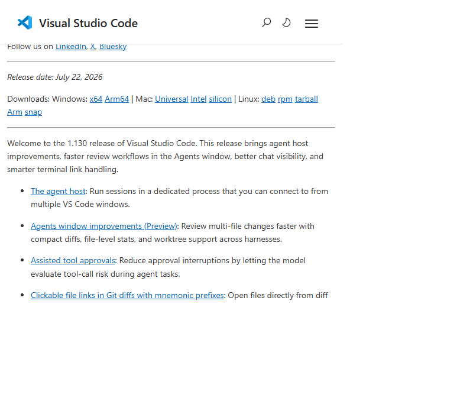

# What's new in VS Code 1.130

Visual Studio Code **1.130** (released **July 22, 2026**) centres on a foundational architectural shift: agent sessions now run in a dedicated **Agent Host** process, communicated via the open **Agent Host Protocol (AHP)**. On top of that foundation, this release introduces model-evaluated tool-approval decisions, faster review workflows in the Agents window, and marks the first VS Code release compiled with **TypeScript 7**.

**Source:**  
- [Visual Studio Code 1.130 release notes](https://code.visualstudio.com/updates/v1_130) 📘 [Official]  
- [Downloads and updates](https://code.visualstudio.com/updates)
  

## Table of contents

- [Release at a glance](#release-at-a-glance)
- [The Agent Host and AHP](#the-agent-host-and-ahp)
- [Assisted tool approvals](#assisted-tool-approvals)
- [Agents window improvements](#agents-window-improvements)
- [Chat](#chat)
- [Terminal](#terminal)
- [Engineering: TypeScript 7](#engineering-typescript-7)
- [Where this fits](#where-this-fits)
- [References](#references)

## Release at a glance

| Capability | What it does | Availability |
|---|---|---|
| Agent Host + AHP | Agent sessions run in a dedicated process, shareable across multiple VS Code windows | Opt-in (`chat.agentHost.enabled`) |
| Assisted tool approvals | The model evaluates tool-call risk, reducing approval interruptions | Opt-in (`chat.assistedPermissions.enabled`) |
| File-level diff statistics | Insertion/deletion counts per file in the Changes editor | Preview (Agents window) |
| Compact multi-file diff view | Tighter gutters, more room for code review | Preview (Agents window) |
| Compact quick chats | Single-line rows for quick chats in the sessions list | Agent Host |
| Worktree support for all harnesses | Claude and Codex sessions now also run in Git worktrees | Agent Host |
| Chat timestamps | Hover to see timestamp and elapsed time for each turn | Stable (`chat.verbose`) |
| Aggregate credit usage | Business/Enterprise users see billing-cycle credit consumption in the status menu | Stable |
| Git diff mnemonic prefix links | Clickable file links in terminal Git diff output with `i/`, `w/`, `1/`, `2/` prefixes | Stable |
| TypeScript 7 compilation | VS Code repo compiled with the release version of TypeScript 7 | Engineering |

---

## The Agent Host and AHP

This is the headline change. VS Code is rearchitecting how agent sessions work around the **Agent Host** — a dedicated process that runs agent harnesses (Copilot, Claude, Codex) independently of the extension host. The host communicates with VS Code (and other clients) through the **[Agent Host Protocol (AHP)](https://microsoft.github.io/agent-host-protocol/)** 📘 [Official], an open protocol in the lineage of LSP and DAP.

### Why it matters

| Before (extension host) | After (Agent Host) |
|---|---|
| Agent logic runs inside an extension — blocked by busy extensions | Dedicated process — agents aren't affected by extension load |
| Session is tied to one window | Session is a shared resource — multiple windows can connect to the same session |
| Session dies when the window closes | Session continues without a connected client |
| One agent runtime, tightly coupled | Pluggable adapters — Copilot, Claude, and Codex plug into a common host interface |

### How AHP keeps clients in sync

AHP uses a totally ordered mutation stream: the host stamps each state change with a monotonic sequence number and broadcasts it to every subscribed client. Clients apply their own actions optimistically and reconcile when the host's echo returns. This model ensures every connected window sees the same session state, even when edits arrive concurrently.

For more on the architecture, see the [VS Code Agent Host architecture documentation](https://code.visualstudio.com/docs/agents/concepts/agent-host) 📘 [Official].

### Remote and standalone hosts

The Agent Host can also run as a standalone server on a remote machine — start it with `code agent host` and expose it via `--tunnel`. Clients reach it over SSH or a dev tunnel, keeping the UI local while workspace operations run close to the source code. This mirrors the Remote Development model VS Code already uses for extensions.

### Opting in

Enable the Agent Host with `chat.agentHost.enabled`, then pick an Agent Host harness from the harness dropdown. For Claude sessions on the Agent Host, also enable `chat.agents.claude.preferAgentHost`.

---

## Assisted tool approvals

**Setting:** `chat.assistedPermissions.enabled`

Repeated tool-approval prompts are a real friction point during long-running agent tasks. This release introduces a fundamentally different approach: instead of static allow/deny rules, the **language model itself evaluates the risk** of each tool call and decides whether it can run automatically or needs your confirmation.

### The three-tier permission model

This effectively creates three tiers of tool-call permission:

| Tier | Mechanism | Example |
|---|---|---|
| **Static deny** | Rule-based block | Dangerous operations always blocked |
| **Model-evaluated risk** (new) | LLM assesses call context and risk | Reading a file → auto-approved; deleting a branch → needs confirmation |
| **Static allow** | Rule-based auto-approval | Explicitly trusted operations |

Assisted permissions appear as a new option in the permissions picker for agents running on the Agent Host. The model handles the gray area between "always block" and "always allow", which is where most approval fatigue lives.

---

## Agents window improvements

The [Agents window](https://code.visualstudio.com/docs/agents/agents-window) 📘 [Official] gets several updates that make reviewing agent work faster and more informative.

### File-level diff statistics

Each file header in the Changes editor now shows live insertion and deletion counts. You can scan a multi-file diff and immediately see which files have the most changes.

### Compact multi-file diff view

The diff gutters are tighter — less empty space before code, consistent alignment across file headers, line numbers, and collapsed-region controls. The result is more visible code per screen width.

### Compact quick chats

Quick chats (on the Agent Host) use compact, single-line rows in the sessions list, making them visually distinct from full project sessions that show change statistics and timestamps on a second line.

### Worktree support for all harnesses

Previously, only Copilot sessions supported Git worktree isolation. Now Claude and Codex sessions on the Agent Host also run in worktrees. This means you can spin up parallel agent sessions for different features — regardless of which harness you use — without any of them interfering with your working directory.

---

## Chat

- **Chat timestamps.** Hover over any message toolbar to see when it was sent and how long the response took. Controlled by `chat.verbose`.

- **Aggregate credit usage.** Copilot Business and Enterprise users can now see total credits consumed in the current billing cycle directly in the Copilot status menu — even when no user-level budget is configured. Previously, credit visibility required a configured budget.

---

## Terminal

- **Clickable file links in Git diffs with mnemonic prefixes.** When Git's `diff.mnemonicPrefix` option is enabled, VS Code recognises prefixes like `i/` (index) and `w/` (working tree) and strips them from the link target so the correct file opens. It also handles the numeric `1/` and `2/` prefixes from `git diff --no-index`.

---

## Engineering: TypeScript 7

VS Code is now compiled with the release version of **TypeScript 7** — a native port of TypeScript written in Go that delivers **8–12× build speedups** through native code speed, shared-memory multithreading, and parallel type-checking.

Key numbers from the [TypeScript 7.0 announcement](https://devblogs.microsoft.com/typescript/announcing-typescript-7-0/) 📘 [Official]:

| Metric | Before (TS 6) | After (TS 7) |
|---|---|---|
| First error in VS Code codebase | ~17.5 seconds | <1.3 seconds (>13× faster) |
| Full build speedup | — | 8–12× across real-world codebases |
| Language server crashes | Baseline | 60% fewer |
| Failing LS commands | Baseline | 80% fewer |

TypeScript 7 introduces `--checkers` (parallel type-checking workers, default 4) and `--builders` (parallel project-reference builds) for fine-tuning parallelisation. It also ships a rebuilt `--watch` mode using a Go port of Parcel's file watcher.

**Practical impact for AI-assisted development:** Faster type-checking tightens agentic feedback loops — when an agent runs `tsc` as a validation step, turnaround drops from seconds to sub-second.

**Caveat:** TypeScript 7.0 doesn't ship with a programmatic API — tools like webpack loaders and embedded language servers (Vue, Svelte, Angular via Volar) must continue using TypeScript 6 via `@typescript/typescript6`. The API is expected in TypeScript 7.1.

---

## Where this fits

This is the second release in a rapid sequence of agent infrastructure improvements:

- **[What's new in VS Code 1.128](../20260708-vscode-v1.128-release/01-summary.md)** — Multi-chat Claude sessions, quick chats, Copilot Vision GA, BYOK in agent host, OpenTelemetry export.
- **[What's new in VS Code 1.130](#)** (this article) — Agent Host architecture, assisted tool approvals, cross-harness worktrees, TypeScript 7.

Together, they show a clear trajectory: the Agent Host is becoming the primary runtime for all agent features, with the Agents window as the unified management surface.

---

## References

**[Visual Studio Code 1.130 release notes](https://code.visualstudio.com/updates/v1_130)** 📘 [Official]
The primary source for this summary. Covers all capabilities introduced in the July 22, 2026 release.

**[Agent Host Protocol (AHP) documentation](https://microsoft.github.io/agent-host-protocol/)** 📘 [Official]
Protocol specification and guide for the open, agent-agnostic protocol that powers multi-client session synchronisation.

**[VS Code Agent Host architecture](https://code.visualstudio.com/docs/agents/concepts/agent-host)** 📘 [Official]
Architectural overview explaining the process model, client/host separation, remote hosting, and agent adapters.

**[Announcing TypeScript 7.0](https://devblogs.microsoft.com/typescript/announcing-typescript-7-0/)** 📘 [Official]
Daniel Rosenwasser's announcement of the native Go port, covering speedups, parallelisation, production readiness, and migration from TypeScript 6.

**[Agents window documentation](https://code.visualstudio.com/docs/agents/agents-window)** 📘 [Official]
Reference for the Agents window UX — sessions list, changes editor, and management features.

**[What's new in VS Code 1.128](../20260708-vscode-v1.128-release/01-summary.md)**
Previous release summary covering multi-chat sessions, Copilot Vision GA, and BYOK support.
