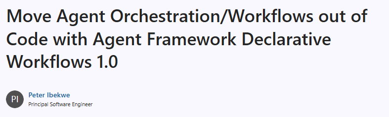

 
# Agent Framework Declarative Workflows 1.0: orchestration as YAML, not code

<mark>**Declarative workflows**</mark> let you define how agents coordinate — the sequence of steps, the branching, the state changes, and when a human steps in — as a **YAML document** rather than as control flow buried in application code. Microsoft Agent Framework loads that document into a standard `Workflow` you can run, stream, and compose exactly like a code-first one. With the **1.0** milestone, this authoring style is now stable across both SDKs.

> [](https://devblogs.microsoft.com/agent-framework/move-agent-orchestration-workflows-out-of-code-with-agent-framework-declarative-workflows-1-0/)
>
> **Source:** [Move Agent Orchestration/Workflows out of Code with Agent Framework Declarative Workflows 1.0](https://devblogs.microsoft.com/agent-framework/move-agent-orchestration-workflows-out-of-code-with-agent-framework-declarative-workflows-1-0/) by Peter Ibekwe (Principal Software Engineer, Microsoft Agent Framework), Microsoft DevBlogs, July 23, 2026 📘 [Official]. Announces declarative workflows reaching 1.0 across the Python and .NET Agent Framework SDKs.

The upshot, stated up front: in most multi-agent apps the orchestration — the order of steps, the branches, the handoffs — lives inside the program, which makes it hard to review, version, and change. Declarative workflows make that orchestration **explicit and external**: it becomes a document you can diff, review, and ship on its own, with **no runtime tradeoff** because it loads into the same `Workflow` type as code-first orchestration.

## Table of contents 
 
- 📌 [Summary](#summary)
- 🔍 [What declarative workflows are](#what-declarative-workflows-are)
- 🧭 [Why teams choose them](#why-teams-choose-them)
- 🧱 [Author in YAML, run as an ordinary workflow](#author-in-yaml-run-as-an-ordinary-workflow)
- ⚙️ [Loading a workflow in .NET and Python](#loading-a-workflow-in-net-and-python)
- 🧰 [What you can build](#what-you-can-build)
- 🔗 [How this relates to the Hub's orchestration content](#how-this-relates-to-the-hubs-orchestration-content)
- 🚀 [Getting started](#getting-started)
- 📚 [References](#references)

---

## 📌 Summary

The short version:

- **Orchestration as data.** You define agent coordination — steps, branching, state, and human handoffs — in YAML instead of application control flow.
- **No runtime tradeoff.** A declarative workflow loads into the **same `Workflow` type** as a code-first one, so it runs, streams, and composes identically.
- **Reviewable and versionable.** Updating an approval step, adding a handoff, or changing branching logic becomes a **YAML change** you can diff, review, and ship independently — not a code change.
- **Stable across both SDKs.** 1.0 covers **Python** (`agent-framework-declarative`, now 1.0.0) and **.NET** (`Microsoft.Agents.AI.Workflows.Declarative`, already stable).
- **A different layer** from the Learning Hub's existing GitHub Copilot prompt-file orchestration how-tos — see [How this relates](#how-this-relates-to-the-hubs-orchestration-content).

---

## 🔍 What declarative workflows are

Most multi-agent apps wire every flow in application code: the sequence of steps, the branching, and the handoffs between agents all live inside the program. That makes the orchestration harder to review, version, and change, because the "shape" of the system is tangled up with its implementation.

A declarative workflow separates the two. In YAML you describe:

- **how agents coordinate** — the steps and the order they run in,
- **how state changes** — values stored and computed as the workflow runs,
- **where execution branches** — conditions and routing, and
- **when people step in** — pauses for human input or approval.

Agent Framework reads that definition and turns it into a standard workflow object. The orchestration is now a **document** rather than a call graph.

---

## 🧭 Why teams choose them

The separation of orchestration from application logic pays off beyond cleaner code:

- **Anyone can review the flow.** Because the workflow is a document, product owners, solution architects, and developers can see how it behaves without reading framework code.
- **Changes are diffable.** Adding an agent handoff, reordering a branch, or editing an approval step is a YAML edit — something you can review in a pull request and ship on its own.
- **You give up nothing at runtime.** A declarative workflow loads into the same `Workflow` type as a code-first one, so it runs, streams, and composes just the same.

---

## 🧱 Author in YAML, run as an ordinary workflow

Consider a support desk that routes each incoming request to the right specialist. A triage agent classifies the request, and a condition routes it to the billing, sales, or support agent. The entire orchestration is a short, readable list of steps:

```yaml
kind: Workflow
trigger:
  kind: OnConversationStart
  id: support_router
  actions:

    # A triage agent classifies the incoming request.
    - kind: InvokeAzureAgent
      id: triage
      conversationId: =System.ConversationId
      agent:
        name: TriageAgent
      output:
        responseObject: Local.Triage

    # Route to the specialist that matches the category.
    - kind: If
      id: route
      condition: =Local.Triage.Category = "Billing"
      then:
        - kind: InvokeAzureAgent
          id: billing
          agent:
            name: BillingAgent
      else:
        - kind: If
          condition: =Local.Triage.Category = "Sales"
          then:
            - kind: InvokeAzureAgent
              id: sales
              agent:
                name: SalesAgent
          else:
            - kind: InvokeAzureAgent
              id: support
              agent:
                name: SupportAgent
```

The routing lives in the definition, not in application control flow. To add a category or reorder the checks, you edit the list — there are no executors to rewire. The named agents (`TriageAgent`, `BillingAgent`, …) live in your Foundry project; conditions use **Power Fx** expressions (the `=…` values).

---

## ⚙️ Loading a workflow in .NET and Python

A declarative definition loads into the same `Workflow` type you already use, so from there you run, stream, or compose it like any other workflow.

**Python** — use `WorkflowFactory` to load the YAML:

```python
from agent_framework.declarative import WorkflowFactory

factory = WorkflowFactory()
workflow = factory.create_workflow_from_yaml_path("support_router.yaml")
# workflow is a standard Workflow - run, stream or compose it like any other.
# The agents it names (TriageAgent, BillingAgent, ...) live in your Foundry project.
```

**.NET** — use `DeclarativeWorkflowBuilder` to build the workflow:

```csharp
using Microsoft.Agents.AI.Workflows;
using Microsoft.Agents.AI.Workflows.Declarative;

// options carries your agent provider and configuration; see the sample for setup.
Workflow workflow = DeclarativeWorkflowBuilder.Build<string>("CustomerSupport.yaml", options);

// From here, run or stream `workflow` like any other workflow.
```

For the full, runnable version of this pattern — with ticketing, escalation, and a human handoff — see the customer-support sample for [Python](https://github.com/microsoft/agent-framework/tree/main/python/samples/03-workflows/declarative/customer_support) and [.NET](https://github.com/microsoft/agent-framework/tree/main/dotnet/samples/03-workflows/Declarative/CustomerSupport).

---

## 🧰 What you can build

The router above is intentionally small, but the same building blocks carry real multi-agent work. Each capability has a runnable sample in the repository:

| Building block | What it does |
|---|---|
| **State and expressions** | Store values in workflow state and compute new ones with Power Fx (e.g. `=If(IsBlank(inputs.name), "World", inputs.name)`) |
| **Control flow** | Branch on workflow state or agent results using conditions, loops, and jumps |
| **Agent invocation** | Invoke agents and route their responses — from sequential pipelines to conditional routing |
| **Function, MCP, and HTTP tools** | Call application code, MCP tools, or HTTP requests from a step |
| **Human-in-the-loop** | Pause for input or approval and continue when the person responds |
| **Checkpoint and resume** | Persist workflow state and resume execution later |

Because declarative definitions load as standard `Workflow` instances, you can mix them with code-first workflows — use YAML where it fits and the lower-level APIs when you need custom behavior.

---

## 🔗 How this relates to the Hub's orchestration content

The Learning Hub already documents *orchestration*, but at a different layer. Keeping the two straight avoids confusion:

- **This article** — orchestrating **agents inside a running .NET/Python application** with the Agent Framework SDK. The "workflow" is application runtime behavior, authored in YAML.
- **The Hub's existing how-tos** — orchestrating **GitHub Copilot customization files** (prompts, agents, subagents) during authoring:
  - [How to design orchestrator prompts](../../03.00-tech/05.02-prompt-engineering/04-howto/10.00-how-to-design-orchestrator-prompts.md)
  - [How to design subagent orchestrations](../../03.00-tech/05.02-prompt-engineering/04-howto/11.00-how-to-design-subagent-orchestrations.md)
  - [How to manage information flow during prompt orchestrations](../../03.00-tech/05.02-prompt-engineering/04-howto/12.00-how-to-manage-information-flow-during-prompt-orchestrations.md)

Both are "orchestration," but one coordinates *customization files* used by an AI coding assistant, while declarative workflows coordinate *agents in a production application*. The shared idea — make the coordination explicit and reviewable rather than implicit — is the same instinct applied at two layers.

---

## 🚀 Getting started

Install the package for your SDK:

```bash
pip install agent-framework-declarative

dotnet add package Microsoft.Agents.AI.Workflows.Declarative
```

Then try a declarative workflow for an orchestration you would otherwise implement in code. The official docs and samples are the fastest way in:

- Docs: [Declarative workflows overview](https://learn.microsoft.com/en-us/agent-framework/workflows/declarative)
- Python samples: [python/samples/03-workflows/declarative](https://github.com/microsoft/agent-framework/tree/main/python/samples/03-workflows/declarative)
- .NET samples: [dotnet/samples/03-workflows/Declarative](https://github.com/microsoft/agent-framework/tree/main/dotnet/samples/03-workflows/Declarative)

---

## 📚 References

- [Move Agent Orchestration/Workflows out of Code with Agent Framework Declarative Workflows 1.0](https://devblogs.microsoft.com/agent-framework/move-agent-orchestration-workflows-out-of-code-with-agent-framework-declarative-workflows-1-0/) — Peter Ibekwe, Microsoft DevBlogs, July 23, 2026 📘 [Official]
- [Declarative workflows overview](https://learn.microsoft.com/en-us/agent-framework/workflows/declarative) — Microsoft Learn 📘 [Official]
- [microsoft/agent-framework — Python declarative samples](https://github.com/microsoft/agent-framework/tree/main/python/samples/03-workflows/declarative) 📘 [Official]
- [microsoft/agent-framework — .NET declarative samples](https://github.com/microsoft/agent-framework/tree/main/dotnet/samples/03-workflows/Declarative) 📘 [Official]

