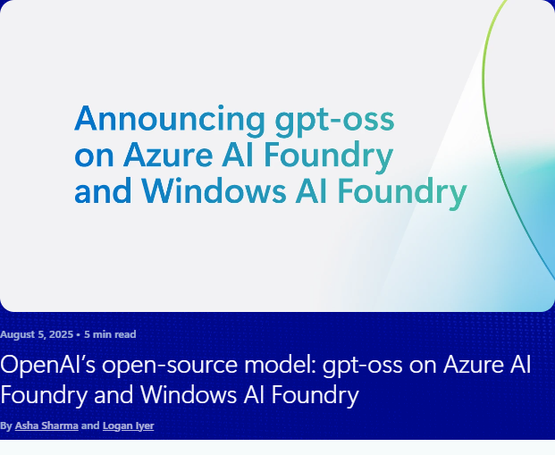

# gpt-oss one year on: frozen weights, a moving runtime

<mark>**Open-weight models**</mark> ship differently from hosted ones. A hosted model improves underneath you — the endpoint stays the same while the intelligence behind it changes. An open-weight model is a **file you hold**: it improves only when someone publishes new weights, and it stays exactly as capable as the day you downloaded it. OpenAI's `gpt-oss` turns out to be a clean case study in what that difference costs and what it buys.

> 
>
> **Source:** [OpenAI's open-source model: gpt-oss on Azure AI Foundry and Windows AI Foundry](https://azure.microsoft.com/en-us/blog/openais-open%e2%80%91source-model-gpt%e2%80%91oss-on-azure-ai-foundry-and-windows-ai-foundry/) by Asha Sharma and Logan Iyer, Microsoft Azure Blog, August 5, 2025 📘 [Official]. Announces `gpt-oss-120b` and `gpt-oss-20b` arriving in the Azure model catalog and in Foundry Local on Windows.

The upshot, stated up front: the **base weights haven't moved since August 2025**, while OpenAI's hosted line kept shipping and reached GPT-5.6, and the runtime that serves gpt-oss locally was rebuilt around an SDK-first, cross-platform design. So the useful question today isn't whether gpt-oss is new. It's whether a **fixed, auditable, Apache-2.0 artifact you control** is worth more to you than a moving hosted target you don't.

## Table of contents

- 📌 [Summary](#summary)
- 🎯 [What landed in August 2025](#what-landed-in-august-2025)
- 📅 [What actually shipped since](#what-actually-shipped-since)
- 🏷️ [Who maintains gpt-oss, and who only distributes it](#who-maintains-gpt-oss-and-who-only-distributes-it)
- 🧭 [How the surrounding roadmaps moved](#how-the-surrounding-roadmaps-moved)
- ⚖️ [Choosing gpt-oss inside the Foundry Local catalog](#choosing-gpt-oss-inside-the-foundry-local-catalog)
- 🔗 [How this relates to the Hub's local-AI content](#how-this-relates-to-the-hubs-local-ai-content)
- 📚 [References](#references)

---

## 📌 Summary

The short version:

- **The weights are frozen.** Both `gpt-oss-120b` and `gpt-oss-20b` were last updated **August 26, 2025**. Eleven months later, there's been no new base-model release.
- **One derivative shipped.** `gpt-oss-safeguard` (October 2025) reuses the architecture for safety classification against policies *you* write. It's a genuinely different job, not a successor.
- **The ecosystem carried the momentum instead.** 214 adapters, 106 finetunes, and 121 quantizations now descend from `gpt-oss-120b`, and the 20b variant still pulls roughly **8 million downloads a month**.
- **OpenAI maintains it; Microsoft distributes and optimizes it.** The repo explicitly declines feature contributions — it's a reference implementation, not a community project.
- **The runtime changed far more than the model.** Foundry Local reached GA, added macOS and Linux, moved SDK-first at about **20MB**, and adopted the OpenAI Responses API format.
- **Your real choice sits inside the catalog, not against it.** gpt-oss *is* a Foundry Local model — you pick it against Qwen, Phi, Mistral, or DeepSeek, not against Foundry Local.

---

## 🎯 What landed in August 2025

OpenAI's first open-weight release since GPT-2 arrived as two <mark>**mixture-of-experts**</mark> models — architectures where only a fraction of the parameters activate for any given token, so memory footprint and compute cost diverge sharply.

| | `gpt-oss-120b` | `gpt-oss-20b` |
|---|---|---|
| Total parameters | 117B | 21B |
| Active per token | 5.1B | 3.6B |
| Target hardware | Single 80GB GPU (H100 or MI300X) | 16GB memory |
| Intended role | Datacenter reasoning | On-device agentic work |

Both ship with **MXFP4 quantization** applied to the MoE weights while other tensors stay BF16, which is how a 117B-parameter model fits on one card. Both expose **configurable reasoning effort** (low, medium, or high) and emit a full chain of thought — which OpenAI is explicit is for inspection and debugging, and *"not intended to be shown to end users."* Both support function calling, browsing, Python execution, and structured outputs natively.

Two details from launch still matter operationally a year later:

- **The harmony response format is mandatory.** These models won't work correctly without it. That's a hard gate, not a quality knob — a wrong format produces broken output, not merely worse output.
- **Open weights unlock the whole downstream toolchain.** Fine-tuning (LoRA, QLoRA, PEFT), distillation, re-quantization, and ONNX or Triton export are all yours to run. The 120b fine-tunes on a single H100 node; the 20b fine-tunes on consumer hardware.

The launch benchmarks positioned the pair against OpenAI's own hosted reasoning models of the time:

| Benchmark | `gpt-oss-120b` | `gpt-oss-20b` | o3 | o4-mini |
|---|---|---|---|---|
| MMLU | 90.0 | 85.3 | 93.4 | 93.0 |
| GPQA Diamond | 80.1 | 71.5 | 83.3 | 81.4 |
| Humanity's Last Exam | 19.0 | 17.3 | 24.9 | 17.7 |
| AIME 2024 | 96.6 | 96.0 | 95.2 | 98.7 |
| AIME 2025 | 97.9 | 98.7 | 98.4 | 99.5 |

One number that didn't appear in the launch material is worth carrying forward: `gpt-oss-120b` scores **16.2 on SWE-bench Pro**. Competition math is a strength; multi-step real-world software engineering isn't.

---

## 📅 What actually shipped since

This is where an open-weight release stops resembling a hosted one.

**The base models never moved.** The Hugging Face pages for both `gpt-oss-120b` and `gpt-oss-20b` show a last update of **August 26, 2025** — three weeks after launch, and nothing since. The GitHub repository's most recent release is **v0.0.9**, six months ago, out of six releases total. Recent commits are tooling changes: the browser backend default switched to You.com, and an `api_key` parameter was added. Nothing touching the weights.

**One derivative did ship.** `gpt-oss-safeguard-120b` appeared in **October 2025**, with `gpt-oss-safeguard-20b` updated in **January 2026**. These are safety-reasoning models built on gpt-oss that classify content against **safety policies you supply at inference time**, rather than against policies baked into training. That's a meaningful capability for anyone building moderation, but the adoption numbers show how specialized it is: safeguard-20b draws about **99,000 downloads a month** against the base 20b's **7.98 million**.

**OpenAI's other open releases went elsewhere entirely.** `circuit-sparsity` (0.4B, December 2025) and `privacy-filter` (1B token classification, April 2026) are research and utility artifacts, not additions to the gpt-oss line.

**The community supplied the iteration.** Derived from `gpt-oss-120b` alone: **214 adapters, 106 finetunes, 121 quantizations, and 1 merge**. Where a hosted model improves through vendor releases, this one improved through third-party derivatives — each carrying its own provenance and its own evaluation burden.

**Meanwhile the closed line kept moving.** OpenAI's hosted models went through GPT-5.4, GPT-5.5, and GPT-5.6 across the same period. The August 2025 framing of *"o4-mini-level performance you can run yourself"* was accurate then; today that comparison anchor is three generations back.

The honest reading: **a frozen artifact is the feature, not the bug** — if reproducibility is what you need. If capability freshness is what you need, eleven months is a long time, and the training cutoff ages with every month that passes.

---

## 🏷️ Who maintains gpt-oss, and who only distributes it

This distinction gets blurred constantly, and it changes who you escalate to.

| | Role | What they actually control |
|---|---|---|
| **OpenAI** | Maintainer | The weights, the model card, the harmony format spec, and the reference implementations |
| **Microsoft** | Distributor and optimizer | Catalog hosting in Microsoft Foundry, and the ONNX-quantized build in the Foundry Local curated catalog |
| **Community** | Derivative authors | Adapters, finetunes, quantizations, and third-party runtime support |

The `openai/gpt-oss` repository (Apache-2.0, ~20.3k stars, 2.1k forks, 63 contributors) is governed narrowly. Its own contribution guidance states that *"outside of bug fixes we do not intend to accept new feature contributions."* The repo exists to demonstrate correct usage, not to evolve as a community codebase. Contributors are largely OpenAI staff, with some inference-engine maintainers from the vLLM project.

**Apache-2.0 is the quiet headline.** No copyleft obligations, an express patent grant, and no restriction on commercial redistribution. For anyone shipping a model inside a product, that license is often the deciding factor before any benchmark is consulted.

What this means practically: Microsoft isn't going to publish a better gpt-oss. If the weights don't improve, they don't improve for anyone. What Microsoft *can* change — and has changed substantially — is everything around them.

---

## 🧭 How the surrounding roadmaps moved

The model stood still. The platform didn't.

### Foundry Local: from a tool you run to something you ship

The August 2025 story was a CLI and a local server you started alongside your app. The current documentation describes something else: an **end-to-end local AI solution that your application ships with**.

- **SDK-first.** C#, JavaScript, Rust, and Python SDKs run inference **in-process**, on an ONNX Runtime footprint of roughly **20MB**. The CLI and web server are now positioned as development-workflow tools rather than the deployment surface.
- **Three platforms, not one.** Windows, macOS on Apple silicon, and **Linux**. August 2025 promised macOS as "coming soon" and never mentioned Linux at all.
- **The API promise landed.** "Will soon be API-compatible" became support for the **OpenAI Responses API format**, so local and hosted calls share a shape.
- **Windows ML integration.** The `Microsoft.AI.Foundry.Local.WinML` packages (and their JavaScript and Rust equivalents) route through Windows ML for broader hardware acceleration across vendors.
- **A new deployment shape.** *Foundry Local on Azure Local* extends the same runtime onto Arc-enabled Kubernetes for enterprise-scale and sovereign scenarios.

Two boundaries are now stated explicitly, and both are useful when you're scoping work:

- **It isn't a server inference stack.** The documentation directs multi-user concurrent serving to vLLM or Triton. Foundry Local targets single-user, on-device inference.
- **The catalog is curated on purpose.** It's *"designed for shipping production applications, not for general-purpose model experimentation."* That's why the catalog is short — chat completion models including GPT OSS, Qwen, DeepSeek, Mistral, and Phi, plus Whisper for transcription — with pinnable versions.

### Windows AI Foundry: three layers, two of them now GA

Build 2026 organized Windows local AI into three tiers, which is the clearest framing of the stack so far:

| Layer | For | Status |
|---|---|---|
| **Windows AI APIs** | Turnkey tasks, no model management | Expanding beyond Copilot+ devices to CPU and GPU |
| **Foundry Local** | Curated open models | **GA** |
| **Windows ML** | Your own custom models | **GA** |

Alongside those: a **Windows ML CLI** in preview for converting, analyzing, and benchmarking models; **WebNN** bringing the same acceleration to web applications; **Windows ML 2.0** in preview; and **Ion**, the next-generation successor to Phi Silica that powers the Prompt API in Edge Canary with better quality, a larger context window, and higher throughput, distributed through Windows Inbox APIs.

One roadmap signal is worth reading plainly rather than competitively: Microsoft's own Build 2026 local-AI demonstrations featured **Qwen 3.5 Vision** and **Ion**, not gpt-oss. gpt-oss remains a first-class catalog citizen — it's listed first among Foundry Local's chat models — but Microsoft's Windows narrative now centers on multimodal capability and on inbox models it ships itself. A frozen text-only model doesn't carry a keynote; it carries workloads.

### The economics that make any of this worth doing

Qualcomm's Build 2026 session supplied the numbers that justify local inference as an architecture rather than a preference. The proposal is **tiered routing by task**: models of 13B parameters or fewer on-device, 14B–34B on-premises, and 70B-plus in the cloud. Reported results are a **67% reduction in cloud tokens** and a **70% reduction in latency**, with total cost falling 50–75% at equivalent quality. Snapdragon X2 Elite contributes an **80 TOPS NPU**, and float-to-integer quantization roughly halves both size and cost.

That framing puts gpt-oss in an interesting spot. At **21B total parameters**, `gpt-oss-20b` sits above the on-device tier by parameter count — but only **3.6B activate per token**, so its compute profile behaves like a much smaller model while its memory profile doesn't. Memory is the binding constraint, which is exactly why the 16GB floor is the number to design against.

---

## ⚖️ Choosing gpt-oss inside the Foundry Local catalog

A premise worth correcting first, because it's a common one: **gpt-oss versus Foundry Local is not a choice.** gpt-oss *is* a Foundry Local model. The real decisions are three separate axes:

1. **Which model** — gpt-oss against Qwen, Phi, Mistral, or DeepSeek in the same catalog.
2. **Which runtime** — Foundry Local against Ollama, LM Studio, llama.cpp, or vLLM, all of which can load the same weights.
3. **Which tier** — local open-weight against hosted frontier, per task.

On the first axis, here's how gpt-oss earns or loses its place.

**Reach for gpt-oss when:**

- **License risk is a gating concern.** Apache-2.0 with an express patent grant and no copyleft clears legal review for commercial redistribution more easily than most alternatives.
- **You need to audit the reasoning.** The full chain of thought is exposed, which matters for debugging and for regulated review.
- **You're fine-tuning.** The 120b trains on a single H100 node; the 20b trains on consumer hardware.
- **You want portability.** Identical weights run under Foundry Local, Ollama, LM Studio, llama.cpp, vLLM, or a cloud endpoint — so runtime choice stays reversible.
- **You need one family across tiers.** The 20b on a laptop and the 120b in a datacenter share a format and a prompt style, which keeps a hybrid design coherent.

**Look elsewhere when:**

- **Freshness matters.** The weights are eleven months old and the training cutoff ages with them.
- **You can't adopt the harmony format.** This is binary — without it, output is broken rather than degraded.
- **You're under 16GB of memory.** Smaller Phi or Qwen variants are built for that envelope.
- **The workload is hard agentic coding.** A SWE-bench Pro score of 16.2 sets realistic expectations.
- **You need multimodal input.** gpt-oss is text-only; the catalog's vision-capable models aren't.

A practical note on privacy, since it's frequently the reason local inference is on the table at all: Foundry Local requires no Azure subscription, and prompts and outputs are processed on the device. Network access is used for downloading models and execution providers, and for optional diagnostics.

---

## 🔗 How this relates to the Hub's local-AI content

This article is the timeline and the decision framing. The Hub's event coverage carries the hands-on detail, and most of it is *newer* than the August 2025 announcement:

- [BRK223: An overview of Windows AI Foundry](../../02.00-events/202506-build-2025/brk-breakout-sessions/brk223-an-overview-of-windows-ai-foundry/summary.md) — the original three-layer stack, before GA.
- [DEM520: Local AI development with Foundry Local and .NET Aspire](../../02.00-events/202506-build-2025/dem-demonstrations/dem520-local-ai-development-with-foundry-local-and-dotnet-aspire/readme.sonnet4.md) — wiring Foundry Local into an app.
- [DEM524: Running large language models on your local machine](../../02.00-events/202506-build-2025/dem-demonstrations/dem524-running-large-language-models-on-your-local-machine/summary.md) — the hardware envelope in practice.
- [BRK225: Bring your own model to Windows using Windows ML](../../02.00-events/202506-build-2025/brk-breakout-sessions/brk225-bring-your-own-model-to-windows-using-windows-ml/summary.md) — the custom-model layer beneath the catalog.
- [BRK260: Build apps with local AI on every Windows PC](../../02.00-events/202606-build-2026/05-windows/brk260-build-apps-w-local-ai-for-unmetered-intelligence-on-every-windows-pc/summary.md) — the Build 2026 GA milestones, Ion, and WebNN.
- [OD851: Expand local AI reach with Windows ML](../../02.00-events/202606-build-2026/05-windows/od851-expand-local-ai-reach-with-windows-ml/summary.md) — hardware reach across silicon vendors.
- [BRKSP90: Stop routing docstrings to 70B models](../../02.00-events/202606-build-2026/04-developer-tools-and-frameworks/brksp90-stop-routing-docstrings-to-70b-models-with-on-device-ai-on-snapdragon/summary.md) — the tiered-routing economics quoted above.

One terminology note while reading across them: Build 2025 material says **Azure AI Foundry**, Build 2026 material says **Microsoft Foundry**. Same platform, renamed in between.

---

## 📚 References

**[OpenAI's open-source model: gpt-oss on Azure AI Foundry and Windows AI Foundry](https://azure.microsoft.com/en-us/blog/openais-open%e2%80%91source-model-gpt%e2%80%91oss-on-azure-ai-foundry-and-windows-ai-foundry/)** 📘 [Official]  
The originating announcement by Asha Sharma and Logan Iyer, August 5, 2025. Establishes the launch baseline this article measures against — model sizes, target hardware, and the Foundry Local story as it stood then. A [Tech Community teaser](https://techcommunity.microsoft.com/blog/partnernews/openai%E2%80%99s-open%E2%80%91source-model-gpt%E2%80%91oss-on-azure-ai-foundry-and-windows-ai-foundry/4440434) 📘 [Official] points at the same content.

**[What is Foundry Local?](https://learn.microsoft.com/en-us/azure/ai-foundry/foundry-local/what-is-foundry-local)** 📘 [Official]  
Current product documentation, and the best evidence of how far the runtime moved. Covers the SDK-first architecture, the supported platforms, the curated catalog, the Responses API support, and the explicit boundary against server-side serving.

**[openai/gpt-oss on GitHub](https://github.com/openai/gpt-oss)** 📘 [Official]  
Reference implementations, the harmony format tooling, and the release history. Read the contribution guidance to understand the governance model before planning around upstream changes.

**[gpt-oss-120b on Hugging Face](https://huggingface.co/openai/gpt-oss-120b)** 📘 [Official]  
The model card, plus the live derivative counts and download figures cited here. The "last updated" date is the single most useful field for anyone tracking whether the weights have moved.

**[OpenAI open models](https://openai.com/open-models/)** 📘 [Official]  
The published benchmark table comparing both gpt-oss sizes against o3 and o4-mini, and the summary of reasoning-effort configuration and agentic capabilities.

**[gpt-oss-120b & gpt-oss-20b Model Card (arXiv:2508.10925)](https://arxiv.org/abs/2508.10925)** 📗 [Verified Community]  
The technical paper behind the release, published August 8, 2025. Use it for architecture and evaluation methodology detail that the product pages compress.

<!--
validations:
  grammar: {status: "not_run", last_run: null}
  readability: {status: "not_run", last_run: null}
  structure: {status: "not_run", last_run: null}
  references: {status: "not_run", last_run: null}

article_metadata:
  filename: "overview.md"
  diataxis_type: "explanation"
-->
