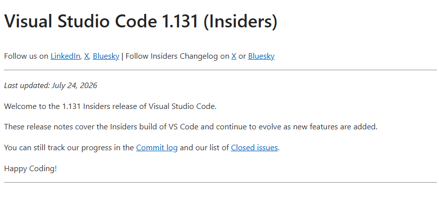

# What's new in VS Code 1.131

VS Code 1.131 is an Insiders release, and it has a clear centre of gravity: **voice**. Nine of its fifteen documented changes move dictation, text-to-speech, and Voice Mode from an extension into the product itself — the same route agent sessions took one release earlier when they moved into the Agent Host. The rest of the release refines the Agents window, adds streaming command output in the terminal, and ships a tool for migrating old prompt files.

Because this is an Insiders build, the notes keep evolving and anything here can still change before it reaches stable.

**Source:**  
- [Visual Studio Code 1.131 release notes](https://code.visualstudio.com/updates/v1_131) 📘 [Official]  
- [Downloads and updates](https://code.visualstudio.com/updates)
  

## Table of contents

- [Release at a glance](#release-at-a-glance)
- [Voice moves in-box](#voice-moves-in-box)
- [Dictation you can write prose with](#dictation-you-can-write-prose-with)
- [Turn control and microphone handling](#turn-control-and-microphone-handling)
- [Agents window](#agents-window)
- [Terminal and command execution](#terminal-and-command-execution)
- [Prompts](#prompts)
- [Chat](#chat)
- [Where this fits](#where-this-fits)
- [References](#references)

## Release at a glance

| Capability | What it does | Availability |
|---|---|---|
| Built-in on-device voice | Dictation in the editor and terminal, plus read-aloud text-to-speech, without a marketplace extension | Insiders 1.131 |
| Extension voice stand-down | Extension-provided voice mode switches itself off when built-in voice is in use | Insiders 1.131 |
| Incremental dictation cleanup | Punctuation and phrasing get refined while you're still speaking | Insiders 1.131 |
| List formatting in dictation | Spoken bullets and numbered lists come out as real lists | Insiders 1.131 |
| Filler-word filtering | "Um" and "uh" don't reach the transcript | Insiders 1.131 |
| Turn stays open | With hands-free off, a Voice Mode turn no longer auto-sends unless you configure it to | Insiders 1.131 |
| Microphone quick actions | Pick a mic or mute it straight from the voice button | Insiders 1.131 |
| Agents window refinements | Custom session groups, single-file diffs, folder quick-pick, fuzzy `#` search | Insiders 1.131 |
| Streaming command output | Watch long-running commands as they run instead of waiting for the end | Insiders 1.131 |
| Migrate Prompts | Review, move, and delete old prompt files in one pass | Insiders 1.131 |
| Chat timestamps | Older conversations now carry timestamps too | Insiders 1.131 |

---

## Voice moves in-box

The headline change is [built-in on-device dictation extended to editor dictation and terminal voice, plus read-aloud text-to-speech](https://github.com/microsoft/vscode/issues/326969). Paired with it, [extension-provided voice mode is now auto-disabled when built-in voice mode is used](https://github.com/microsoft/vscode/issues/327000), so you don't end up with two microphones fighting over the same keystroke.

Most of these capabilities existed before — they just arrived through the [VS Code Speech](https://marketplace.visualstudio.com/items?itemName=ms-vscode.vscode-speech) extension. What changes is who ships them.

### Why it matters

| Before | After |
|---|---|
| Voice needed the VS Code Speech extension installed | Voice is part of the editor |
| Language support arrived as separate per-language extension packs | Handled by the built-in engine |
| Terminal dictation wasn't a thing | You can speak into the terminal |
| Read-aloud lived in chat only | Read-aloud is a general capability |
| Two voice providers could compete for the same input | The extension steps aside automatically |

The "on-device" part carries over from the extension model, where recordings were computed locally and never sent to an online service. That's the property worth keeping an eye on as the built-in stack settles — it's what makes dictation usable on code you can't send anywhere.

If you already have a voice extension installed, this is the one change that can alter your setup without you asking. Check which provider is actually handling your microphone after you update.

---

## Dictation you can write prose with

Three changes attack the same problem — raw speech-to-text output reads like a transcript, not like writing.

- [Incremental dictation cleanup while you're still speaking](https://github.com/microsoft/vscode/issues/327222). Punctuation and phrasing refinements land during a long dictation session rather than all at the end, so you can see what you're producing while you produce it.
- [Bullet and numbered list formatting in post-processing](https://github.com/microsoft/vscode/issues/327219). Say a list, get a list. Dictated notes keep the structure you intended instead of collapsing into a run-on paragraph.
- [Filler-word filtering](https://github.com/microsoft/vscode/issues/327205). "Um" and "uh" get dropped before they reach the buffer.

None of these is architecturally interesting. Together they're the difference between dictating a short chat prompt and dictating a paragraph of documentation — which is the workload that used to make people give up on dictation.

---

## Turn control and microphone handling

[Voice Mode turns now stay open when hands-free mode is disabled](https://github.com/microsoft/vscode/issues/327217), unless you explicitly configure silence detection or a stop phrase to send the turn for you. Previously a pause could submit before you were finished.

This one has a trap in it. If you were relying on a pause to send your message, that behaviour is now opt-in — you'll need to configure auto-send explicitly to get it back.

Microphone handling got simpler too. [Quick actions on the voice buttons](https://github.com/microsoft/vscode/issues/327013) let you select a specific microphone or disable it without leaving the control, and [microphone context-menu actions](https://github.com/microsoft/vscode/issues/327055) replace the separate configuration gear buttons that used to sit next to them.

---

## Agents window

Four refinements, all reducing friction rather than adding capability:

- [Easier custom session-group creation](https://github.com/microsoft/vscode/issues/327153) — grouping agent sessions is more discoverable and takes less setup.
- [Single-file diff from the Changes list](https://github.com/microsoft/vscode/issues/327012) in the single-pane layout, so you can inspect one file without opening the full multi-file view.
- [Quick-pick folder selection in the new-session view](https://github.com/microsoft/vscode/issues/326987) — start a session in the right workspace without hunting for it.
- [Fuzzy `#` file search in the Agent Host input box](https://github.com/microsoft/vscode/issues/326474), so typing `#roadma` finds `roadmap.md` the way it already did in local chat.

That last one is a small item with a bigger story behind it. When agent sessions moved into the dedicated Agent Host process in 1.130, the Agent Host input box became a separate surface from the local chat input — and separate surfaces drift. Parity fixes like this are the ongoing cost of that split, and they're worth expecting for a few releases.

---

## Terminal and command execution

[Streaming of command output](https://github.com/microsoft/vscode/issues/324825) is the more consequential of the two terminal changes. Until now a long-running command produced nothing visible until it finished. Now you can follow it as it runs.

The value isn't cosmetic. When an agent kicks off a build or a test suite, streaming output means you can tell early whether it's going somewhere useful — and stop it when it isn't, instead of waiting out a five-minute failure.

Separately, you can now [disable the terminal dimensions overlay](https://github.com/microsoft/vscode/issues/295790) that appears while resizing.

---

## Prompts

[Migrate Prompts](https://github.com/microsoft/vscode/issues/325660) adds triage and cleanup actions to the migration flow, so moving to the new prompt experience is also a chance to review what you've accumulated and delete what's gone stale.

Worth knowing about, worth waiting on. The command is Insiders-only and its triage UX is still moving, so it's not yet something to build a prompt-maintenance routine around.

---

## Chat

[Timestamps now appear on older conversations](https://github.com/microsoft/vscode/issues/324482), extending the hover timestamps that arrived in 1.130 to chat history rather than just the current session.

---

## Where this fits

The pattern to notice is the one this release shares with the last one. In 1.130, agent sessions moved out of the extension host into a dedicated Agent Host process with an open protocol. In 1.131, voice moves out of a marketplace extension into the editor — and the extension is told to stand down. Both are the same kind of decision: a capability that proved itself as an extension gets absorbed into the product, and the extension becomes the compatibility path rather than the delivery path.

For a deeper look at what voice does in VS Code today and what actually changed underneath, see the concepts article on [voice input, dictation, and read-aloud](../../03.00-tech/05.02-prompt-engineering/03-concepts/01.10-understanding-voice-input-dictation-and-read-aloud.md).

Earlier releases in this series:

- [What's new in VS Code 1.130](../20260722-vscode-v1.130-release/01-summary.md) — the Agent Host and AHP, assisted tool approvals, TypeScript 7
- [What's new in VS Code 1.128](../20260708-vscode-v1.128-release/01-summary.md) — earlier Agents window work

The investigation trail for this entry is in [`_analysis/`](./_analysis/).

---

## References

**[Visual Studio Code 1.131 release notes](https://code.visualstudio.com/updates/v1_131)** 📘 [Official]  
The primary source for this article, covering the Insiders build from July 21 to July 24, 2026. Each entry links to the GitHub issue that drove it, which is often the only place a behaviour change is described in detail. Because it's an Insiders page it keeps changing — check the "last updated" line before relying on it.

**[Voice support in VS Code](https://code.visualstudio.com/docs/configure/accessibility/voice)** 📘 [Official]  
The reference for how voice actually works day to day: dictation commands, voice chat entry points, walky-talky mode, keyword activation, and the language settings. Note that it still documents the extension-based delivery model, so read it for behaviour rather than for installation steps until it catches up with 1.131.

**[VS Code Speech extension](https://marketplace.visualstudio.com/items?itemName=ms-vscode.vscode-speech)** 📘 [Official]  
The marketplace extension that delivered voice support before 1.131 built it in. Useful for understanding what the built-in stack replaces, and still the path for anyone on a stable build.

**[Understanding voice input, dictation, and read-aloud](../../03.00-tech/05.02-prompt-engineering/03-concepts/01.10-understanding-voice-input-dictation-and-read-aloud.md)**  
The Learning Hub concepts article on the built-in voice stack. Explains where voice works, what the extension-to-built-in shift changes, and what to re-check in an existing setup.

**[What's new in VS Code 1.130](../20260722-vscode-v1.130-release/01-summary.md)**  
The previous release summary, covering the Agent Host process model and the Agent Host Protocol. Read it first if the Agents window and Agent Host references in this article need context.
