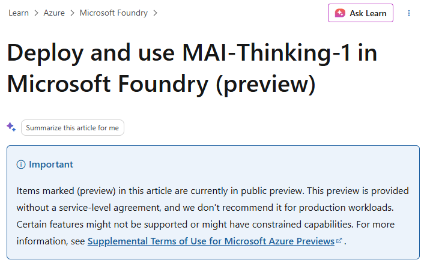

# MAI-Thinking-1 observation completion summary

> **[Deploy and use MAI-Thinking-1 in Microsoft Foundry (preview)](https://learn.microsoft.com/azure/foundry/foundry-models/how-to/use-foundry-models-mai-thinking)** 📘 [Official]
> 
> Microsoft Learn, Azure AI Foundry documentation. This source confirms MAI-Thinking-1 preview status, Foundry deployment model, reasoning-focused usage, and API/operational constraints.

Manual source snapshot capture is still required for the image above.

## 🎯 What was investigated

This observation was investigated to determine impact on:

- Prompt engineering documentation at 03.00-tech/05.02-prompt-engineering.
- Prompt engineering context authority files at .copilot/context/00.00-prompt-engineering.

## 🔗 Connected findings

1. Official Foundry documentation confirms that MAI-Thinking-1 is available in preview for reasoning-heavy workloads with concrete operational constraints (deployment type, quotas, and API behavior).
2. Because those details are now explicit and operational, existing model-selection guidance remains conceptually valid but lacks provider-conditional implementation notes for Foundry reasoning flows.
3. Because the conceptual baseline is already strong, the gap is concentrated in canonical amendment points rather than in missing foundations.
4. Therefore, the right integration mode is a gated meta/architecture amendment plan targeting existing PE docs and context artifacts, not an autonomous stand-alone article insertion.

## 🧭 Impact on prompt-engineering corpus

- Core model-family and reasoning guidance stays valid.
- High-priority amendment targets are:
	- 03.00-tech/05.02-prompt-engineering/03-concepts/01.07-understanding-llm-models-and-model-selection.md
	- 03.00-tech/05.02-prompt-engineering/04-howto/08.00-how-to-optimize-prompts-for-specific-models.md
	- .copilot/context/00.00-prompt-engineering/03.02-model-specific-optimization.md

## 📚 Published references

- **[Deploy and use MAI-Thinking-1 in Microsoft Foundry (preview)](https://learn.microsoft.com/azure/foundry/foundry-models/how-to/use-foundry-models-mai-thinking)** 📘 [Official]
- **[Overview of Microsoft Foundry Models](https://learn.microsoft.com/azure/foundry/concepts/foundry-models-overview)** 📘 [Official]
- **[Observability in generative AI](https://learn.microsoft.com/azure/foundry/concepts/observability)** 📘 [Official]
- **[Compare models using the model leaderboard (preview)](https://learn.microsoft.com/azure/foundry/how-to/benchmark-model-in-catalog)** 📘 [Official]
- [03.00-tech/05.02-prompt-engineering/03-concepts/01.07-understanding-llm-models-and-model-selection.md](../../../03.00-tech/05.02-prompt-engineering/03-concepts/01.07-understanding-llm-models-and-model-selection.md)
- [03.00-tech/05.02-prompt-engineering/04-howto/08.00-how-to-optimize-prompts-for-specific-models.md](../../../03.00-tech/05.02-prompt-engineering/04-howto/08.00-how-to-optimize-prompts-for-specific-models.md)
- [.copilot/context/00.00-prompt-engineering/03.02-model-specific-optimization.md](../../../.copilot/context/00.00-prompt-engineering/03.02-model-specific-optimization.md)