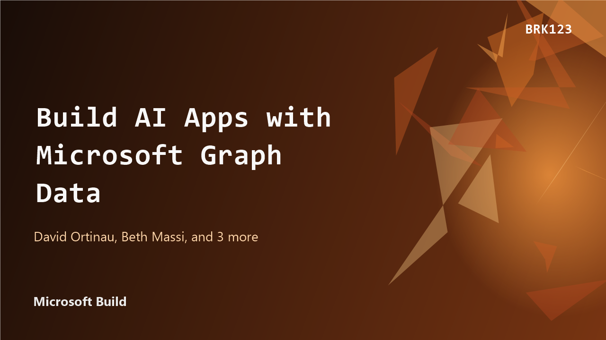

# Session Summary: AI-Infused Mobile & Desktop Apps with .NET MAUI

**Session Date:** 2025-05-22 (Microsoft Build, May 19–22, 2025)  
**Summary Date:** 2026-06-14  
**Summarized By:** Dario Airoldi  
**Recording Link:** [Microsoft Build 2025 — Session BRK123](https://build.microsoft.com/en-US/sessions/BRK123?source=sessions)  
**Duration:** ~1 hour  
**Speakers:** David Ortinau (Product Manager, .NET MAUI), Beth Massi (Product Manager, .NET), Gerald Versluis (Developer Advocate, .NET MAUI), Uma Maheswari Chandrabose (Syncfusion), Maddy  
**Associated Analysis:** —



---

## Executive Summary

This session demonstrates how to build **intelligent, AI-infused mobile and desktop apps** with **.NET MAUI**, covering both the *agentic app* (AI embedded in the app experience) and *agentic DevOps* (AI embedded in the development lifecycle). Through live demos on a real phone, the speakers show personalization, context awareness, and multi-modal interaction in a .NET MAUI app, then turn to Blazor Hybrid web UI, the Syncfusion partnership, and AI-assisted development with Visual Studio, GitHub Copilot, and .NET Aspire. The audience value is a practical picture of how little code is now needed to add meaningful AI capabilities to cross-platform apps.

---

## Table of Contents

- 🧠 [Building Intelligent Apps](#building-intelligent-apps)
- 🎯 [Three Pillars of AI-Enhanced UX](#three-pillars-of-ai-enhanced-ux)
- 📐 [AI Design Principles](#ai-design-principles)
- 📱 [Live Demo: The Intelligent To-Do App](#live-demo-the-intelligent-to-do-app)
- 🛠️ [Technical Implementation with Microsoft.Extensions.AI](#technical-implementation-with-microsoftextensionsai)
- ☁️ [On-Device vs. Cloud Processing](#on-device-vs-cloud-processing)
- 🌐 [.NET MAUI Hybrid Apps](#net-maui-hybrid-apps)
- 🤝 [Syncfusion Partnership](#syncfusion-partnership)
- 🤖 [Agentic DevOps with Visual Studio and Copilot](#agentic-devops-with-visual-studio-and-copilot)
- 📊 [.NET Aspire Orchestration for MAUI](#net-aspire-orchestration-for-maui)

---

## Session Content

### Building Intelligent Apps

**Discussed by:** David Ortinau

**Key Points:**

- An **intelligent app** brings AI into the app to do something unexpected and non-deterministic — behavior that depends on context rather than fixed, deterministic logic.
- The mental shift is to focus on **what you want the computer to do, not how to do it**: users express *intention* rather than step-by-step instructions.
- The space splits into two halves: **agentic apps** (AI inside the app you build) and **agentic DevOps** (AI inside your Visual Studio / GitHub development workflow).
- AI output can be "squirrelly" (unpredictable), so apps must be designed to tolerate and guide that variability.

> "Focus on what you want the computer to do, not how to do it." — David Ortinau

---

### Three Pillars of AI-Enhanced UX

**Discussed by:** David Ortinau

The session frames three ways AI reshapes user experience in MAUI apps:

**Key Points:**

- **Personalization** — the same app can adapt its UI on the fly, in real time, per user (e.g., AI-prioritized tasks shown only to that user); personalization can serve both *purpose* and *preference*, and users opt in to what the app may access.
- **Context awareness** — the app uses calendar, GPS/location, device sensors, and time of day to make relevant, in-the-moment suggestions.
- **Multi-modal interaction** — voice (speech-to-text), vision (camera), and traditional touch/keyboard input, with the user able to switch between modalities depending on their situation.

---

### AI Design Principles

**Discussed by:** David Ortinau

Grounded in published HCI research, the session outlines principles for responsible AI app design:

**Key Points:**

- **Design responsibly** — solve real problems, minimize harm, and apply mitigation layers rather than chasing flashy features.
- **Design for mental models** — different users conceptualize the same task differently; flexible AI-driven UI lets one app serve multiple mental models (illustrated by a healthcare-claims data-entry anecdote).
- **Design for appropriate trust and reliance** — make the AI's reasoning visible ("why did you prioritize this?") so users can understand and calibrate trust.
- **Design for generative variability** — expect unpredictable output and provide guardrails and user controls.
- **Design for co-creation** — enable collaborative, iterative refinement between user and AI.
- **Design for imperfection** — surface uncertainty, provide fallbacks, and set expectations.
- Microsoft resources noted: the **HAX Toolkit**, the **system message / safety framework**, and the **Azure AI Foundry model catalog** for choosing the right model per use case.

---

### Live Demo: The Intelligent To-Do App

**Discussed by:** David Ortinau

**Demo Summary:**
David live-demoed a .NET MAUI to-do app (built on the .NET 9 sample-content template with SQLite) running on a physical phone, progressively "plussed up" with AI capabilities:

- **AI task prioritization** — after granting calendar, location (GPS), and personal-preference context (plus a bring-your-own-key setup), the app reorders tasks; its top suggestion was to celebrate the successful delivery of his Build presentation, with the principle that the user should be able to ask *why* it was prioritized.
- **Voice → task (multi-modal)** — spoken input ("reservation at a local brewery") was transcribed via **Whisper**, filtered down to intent, and turned into a task.
- **Vision → shopping list** — a photo of a banana-bread recipe (via MediaPicker) was converted by an AI vision model into a shopping list rather than a recipe; David noted he trimmed a real cloud round-trip latency from the recording.
- **Tool calling** — a custom **location tool** backed by the **Google Places API** supplies local context to the model.
- The UI animation around the AI feature was generated by Claude 3.7, not hand-coded.

**Key Takeaway:** capabilities that required specialized teams two years ago can now be built from the couch with a few lines of code, and MAUI is a strong candidate for delivering them.

**Resources mentioned:**

- Google Places API · Whisper (speech-to-text) · Claude 3.7

---

### Technical Implementation with Microsoft.Extensions.AI

**Discussed by:** David Ortinau

**Key Points:**

- **Microsoft.Extensions.AI** provides a small, unified API surface: supply an API key and model name to get a chat client you can send requests to.
- **Structured output** removes the old burden of hand-crafting JSON-format prompts — the model returns typed results directly (used for task prioritization).
- **Tool calling / MCP** lets the model invoke functions (e.g., the Google Places location tool) described by a simple description string; implementation detail is hidden behind that description.
- **Multiple models** are used in the same app — different models for voice, vision, and general-purpose chat — and you can prototype with one, find its limits, then swap in others.
- **Security:** bring-your-own-key, never embed keys in client code; encrypt and prefer server-side key handling because client apps ship to many devices.

> "I don't have to do a bunch of JSON things telling it, 'Give me the JSON in this format.'" — David Ortinau (on structured output)

---

### On-Device vs. Cloud Processing

**Discussed by:** David Ortinau

**Key Points:**

- **Cloud** gives access to the latest, most powerful models without device storage constraints, but adds latency (the image round-trip in the recipe demo was noticeably slow).
- **On-device** with **ONNX Runtime** reduces latency, preserves privacy, enables offline use, and lowers cost — best for small, purpose-built models; the integration code is described as straightforward.
- Picking the right model for the use case (voice vs. vision vs. chat) matters more than always using the biggest model.

---

### .NET MAUI Hybrid Apps

**Discussed by:** Beth Massi

**Key Points:**

- **Hybrid apps** blend native and web technology: web UI (HTML/CSS/JS) with full access to native device APIs, distributed through app stores for greater reach and developer productivity.
- Two MAUI controls cover two approaches:
  - **BlazorWebView** — brings the full Blazor model (templates, components, validation, auth, Hot Reload, tight Copilot inner loop) into MAUI.
  - **HybridWebView** — brings other JS frameworks (Angular, Vue, React) into MAUI with JavaScript ↔ C# interop; **.NET 10 Preview 5** adds hooks for intercepting web requests.
- **Code reuse:** a shared **Razor Class Library** holds UI components; the MAUI client calls minimal Web APIs over HttpClient while the server talks to the database directly.

**Demo Summary:**
Beth showed a "task-o-matic" admin page built once in a shared Razor library and rendered identically via BlazorWebView on a Windows (WinUI) app and an Android app, with responsive design provided by Syncfusion Blazor controls.

---

### Syncfusion Partnership

**Discussed by:** Uma Maheswari Chandrabose

**Key Points:**

- Syncfusion offers ready-to-use UI components (1,900+ controls across Blazor, .NET MAUI, Angular, React, etc.) plus document-processing libraries (PDF, Word, Excel, PowerPoint).
- Open-source contribution to the .NET MAUI framework repository: **320+ PRs merged in six months**, **100+ under review**, accounting for roughly **65% of community contributions**; Syncfusion also reviews community PRs first-pass and triages issues daily.
- Working close to the framework source sped up Syncfusion's own development, improved control quality/compatibility, and let them test against MAUI beta builds before release.
- **New controls** (added recently): date picker, picker, time picker, date-time picker, and linear/circular progress bars — all optimized for **AOT and trimming** (notably for faster, lighter iOS apps).

> "We feel so humbled and proud to give back to the community along with Microsoft." — Uma Maheswari Chandrabose

---

### Agentic DevOps with Visual Studio and Copilot

**Discussed by:** Gerald Versluis

**Key Points:**

- "DevOps" expands beyond CI/CD to AI assistance everywhere in the toolchain — the Copilot icon shows up across Visual Studio and GitHub.
- **GitHub Copilot agent mode** (Visual Studio 17.14) acts as a peer: it doesn't just suggest, it implements feature requests, retriggers builds, and inspects build output.
- **Copilot Vision** turns design images/sketches into XAML, references existing assets (e.g., a logo file in the repo), and integrates with **Figma via MCP (Model Context Protocol)**.
- **Design-time tooling**: XAML Live Preview and Hot Reload show changes without entering a debug session; Copilot can also read component documentation (e.g., Syncfusion docs) so you don't have to.
- AI also handles writing **tests and documentation** and acts as a sounding board for alternative implementation approaches.
- Security reminder for mobile: never ship keys in the client app, since the client binary is widely distributed and easy to inspect.

**Demo Summary:**
Gerald prompted Copilot to generate XAML from a design reference, refined it to use Syncfusion controls, and wired up navigation/business logic — all visible live via XAML preview without running a debug session.

---

### .NET Aspire Orchestration for MAUI

**Discussed by:** Gerald Versluis

**Key Points:**

- **.NET Aspire** provides a **code-based representation of the whole app landscape** via an *app host* (bootstrapper) project — effectively a "multi-project startup on steroids" with service discovery and configuration.
- A MAUI app can be enlisted into an Aspire orchestration (some manual wiring today; a Visual Studio context-menu option is coming) alongside web/API projects, choosing the target platform as usual.
- **Observability**: the Aspire **dashboard** centralizes logs, traces (HTTP calls), and metrics — including telemetry and `ILogger` messages flowing from the MAUI app via the MAUI SDK and OpenTelemetry.
- **Aspire 9.3** brings **Copilot into the dashboard**: instead of digging through logs, you can ask "what's going on?" and get a human-readable diagnosis with recommendations.
- Future direction: hooking up OpenTelemetry to detect issues like memory leaks.

**Demo Summary:**
Gerald showed an Aspire app host orchestrating a shared project, a MAUI app, and a website, with the dashboard surfacing a MAUI-originated error as a red indicator and Copilot explaining it in plain language.

---

## Main Takeaways

1. **AI capabilities are now low-code in MAUI**
   - With `Microsoft.Extensions.AI`, adding chat, vision, voice, and tool calling takes only a handful of lines.
   - This lowers the barrier to building intelligent cross-platform apps dramatically.

2. **Design for AI, not just with AI**
   - Personalization, context awareness, and multi-modality must be paired with responsible-design principles (transparency, trust calibration, guardrails for variability).

3. **Hybrid + native is a spectrum, not a choice**
   - BlazorWebView and HybridWebView let teams reuse existing web UI and skills while keeping native device access; a shared Razor library maximizes reuse across Windows, Android, and web.

4. **Agentic DevOps is here in the IDE**
   - Copilot agent mode, Copilot Vision (design-to-XAML, Figma via MCP), and Aspire's Copilot-enabled dashboard move AI into building, debugging, and observability — not just coding.

5. **Open-source partnership is sustaining MAUI**
   - The Syncfusion collaboration (65% of community contributions over six months) is a model for sustainable, community-driven framework growth.

---

## Questions Raised

No formal Q&A segment was captured in the recording; audience interaction was limited to informal call-and-response during the live demos.

---

## Action Items

- [ ] Evaluate `Microsoft.Extensions.AI` (structured output + tool calling) for adding AI features to existing MAUI apps.
- [ ] Decide cloud vs. on-device (ONNX Runtime) per scenario based on latency, privacy, and cost.
- [ ] Pilot BlazorWebView/HybridWebView with a shared Razor Class Library to reuse web UI across platforms.
- [ ] Try GitHub Copilot agent mode and Copilot Vision in Visual Studio 17.14+ for design-to-XAML workflows.
- [ ] Capture the session's resource slide (`aka.ms` link shown at the end) for the full link set.

---

## Decisions Made

This was a presentation/demo session; no organizational decisions were made. Recommended technical directions are captured under Main Takeaways and Action Items.

---

## 📚 Resources and References

**Classification rules:** `.github/instructions/documentation.instructions.md` → Reference Classification  
**Markers:** `📘 Official` · `📗 Verified Community` · `📒 Community` · `📕 Unverified`

### Session Materials

**[Microsoft Build 2025 — Session BRK123](https://build.microsoft.com/en-US/sessions/BRK123?source=sessions)** `[📘 Official]`  
Full session recording covering the intelligent-app demos, hybrid apps, the Syncfusion update, and agentic DevOps with Visual Studio and .NET Aspire.

### Official Documentation

**[.NET MAUI documentation](https://learn.microsoft.com/dotnet/maui/)** `[📘 Official]`  
The official hub for .NET Multi-platform App UI, covering native cross-platform apps for Android, iOS, macOS, and Windows. Directly relevant as the framework the entire session is built around.

**[Microsoft.Extensions.AI libraries](https://learn.microsoft.com/dotnet/ai/microsoft-extensions-ai)** `[📘 Official]`  
Documents the unified `IChatClient` / `IEmbeddingGenerator` abstractions, structured output, tool/function calling, and middleware (telemetry, caching) demonstrated in the to-do app.

**[ASP.NET Core Blazor Hybrid](https://learn.microsoft.com/aspnet/core/blazor/hybrid/)** `[📘 Official]`  
Explains BlazorWebView and how Razor components render natively in an embedded Web View — the basis for Beth Massi's hybrid-app demo and cross-platform UI reuse.

**[Integrate a .NET MAUI app into an Aspire orchestration](https://learn.microsoft.com/dotnet/maui/data-cloud/aspire-integration)** `[📘 Official]`  
Guidance for enlisting a MAUI app into a .NET Aspire app host with service discovery and OpenTelemetry, matching Gerald's orchestration and dashboard demo.

**[.NET Aspire documentation](https://learn.microsoft.com/dotnet/aspire/)** `[📘 Official]`  
The code-first orchestration and observability stack used to coordinate the MAUI app, web app, and API, including the dashboard for logs, traces, and metrics.

**[Model Context Protocol (MCP)](https://modelcontextprotocol.io/)** `[📘 Official]`  
Open protocol referenced for the Figma → Copilot Vision integration, enabling tools and data sources to be exposed to AI models in a standard way.

**[ONNX Runtime](https://onnxruntime.ai/)** `[📘 Official]`  
Cross-platform engine for running small, purpose-built models on-device (mobile included), supporting the on-device vs. cloud trade-offs discussed for latency and privacy.

**[Azure AI Foundry model catalog](https://learn.microsoft.com/azure/ai-foundry/how-to/model-catalog-overview)** `[📘 Official]`  
The catalog referenced for selecting the right model per use case (voice, vision, general chat) when building intelligent apps.

### Community / Vendor Resources

**[Syncfusion .NET MAUI controls](https://www.syncfusion.com/maui-controls)** `[📒 Community]`  
Vendor catalog of .NET MAUI UI controls — including the text input layout, pickers, and progress bars highlighted in the session — plus the open-source toolkit contributed to the MAUI framework.

**[Syncfusion open-source .NET MAUI Toolkit](https://www.syncfusion.com/net-maui-toolkit)** `[📒 Community]`  
The free, open-source toolkit behind the partnership numbers Uma cited (320+ merged PRs, new date/time pickers and progress bars optimized for AOT and trimming).

---

## Follow-Up Topics

1. **Structured output patterns in Microsoft.Extensions.AI** — how typed results replace manual JSON prompting in practice.
2. **On-device model selection with ONNX Runtime** — choosing and packaging small models for MAUI on iOS/Android.
3. **HybridWebView request interception (.NET 10 Preview 5)** — what the new hooks enable for Angular/React/Vue inside MAUI.
4. **Aspire + Copilot dashboard diagnostics** — wiring MAUI telemetry through OpenTelemetry for memory-leak and error detection.

---

## Next Steps

- Prototype one AI capability (prioritization or vision) in an existing MAUI app using `Microsoft.Extensions.AI`.
- Review the official resource links above and the end-of-session `aka.ms` slide for getting-started material.
- Watch the .NET MAUI session recordings from .NET Conf for follow-on content.

---

## Related Content

**Related articles in this repository:**

- [BRK104 — Building the next generation of apps with AI and .NET](../brk104-building-the-next-generation-of-apps-with-ai-and-dotnet/summary.md)
- [BRK226 — Boost Development Productivity](../brk226-boost-development-productivity/summary.md)

**Series:** Microsoft Build 2025 — Breakout Sessions

---

## Transcript Segments

<details>
<summary>Expand for key transcript excerpts</summary>

### Building Intelligent Apps

```
What's an intelligent app? It is that app where you're bringing AI into the app
and you're doing something unexpected. ... It's not deterministic, it depends on
all kinds of other factors. ... focusing on what you want the computer to do, not
how to do it — you just express your intention and it can do it.
```

### Multi-Modal Demo (voice to task)

```
I need to get an invite to a local brewery ... it's going to transcribe that using
the Whisper transcription ... it filtered that out and got down to the brass tacks
of the thing that I needed, which was to get a reservation at a local brewery.
```

### Microsoft.Extensions.AI

```
Provide it the API key, tell it the model you want to use and you've got a client
you can start sending stuff to. ... I don't have to do a bunch of JSON things
telling it, "Give me the JSON in this format."
```

### Syncfusion Partnership

```
In the last six months alone to the .NET MAUI framework repository we have merged
320-plus PRs and 100-plus were under review. This almost covers 65% of the entire
community contributions.
```

</details>

---

*Recording Type: Presentation*  
*Tags: dotnet-maui, ai, blazor-hybrid, copilot, dotnet-aspire, build-2025*  
*Status: Draft*

<!--
---
validations:
  structure:
    last_run: null
    outcome: null
article_metadata:
  filename: 'summary.md'
  created: '2026-06-14'
  status: 'draft'
---
-->
