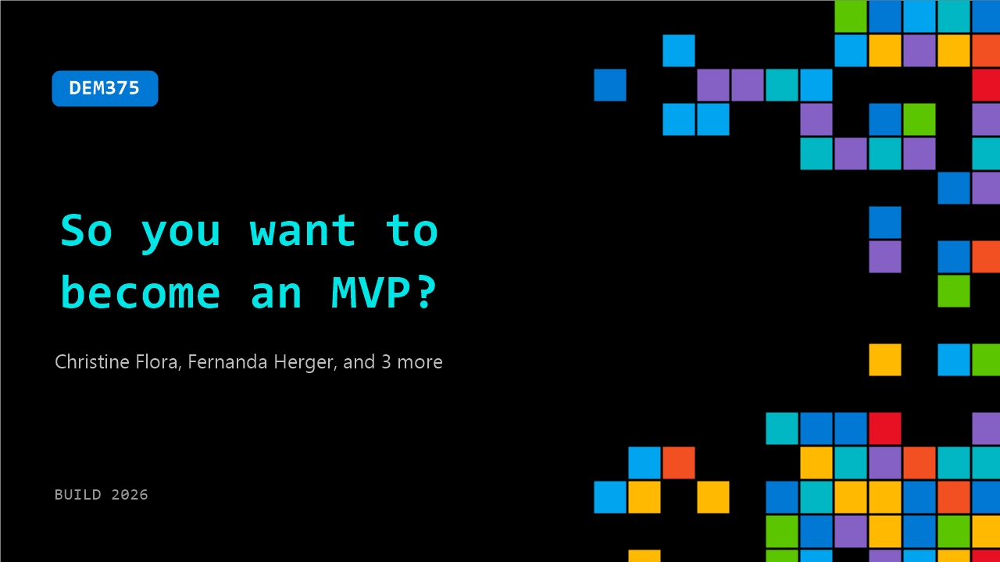

# DEM375: So you want to become an MVP?

**Session code:** DEM375  
**Date:** Tuesday, June 2, 2026 / 4:00 PM - 4:25 PM PDT (Duration 25 minutes)  
**Watch on-demand:** <https://build.microsoft.com/en-US/sessions/DEM375>

---

## Speakers

- **Christine Flora** - CTO / BizApps Practice Director, Microsoft MVP
- **Fernanda Herger** - Principal Customer Exp Mgr, Microsoft
- **Stephen Simon** - Program Manager, Global AI Community
- **Jeremy Sinclair** - Software & AppSec Architect, Orrick, Herrington & Sutcliffe, LLP
- **Betsy Weber** - Senior Global Engagement Lead, Microsoft

## About the session

Passionate about sharing knowledge and making an impact in tech? Learn what it takes to become a Microsoft MVP from those who’ve done it and hear directly from MVP Program staff. Discover how to expand your influence, showcase your expertise, and practical tips for getting nominated. Walk away with a roadmap for growing your contributions and positioning yourself for MVP success.

Seating for this session is first-come, first-served. Add it to your schedule to plan your day and arrive early to secure a spot.

## AI summary

**Introductions and Overview of the MVP Program:** At the start of the video (00:00:02–00:00:19), Betsy Weber, Senior Engagement Lead at Microsoft, welcomes the audience and introduces Fernanda Sariva, Principal Customer Experience Program Manager. They begin by explaining the Microsoft MVP (Most Valuable Professional) Program (00:00:45–00:01:07). The MVP award recognizes outstanding community leaders who freely share technical expertise, provide real-world insights on Microsoft products, and deliver feedback to help shape innovations. Betsy emphasizes that MVPs are passionate contributors who actively engage with and help build the Microsoft community worldwide.

**Global Reach and Community Impact:** Fernanda continues by describing the global landscape of the MVP program (00:01:32–00:02:32). With over 4,000 influencers across 96 countries speaking nearly 50 languages, the MVP network is a diverse and vibrant community. She encourages viewers who are active in local tech communities to consider joining, noting the continual expansion of the program’s global influence. This section highlights the collaborative spirit that defines MVPs—building communities, fostering knowledge exchange, and promoting growth through collective engagement.

**Becoming an MVP and Areas of Contribution:** The conversation then focuses on how individuals can become MVPs (00:02:33–00:05:28). Fernanda explains that potential MVPs should start by engaging in activities they are passionate about—such as writing blogs, creating videos, contributing to open-source projects, or supporting peer groups. Technical expertise, leadership, and meaningful community impact over time are key criteria. She emphasizes that contributions are not limited to Microsoft technologies; people who love sharing knowledge, regardless of their technical focus, are welcome. Betsy clarifies that blogging, podcasting, or open-source work are optional ways to participate—the heart of the program lies in genuine community involvement and sharing expertise freely.

**Benefits and Recognition of MVPs:** Betsy outlines the numerous benefits and experiences MVPs enjoy (00:06:56–00:08:32). These include professional recognition, access to non-disclosure (NDA) product insights, roadmaps from Microsoft product groups, and feedback opportunities for shaping future development. MVPs also attend exclusive events such as the annual MVP Global Summit at Redmond, gaining chances for collaboration and networking with engineers and other community leaders. The experience offers personal and professional growth, credibility within the tech community, and connections worldwide.

**Real MVP Stories and Guidance:** The session transitions to interviews with real MVPs like Jeremy Sinclair and Christine (00:09:30–00:24:56). They share how they first got involved, the personal and career transformations that followed, and strategies for balancing work and community contributions. Their advice centers on authenticity—doing what you love, staying consistent, and helping others without focusing solely on earning the award. Betsy reinforces this point by noting that the most re-awarded MVPs are those who contribute continuously out of passion rather than obligation.

**Wrap-Up and How to Get Nominated:** In conclusion (00:25:00–00:25:47), Betsy and Fernanda summarize three simple steps to become an MVP: be an expert, do what you love, and let Microsoft know about your contributions. Nominations can be made by either a current MVP or a Microsoft employee. They encourage the audience to visit the MVP Learn website (aka.ms/mvp/learn) to explore resources and opportunities, inviting continued engagement across future sessions. The video ends on an encouraging note—celebrating community, collaboration, and the ever-growing impact of the Microsoft MVP ecosystem.

## Session tags

- **Session type:** Demo
- **Level:** (100) Foundational
- **Tags:** Community
- **Location:** Gateway Pavilion, Level 2, Theater B
