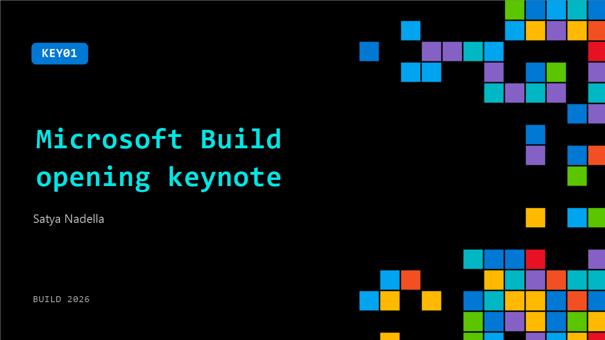

# KEY01: Microsoft Build opening keynote

**Session code:** KEY01  
**Date:** Tuesday, June 2, 2026 / 9:30 AM - 12:00 PM PDT (Duration 2 hours 30 minutes)  
**Watch on-demand:** <https://build.microsoft.com/en-US/sessions/KEY01>

---

## Speakers

- **Satya Nadella** - Chairman and CEO, Microsoft

## About the session

Satya Nadella and Microsoft leaders share how Microsoft is creating new opportunity for developers across our platforms in this era of AI.

There is limited seating in the Festival Pavillion for the keynote. Please arrive early to secure a spot. Additional keynote viewing areas will be available in the outdoor theater, BATS Theater (building B), Cowell Theater, and inside Gateway Pavillion, level 2, at all theaters.

## AI summary

**Opening and Vision for Developers:** The session begins with 00:01:23 by greeting developers at Microsoft Build in San Francisco, emphasizing how developer conferences capture moments of technological transformation. The focus is on understanding the changing tech stack and the opportunities it brings for developers, companies, and society. The central idea is participating in the “frontier intelligence ecosystem” — not bound to one platform but about building compounding value on top of it. Satya Nadella lays out that the purpose of this conference is to unpack the emerging AI stack from compute infrastructure to agents, governance, and the developer tools that empower innovation.

**Infrastructure and Edge Compute Innovations:** At 00:03:20, Nadella outlines the AI stack’s foundation—an interconnected compute fabric running from edge to cloud. He highlights the power of Windows at the edge, citing how PCs now host powerful local AI capabilities. Tools like Outlook’s summarization or PowerPoint’s visual aids run on local AI models using NPUs and GPUs. Microsoft expands Windows ML and Windows AI, introducing onboard reasoning models like Ion Instruct and agentic models such as Ion Plan. Hardware innovation is also emphasized, with collaboration from AMD, Intel, Qualcomm, and NVIDIA—the latter powering the new RTX Spark SoC and the Surface Laptop Ultra. Developers are introduced to the Surface RTX Spark Dev Box at 00:08:06, a machine delivering petaflop-level AI compute designed specifically for software creation. This evolution represents “unmetered intelligence” directly on user devices.

**Developer Tools and Local AI Experiences:** Around 00:12:08, Kayla demonstrates how Windows becomes a distraction-free, AI-enhanced development environment running on the Surface RTX Spark. She shows off vertical taskbars, performance-optimized dev drives, new intelligent terminals integrated with GitHub Copilot, and WSL containers with full GPU utilization. The presentation details how developers can build and test sophisticated AI agents locally while maintaining productivity, privacy, and cost efficiency. This part of the keynote reinforces that Windows now offers the richest native development experience with Linux and Mac ecosystem tools—merging versatility, security, and multi-model AI capabilities directly on the developer desktop.

**Cloud Scale and Responsible Infrastructure:** As the focus shifts to the cloud at 00:19:00, Nadella discusses Azure’s rapid global expansion, scaling both capacity and environmental stewardship. Data centers are being engineered for efficiency—achieving near-zero water operation and sustainable power design. He unveils innovations like the AMD MI300 and the custom ARM-based Cobalt CPUs and networks designed for the dominant AI workloads: training, inference, and agent runtime. Collaborations with NVIDIA are outlined, emphasizing cloud architecture tuned for “tokens per dollar per watt.” Nadella and Jensen Huang jointly discuss the synergy between AI PCs (RTX Spark) and advanced data centers powered by systems like Vera Rubin, which enable secure confidential computing and large-scale agent workloads—all forming the foundation of the AI-driven ecosystem of the future.

**Agentic Devices and Project Solara:** At 00:38:36, a major shift is introduced through Project Solara. Stevie Bathiche and team reveal this as the platform for new "agent-first" computing—an ecosystem that connects specialized devices through Azure. Two prototypes, a stationary agent terminal and a portable smart badge, showcase how agents interact contextually. Demonstrations show voice and vision-based real-time intelligence, with implications across industries from healthcare to retail. Qualcomm’s Cristiano Amon joins remotely, discussing silicon architectures adapted for distributed intelligence. Solara signals the evolution from single-device computing to interconnected personal agents functioning seamlessly across environments—a key milestone toward an agentic platform layer spanning cloud, device, and edge.

**From Local Agents to Foundry and Frontier AI:** Beginning at 01:16:00, the focus returns to Microsoft Foundry, the platform for building, hosting, and governing long-running AI agents. GitHub Copilot evolves into a full application layer, connecting with Foundry and the Rayfin SDK to offer backend services for coding agents. Live demos show creation of persistent, autonomous workflows integrated into enterprise systems. Later, Foundry’s governance layer, Agent 365, ensures containment, security, and compliance across all agentic systems. In 01:49:00, Mustafa Suleyman introduces the “Mai” model family—new reasoning, imaging, and voice models powering this ecosystem. The introduction of Frontier Tuning enables developers and enterprises to create bespoke reinforcement learning environments, turning their operational data into proprietary “hill climbing” intelligence tuned to their business objectives.

**Scientific Discovery, Quantum Advancements, and Closing Vision:** At 02:11:09, Satya presents Microsoft Discovery, a revolutionary platform combining AI agents, HPC, and lab automation to accelerate real-world scientific progress. A live demonstration shows Discovery autonomously hypothesizing, modeling, and validating new proteins for sustainable plastics recycling—linking digital AI reasoning with automated wet labs. This merges physical and computational domains, redefining discovery. The keynote concludes with the unveiling of the Majorana 2 quantum chip at 02:19:04, achieving breakthrough reliability and density for the coming quantum era. Nadella closes by reaffirming Microsoft’s north star: using frontier technologies—AI, autonomous agents, and quantum computing—to expand human opportunity responsibly, making this ecosystem a collective engine for progress rather than concentrated power.

## Session tags

- **Session type:** Keynote
- **Level:** (200) Intermediate
- **Tags:** AI, Windows
- **Location:** Festival Pavilion
