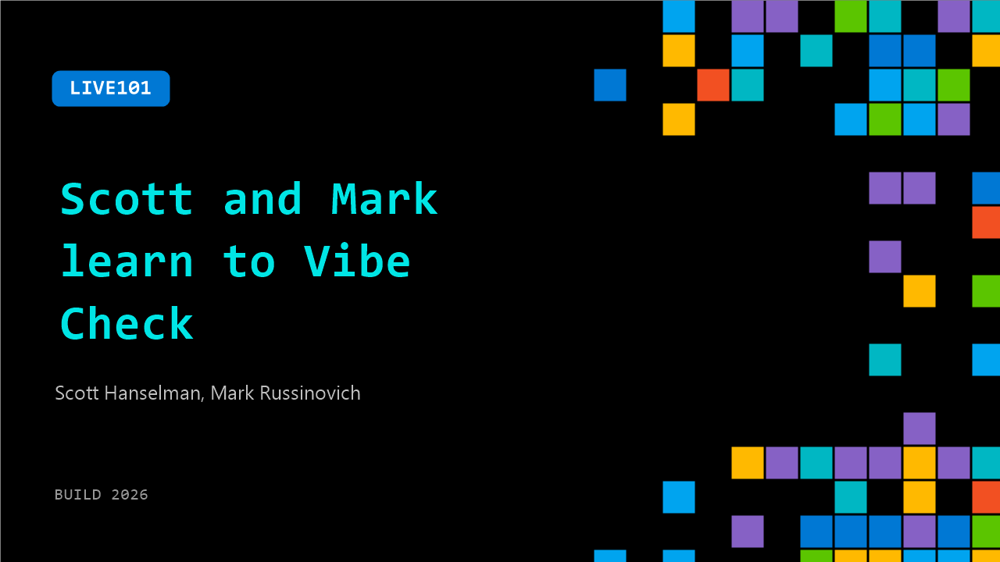

# LIVE101: Scott and Mark learn to Vibe Check

**Session code:** LIVE101  
**Date:** Tuesday, June 2, 2026 / 1:15 PM - 2:30 PM PDT (Duration 1 hour 15 minutes)  
**Watch on-demand:** <https://build.microsoft.com/en-US/sessions/LIVE101>

---

## Speakers

- **Scott Hanselman** - VP, Member of Technical Staff for Microsoft/GitHub, Microsoft
- **Mark Russinovich** - Chief Technology Officer, Deputy CISO, and Technical Fellow, Microsoft Azure, Microsoft

## About the session

AI can turn an idea into a working demo faster than ever. But can that demo survive two experts who have seen every trick in the book? In this live Build showcase, developers present AI-assisted apps, agents, tools, and workflows to Mark Russinovich and Scott Hanselman. Mark and Scott will ask how it works, where the seams are, what the AI actually built, and whether the result is clever prototype, production-ready software, or something unexpectedly magical. Come for the demos. Stay for the technical reveal.

## AI summary

**Opening and Concept Introduction:** The program begins with Scott Hanselman introducing the segment “Scott and Mark Learn to Vibe Check,” joined by Mark Russinovich, who is intentionally kept in the dark about the day’s agenda 00:00:36. The hosts explain their plan to humorously assess community-created AI projects to determine whether they represent “AI slop,” creative “vibes,” or genuine “AI-augmented software engineering.” They liken the format to a “Fool Us”-style session, where developers present applications and explain their implementation. The spirit is playful but aimed at showcasing how tools such as GitHub Copilot and similar technologies influence software craftsmanship. Before diving into the demonstrations, the hosts recognize sponsors for enabling such inventive programming 00:02:02.

**Early Sponsor Highlights and AMD Partnership:** The broadcast transitions briefly to the Microsoft Build show floor in San Francisco at the AMD booth 00:02:28. Scott interviews Adrian from AMD about a longstanding partnership with Microsoft. The discussion centers on fostering a developer ecosystem that enables rapid experimentation through open tooling and infrastructure. With the cost of exploration approaching zero, developers can prototype AI solutions more freely than before. Adrian highlights how this democratization of experimentation empowers creators but also adds complexity through the number of available models, frameworks, and compute configurations. Viewers are encouraged to explore related resources on AMD’s sponsor page before the show cuts back to the main vibe check segment 00:04:24.

**First Vibe Check – Steve Sanderson’s “Vibe OS”:** Returning to the main stage, Scott and Mark welcome software engineer Steve Sanderson, known for projects like Knockout.js and Blazor 00:04:49. Sanderson unveils “Vibe OS,” described as the world’s first “hallucinated operating system.” Demonstrating live, he boots a lightweight virtual disk file and launches familiar applications such as Notepad and Calculator. Remarkably, these interfaces function without any underlying application code—each UI element is dynamically generated by an AI model through the Copilot SDK and HTML-based rendering. Sanderson explains how user interactions are handled via fine-grained diffs fed back to the model. The hosts respond with amazement, calling it intentional slop elevated by engineering expertise. Sanderson’s build process took approximately six hours, highlighting how AI can generate novel experiential software when guided precisely 00:15:49.

**Second Vibe Check – Cassidy Williams’ CSS “Database”: ** The next guest, Cassidy Williams, presents a project that humorously abuses browser technology by constructing a mock SQL database entirely in CSS 00:20:04. Through animated queries and “tables,” she reveals that what seems like traditional JavaScript-driven logic is entirely composed of CSS selectors, variables, and sibling indices. The hosts quiz her about the impractical yet creative effort, probing her methods and her balance between manual coding and Copilot's suggestions. Williams explains she wrote approximately 20% of the code, steering the AI to correct layout and structural issues. Despite its absurd premise, the result pushes boundaries of what “vibe coding” can mean—purposefully cursed yet technically insightful. Her experiment takes just under two hours and wins her praise for embracing both creativity and discipline in AI-assisted authoring 00:31:00.

**Third and Fourth Vibe Checks – Swix’s AIE Bot and Simon Willison’s Data Set Agent:** Later, developer and AI researcher “Swix” demonstrates an “AI Event Scheduler” for managing multi-track conferences 00:33:41. Built on Cloudflare infrastructure with an LLM-driven assistant integrated into chat, email, and web interfaces, the system automatically categorizes and arranges speaking sessions while offering human override and rollback logs. Over a week and a half, Swix developed the fully “vibe-coded” app using multiple small models rather than frontier ones, emphasizing rapid, autonomous development for real-world workflows. Finally, Simon Willison showcases his “Dataset Agent,” a Python-based plugin system leveraging locally or cloud-hosted LLMs to query and visualize his 24-year blog database 00:48:37. He describes how agents craft SQL queries, generate charts, and even run sandboxed Python securely. Willison outlines his methodology for safe AI-assisted development and adversarial model testing, exemplifying how deep domain knowledge amplifies AI’s engineering potential.

**Conclusion and Reflections:** The program closes with booth interviews highlighting sponsor innovations from NVIDIA, Fireworks AI, Elastic, and Qualcomm 01:01:00. Returning to the main stage, Scott and Mark reflect on all four vibe check demos. They agree that while Cassidy’s CSS database borders on pure slop, Sanderson’s Vibe OS, Swix’s scheduler, and Willison’s data agent exemplify sophisticated AI-augmented software engineering. The hosts emphasize that effective “vibe coding” requires foundational expertise and careful technical judgment to turn AI spontaneity into production-level innovation. They sign off with gratitude toward guests, sponsors, and the audience, urging viewers to continue exploring responsible, creative use of AI tools in real-world software development.

## Session tags

- **Session type:** Broadcast Stage
- **Location:** Gateway Pavilion, Level 1, Build Broadcast Stage
