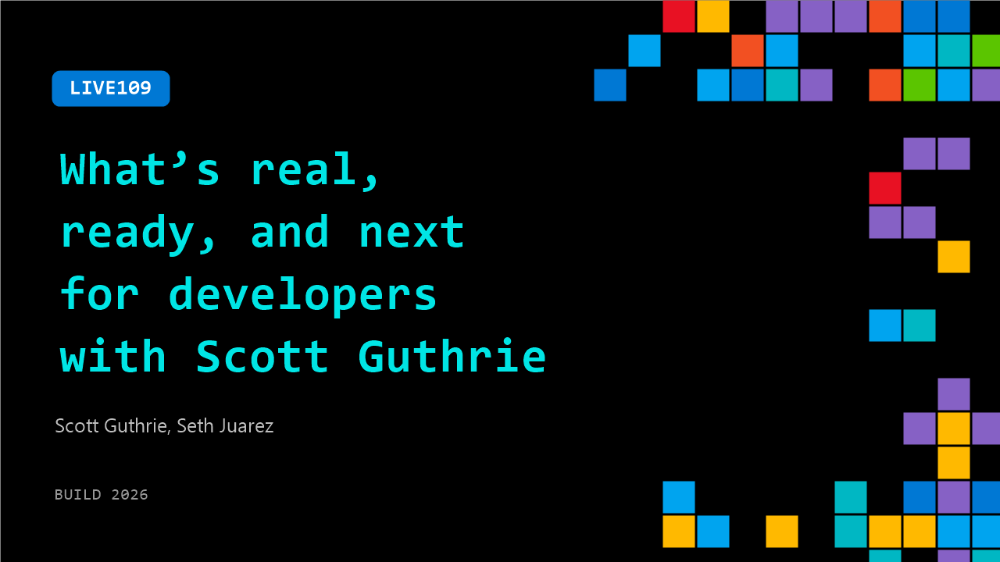

# LIVE109: What’s real, ready, and next for developers with Scott Guthrie

**Session code:** LIVE109  
**Date:** Tuesday, June 2, 2026 / 3:35 PM - 3:50 PM PDT (Duration 15 minutes)  
**Watch on-demand:** <https://build.microsoft.com/en-US/sessions/LIVE109>

---

## Speakers

- **Scott Guthrie** - EVP, Cloud + AI, Microsoft
- **Seth Juarez** - Staff Developer Advocate, Microsoft

## About the session

There’s a lot of noise about AI. In this quick-paced fireside chat, get the builder’s perspective on what actually matters for developers. Drawing from how Microsoft runs a complete system from silicon to software at global scale, Scott breaks down the evolution across AI-ready infrastructure, context layers for agents, and what AI-assisted modernization means for developers.

## AI summary

**Introduction and Context:** The video begins with Seth Juarez welcoming viewers back to Build and introducing his guest, Scott Guthrie (00:00:00–00:00:05). Guthrie explains his role at Microsoft as leading Azure and the broader cloud infrastructure (00:00:20–00:00:27). He emphasizes that Azure serves as the foundation for everything Microsoft builds, from infrastructure and data platforms to higher-level services. At the top of his priorities are expanding global capacity, reducing AI costs through custom silicon (Azure Maia and Azure Cobalt), and maintaining reliability and high performance for AI workloads while enabling tools like GitHub Copilot and Microsoft 365 Copilot (00:00:48–00:01:36).

**Infrastructure Scale and Sustainability:** The discussion moves into the sheer scale of Azure’s global operations (00:01:37–00:02:49). Guthrie shares that Microsoft recently added over a gigawatt of datacenter capacity within 90 days, equivalent to powering a city the size of Seattle (00:01:52–00:02:03). He stresses Microsoft’s commitment to responsible growth, noting its 0-water-waste design and efforts to support local communities through energy stewardship and engagement. Operating in over 80 locations worldwide requires precise planning and execution, backed by skilled tradespeople, strong safety practices, and innovative engineering to ensure both safety and reliability for global customers (00:03:32–00:03:56).

**Engineering Excellence and Technical Depth:** Guthrie elaborates on the complexity of scaling Azure’s software and hardware architecture as capacity doubles every two years (00:04:02–00:05:47). He highlights supply chain constraints in memory and storage and explains how continuous software innovation is required to match growth. To support AI and agentic workloads, Microsoft redesigned core systems such as Cosmos DB to handle global scale by distributing databases regionally with eventual consistency, ensuring seamless replication and fault tolerance (00:06:02–00:06:21). He uses examples like ChatGPT and Copilot to illustrate challenges like chat history management, attachment storage in blob systems, and schema evolution—all done live without downtime.

**Azure Data Services and Innovations:** The conversation transitions into Azure’s data ecosystem, covering SQL, NoSQL, and Postgres-compatible systems (00:07:00–00:10:12). Guthrie categorizes offerings into SQL services such as Hyperscale for SaaS workloads, Cosmos DB supporting large-scale AI solutions, and Horizon DB—a new Postgres service designed for horizontal scale with built-in AI and enhanced elasticity (00:08:23–00:08:53). He introduces Microsoft Fabric, the unified analytics platform with “OneLake,” which integrates data from Databricks, Snowflake, and Power BI models under a single system without the need for data transfer. Fabric IQ—now generally available—connects semantic data directly to Copilot in Microsoft 365 for more intelligent organizational insights (00:09:40–00:10:11).

**Scale, AI Pressure, and Global Replication:** Seth asks about Azure’s massive data scale, with Guthrie revealing that Microsoft now adds exabytes of storage per week—an exponential evolution from traditional petabyte capacities (00:10:26–00:11:03). As AI agents and automated systems introduce millions of requests per second, the architecture must evolve beyond conventional relational designs to globally replicated systems capable of ultra-low latency. These advances ensure apps remain performant under unprecedented load while allowing hybrid use of relational and distributed no-SQL models to balance consistency and scalability (00:11:36–00:11:59).

**AI Transformation and Future Outlook:** In closing, Guthrie reflects on how generative and agentic AI will reshape the software landscape, drawing comparisons to prior waves like mobile and web revolutions (00:12:05–00:13:15). He stresses that AI’s success depends on clean, scalable data, enabled by technologies like Fabric IQ and efficient infrastructure. Advancements at every layer—from VM startup times and ephemeral compute environments to Cobalt processors and improved memory subsystems—are designed for agile, short-lived workloads characteristic of intelligent agents (00:13:37–00:14:15). The video concludes as Seth thanks Guthrie, who confirms that the upcoming AI-driven transformation will be vast and exhilarating for developers and technologists alike (00:14:16–00:14:22).

## Session tags

- **Session type:** Broadcast Stage
- **Location:** Gateway Pavilion, Level 1, Build Broadcast Stage
