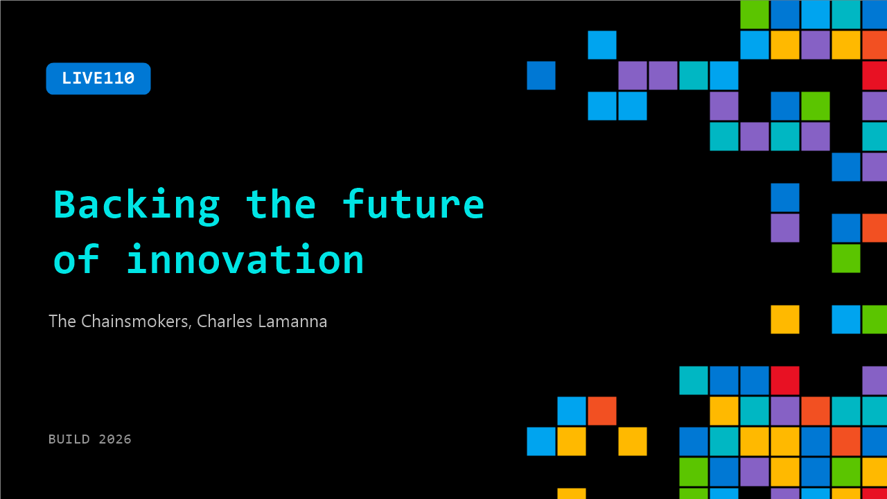

# LIVE110: Backing the future of innovation

**Session code:** LIVE110  
**Date:** Tuesday, June 2, 2026 / 3:15 PM - 3:35 PM PDT (Duration 20 minutes)  
**Watch on-demand:** <https://build.microsoft.com/en-US/sessions/LIVE110>

---

## Speakers

- **The Chainsmokers** - Musical Guest, The Chainsmokers
- **Charles Lamanna** - EVP, Copilot, Agents, and Platform, Microsoft

## About the session

Join Charles Lamanna with the founders of Mantis VC—also known as The Chainsmokers—for a candid conversation on what’s shaping the next wave of innovation.

From building and backing companies to spotting early signals in AI, the discussion will explore what’s gaining real traction, what’s overhyped, and where builders should focus next. Expect honest perspectives on how technology, culture, and go-to-market distribution come together to turn ideas into lasting products.

## AI summary

**Introduction and Overview:** The session begins with a friendly welcome and introductions around 00:00:27. The moderator expresses excitement to host Drew and Alex, known both as members of The Chainsmokers and as leaders of Mantis VC. They explain how their work now intersects music, technology, and startups. The guests highlight that they have been actively investing for years and are about to launch their fourth venture fund 00:01:17. Their enthusiasm centers on technology and entrepreneurship, setting the tone for a conversation exploring the evolution of startups and the future driven by AI.

**Investment Philosophy and Early-Stage Focus:** In the discussion about what they look for when investing, Drew and Alex emphasize that early-stage investing is about backing “the right people” rather than solely metrics or empirical data, since these young companies lack proven records 00:01:31. Their philosophy centers on supporting mission-driven founders who envision where the world is heading, even if their initial predictions are off. They note that great outcomes often result from partnering with resilient, visionary teams. This portion 00:01:56–00:02:09 captures their conviction that founder quality drives long-term success more than specific ideas at inception, and they describe how the capabilities of small teams are expanding dramatically with the emergence of AI “agents” that amplify efficiency across industries.

**Shifting Dynamics with AI and Frontier Technology:** As the conversation deepens around 00:02:25, they discuss how AI is creating new leverage in businesses, enabling smaller teams to scale faster. The speakers argue that technology can make startups more vertically capable and efficient. Alex challenges the notion of a “one-person billion-dollar company” by underscoring the importance of teamwork and partnerships despite increased automation 00:03:36. The dialogue explores how AI lets founders pursue harder, frontier-tech problems—areas once inaccessible due to cost or complexity. This evolution excites them as they see elite talent increasingly moving into frontier AI spaces, such as autonomous agents and complex system architectures that require continuous rethinking of governance, security, and development practices 00:06:00–00:07:32.

**Practical Use of AI Tools and Workflow Integration:** Around 00:08:04, the conversation turns personal with questions about how they use AI tools. Drew mentions leveraging AI heavily for summarizing information and research, improving his productivity and comprehension of complex topics. In contrast, Alex notes they do not currently use AI in music production since their creative process relies on organic collaboration. However, within their venture fund, they have applied AI through systems like Palantir to improve due diligence and operational intelligence 00:09:12. The group discusses integrating AI into existing workflows—rather than forcing new tool adoption—and applauds the growing movement to bring AI into spaces people already work. This section highlights their belief that AI should amplify human talent, not replace it.

**Investment Thesis on AI Layers and Vertical Applications:** Starting near 00:10:26, the discussion dives into where value will accrue within the tech stack. Drew and Alex share that while they have personal investments in major model providers like Anthropic and OpenAI, they expect those layers to become commoditized. Their fund focuses on highly verticalized AI applications in regulated domains like finance, legal, enterprise compliance, and healthcare 00:11:33. They describe investments in companies such as Monaco AI and Kepler that build defensible products through regulatory expertise and proprietary data. The conversation addresses the balance between foundational model providers and application layer innovators, predicting strong opportunities higher up the stack where specialized knowledge and data create enduring moats 00:13:24.

**Culture, Creativity, and Long-Term Resilience:** In the closing segment 00:15:00–00:19:00, Drew and Alex draw parallels between their artistic journey and startup building. They reflect on their early song releases, including one that succeeded commercially but didn’t represent their authentic values. They relate this to founders who pursue opportunities that don’t fit long-term vision and emphasize maintaining clarity of purpose. They advise startup teams to focus on intentional creation, learn quickly from failure, and cultivate a loyal “cult following” around meaningful work. Authenticity, adaptability, and obsession with one’s mission are portrayed as essential traits for survival through volatile technological change. The conversation closes with optimistic commentary about building for the future of AI—investing in founders and ideas anticipating what’s next rather than what’s now—illustrated by their investment in Factory AI 00:19:22–00:20:21.

## Session tags

- **Session type:** Broadcast Stage
- **Location:** Gateway Pavilion, Level 1, Build Broadcast Stage
