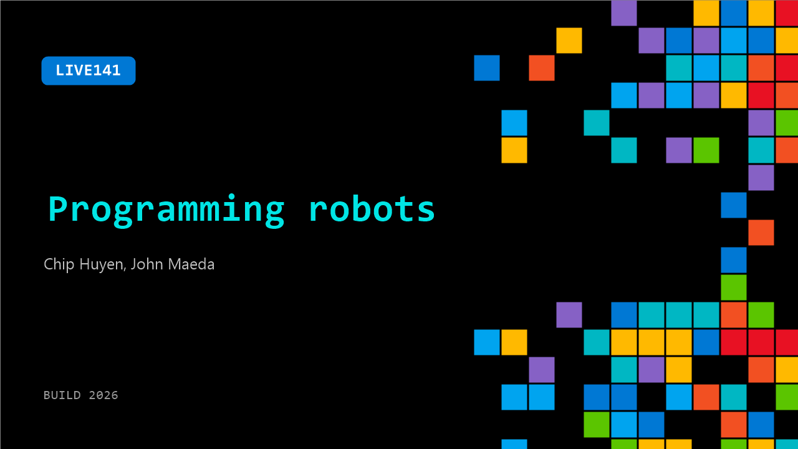

# LIVE141: Programming robots

**Session code:** LIVE141  
**Date:** Tuesday, June 2, 2026 / 3:50 PM - 4:05 PM PDT (Duration 15 minutes)  
**Watch on-demand:** <https://build.microsoft.com/en-US/sessions/LIVE141>

---

## Speakers

- **Chip Huyen** - Builder, Stealth
- **John Maeda** - CVP Eng, Comp Design & Research, Microsoft

## About the session

AI is taking over the digital world, and it's exciting to see how AI can be used in the physical world. Once we have a robot, we need to figure out how to program it to do what we want. This demo shows how we can interface with multiple robots using the same API.

## AI summary

**Introduction and the ChatGPT Moment:** The discussion begins with the host welcoming the audience and introducing guest Chip Yan, who is known for his expertise in AI engineering 00:00:00–00:00:09. Chip recounts his personal reaction to the launch of ChatGPT, describing an intense two-month existential crisis triggered by the realization that AI could now perform both of his core skills—writing and coding—with alarming competence 00:00:20–00:01:02. This period of uncertainty led him to evaluate AI’s broader implications and distill his understanding into his book on AI engineering 00:01:13–00:01:18. He emphasizes how even experts underestimated the exponential usefulness of small performance improvements in AI systems.

**Human Perception and Limits of Digital Intelligence:** Chip explores why AI’s accelerating fluency caught many by surprise, arguing that humans are poor at assessing usefulness relative to incremental accuracy gains 00:01:46–00:02:16. He further contrasts the relative simplicity of modeling the human mind versus the human body, noting that while AI can write code or essays effortlessly, it still struggles with seemingly simple physical actions, such as teaching a humanoid robot to sit gracefully 00:02:20–00:03:12. Unlike the digital world, where structured documentation exists (e.g., for APIs), the physical world lacks predictable parameters—objects can break, children can be harmed, and tactile feedback must be learned experientially 00:03:36–00:04:17.

**Robotics Progress and Challenges:** Transitioning from theory to application, Chip discusses the complexities of building robots that reason and move effectively 00:04:47–00:06:59. He cites Unitary, a profitable robotics firm pursuing an IPO, whose CEO frames robotic intelligence as a combination of reasoning (planning tasks such as fetching water) and motion (executing precise actions). Modern AI excels at step-by-step reasoning, but still struggles with physical feedback—knowing how much pressure to apply without causing damage. Chip highlights research into “world modeling,” where AI learns environmental rules and dynamics, backed by major investments from various startups 00:06:39–00:06:56. For motion, many current robot demonstrations are preprogrammed, and the ultimate challenge remains enabling robots to generate adaptive, natural movements autonomously 00:07:01–00:07:40.

**Integrating Vision, Language, and Motion Models:** When asked about connecting vision and motion, Chip describes two main research directions: vision-language-action (VLA) models and world-model-based systems 00:07:49–00:09:11. VLA approaches ingest visual data and language instructions to generate physical actions, but collecting action data is expensive and often incompatible across robot designs. In contrast, world modeling focuses on encoding environmental properties separately. Researchers are divided on which approach will prevail, with competing camps labeling the other as misguided. Chip concludes that the field remains in flux, and success will be clear only once a model truly works in practice 00:09:00–00:09:11.

**Guidance for Developers and Industry Safety Lessons:** Moving from research to application, Chip advises developers to stay focused instead of chasing every AI advance or funding announcement 00:09:27–00:10:37. He suggests filtering innovations by relevance to personal or practical problems, adopting a “blinder” mindset to maintain direction. The conversation then turns to robot safety, referencing Boston Dynamics’ Spot—a dog-like robot safer than humanoids 00:11:04–00:11:19. Chip explains that humanoids present hazards—an 80‑pound falling metal body is dangerous—so safety design must include low grip strength, distance buffers, and robust battery management to prevent falls during power failures 00:11:39–00:12:50.

**Future Outlook on Robotics:** In conclusion, Chip outlines two emerging schools in robotics development 00:13:16–00:14:09. One focuses on general-purpose robots capable of performing multiple tasks like AI models do with language, though such projects are capital-intensive and data-hungry. The other emphasizes specialized robots built for narrow functions like folding laundry, cooking, or delivery. While Chip is uncertain when general-purpose robots will mature, he expresses optimism about the sector’s trajectory and closes by thanking the audience, encouraging continued innovation and thoughtful focus within AI and robotics 00:14:03–00:14:11.

## Session tags

- **Session type:** Broadcast Stage
- **Location:** Gateway Pavilion, Level 1, Build Broadcast Stage
