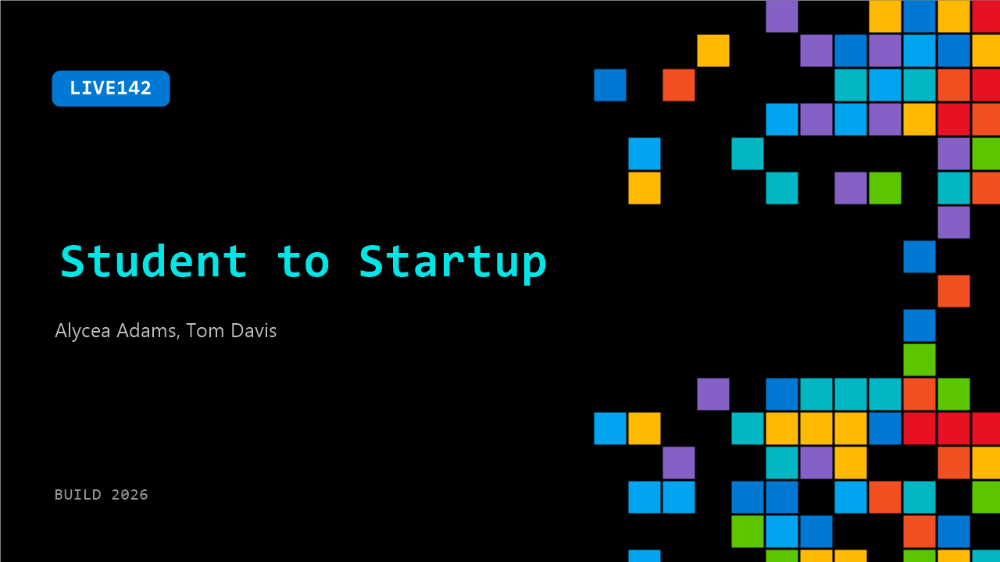

# LIVE142: Student to Startup

**Session code:** LIVE142  
**Date:** Tuesday, June 2, 2026 / 5:45 PM - 6:00 PM PDT (Duration 15 minutes)  
**Watch on-demand:** <https://build.microsoft.com/en-US/sessions/LIVE142>

---

## Speakers

- **Alycea Adams** - Content Creator, Dulcedo
- **Tom Davis** - General Manager - Microsoft for Startups, Microsoft

## About the session

Alycea Adams, founder and Imagine Cup World Championship finalist, joins Tom Davis, GM of Microsoft for Startups, to talk about how Microsoft supports founders at the moments that matter, starting at the student stage. They explore why Imagine Cup is such a strong entry point for early-stage founders ready to move beyond the idea phase, connecting them to the tools, guidance, and ecosystem needed to build and grow.

## AI summary

**Introduction and Background:** At 00:00:00, the interviewer introduces Alicia, the CEO and founder of Hair Match, an Imagine Cup finalist. Alicia explains that Hair Match is a mobile app allowing users, primarily those with textured hair, to upload photos and receive personalized product recommendations. She notes that the idea came from her own experiences struggling to find suitable hair products and wanting to streamline that process through technology.

**Student Founder Journey:** Between 00:00:45–00:01:21, Alicia shares how she launched Hair Match as a student, balancing academics, athletics, and entrepreneurship. A cheerleader and information science major with minors in entrepreneurship and urban planning, she emphasizes having built the skills to handle multiple priorities. She describes turning her personal experience and her online community’s engagement into motivation to test and validate the Hair Match concept, taking advantage of the flexibility and risk tolerance she had as a young founder.

**Technology and Microsoft Partnership:** From 00:02:07 through 00:03:31, Alicia discusses her academic and technical background and how she connected with Microsoft. She recounts meeting her co-founder during an internship at Delta Airlines and learning how to use Microsoft technologies despite not being a developer. Through the Imagine Cup and Microsoft for Startups, Hair Match received mentorship and Azure credits to build their prototype, leveraging design thinking and AI services. The program gave her tools and support to turn her idea into a sustainable startup.

**Growth, AI Integration, and Product Development:** Between 00:04:00–00:06:00, Alicia speaks about Hair Match’s evolution over the past year. She reflects on embracing moments of calm to focus on iterative improvement and user feedback. She explains using Azure OpenAI and AI Foundry models to power the app’s photo recognition capability—allowing users to analyze their hair and receive accurate suggestions. Alicia sees immense potential for vision-language models beyond hair care, emphasizing how accessible AI tools empower non-technical founders to innovate. She also touches on her pivot toward research and development partnerships with major beauty retailers to improve data-driven product creation.

**Business Model and Support from Microsoft:** From 00:07:06–00:08:58, Alicia outlines Hair Match’s subscription-based model. For now, the app is free to build its user base and gather data that will help improve product recommendations and formulations. She credits Microsoft for Startups and the Imagine Cup for providing not just technology but mentorship in pitching, investor relations, and business strategy. Alicia emphasizes how Microsoft’s programs help founders overcome common hurdles and foster a collaborative “family” among young innovators.

**User Insights and Future Vision:** In the final section, 00:09:09–00:13:13, Alicia reveals that her expected audience of young individual users evolved into mothers seeking solutions for their daughters’ hair. She attributes this discovery to using AI models for fine-tuned data collection and multi-shot prompting. Discussing future plans, she intends to grow Hair Match into a data repository for textured hair research to assist product manufacturers. Reflecting personally, Alicia encourages other founders to give themselves grace to make mistakes, embrace learning, and speak their ideas aloud to build momentum. The conversation ends with the interviewer praising her achievements and wishing her continued success, as Alicia expresses gratitude for the support and inspiration she’s received through Microsoft’s programs.

## Session tags

- **Session type:** Broadcast Stage
- **Location:** Gateway Pavilion, Level 1, Build Broadcast Stage
