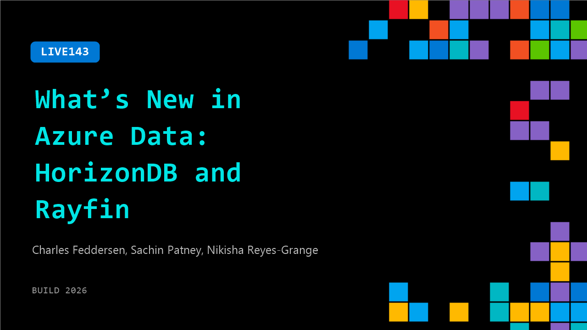

# LIVE143: What’s New in Azure Data: HorizonDB and Rayfin

**Session code:** LIVE143  
**Date:** Tuesday, June 2, 2026 / 4:20 PM - 4:35 PM PDT (Duration 15 minutes)  
**Watch on-demand:** <https://build.microsoft.com/en-US/sessions/LIVE143>

---

## Speakers

- **Charles Feddersen** - Partner Director of Program Management, Microsoft
- **Sachin Patney** - General Manager, Microsoft
- **Nikisha Reyes-Grange** - Sr. Director of Marketing, Azure, Microsoft

## About the session

Get to know two exciting data innovations. Azure HorizonDB rethinks how PostgreSQL databases are built and operated, focusing on a modern, scalable foundation designed for cloud‑native applications. Rayfin makes it easier to build and run data applications in Microsoft Fabric, bringing data, logic, and AI closer together so developers can scale faster without stitching backend services. Learn the motivation behind each, the core concepts to understand, and how they shape the future of application and data development.

## AI summary

**Introduction and Speaker Overview:** The video begins with Nikisha Reyes Grange greeting attendees and wishing them a happy Build conference 00:00:00. She introduces herself as Senior Director with Azure Data and AI and welcomes her colleagues Charles Federsen and Sachin Patne 00:00:06. Charles, the Director of Program Management for Postgres and MySQL on Azure, and Sachin, the General Manager of App Development for Azure Data, join to share key data announcements made at Build. The main agenda includes two major topics: Azure Horizon DB and Raefen SDK 00:00:36.

**Azure Horizon DB Announcement:** Charles explains that Azure Horizon DB is a newly announced Postgres-based database service designed for developers and enterprises 00:00:45. It entered public preview at the time of the Build event 00:00:55. Horizon DB aims to address both app development and enterprise-scale needs by integrating AI and developer-centric tooling. It supports enhanced performance, enterprise-grade security, and AI-driven features, while allowing seamless development in VS Code. Charles highlights new developer enhancements like AI pipelines for asynchronous workflows 00:02:23 and improved storage architecture offering higher scalability and availability compared to standard Postgres services 00:03:11. He notes that developers benefit from full Postgres compatibility.

**Introduction to Raefen SDK and Its Purpose:** Sachin then introduces Raefen, describing it as an open-source SDK and CLI for defining backend services entirely in code 00:03:49. Raefen integrates with Azure Fabric, automatically translating databases, functions, and authentication components into governed, scalable Fabric services during deployment 00:04:07. It was created to bridge the gap between rapid app prototyping and enterprise-grade production deployment 00:05:02. Raefen allows developers to focus on business logic while ensuring governance, compliance, and scalability. Sachin emphasizes that it works seamlessly with other app-building platforms, such as GitHub Copilot and Replit, empowering developers to deploy managed backends directly into their Fabric environments 00:06:06.

**Raefen’s Role within Microsoft Fabric and Open Source Vision:** The discussion moves to why Raefen is deeply integrated with Fabric 00:06:25. Since Fabric is a SaaS platform with zero infrastructure management, Raefen enables organizations to build and host operational and even customer-facing applications without complex data movement. Application data stays within Fabric for instant analytics and governance 00:07:19. Sachin also notes that parts of Raefen’s runtime will be open-sourced, offering flexibility to self-host applications or run outside Fabric if preferred 00:08:10. This approach allows the community to extend Raefen across various infrastructures, making it suitable for both light and enterprise-scale applications 00:08:21.

**Postgres Community Commitment:** Charles highlights Microsoft’s significant role in supporting the open-source Postgres community 00:08:33. Microsoft is among the largest contributors to the upstream Postgres project, modifying roughly 8% of the codebase in the upcoming version 19 00:09:03. This contribution ensures that insights gained from managing cloud-scale Postgres instances benefit the entire ecosystem. Microsoft also organizes the largest virtual Postgres event globally, maintains a podcast, and participates actively in community conferences 00:09:56. The company’s vision is to ensure that enterprise customers running mission-critical workloads receive robust, secure, and well-supported Postgres environments 00:10:08.

**AI and Hybrid Search Capabilities in Horizon DB:** Returning to Horizon DB, Charles elaborates on its AI features 00:10:46. Building on Postgres’s PG vector extension, Horizon introduces AI functions that interact directly with Microsoft Foundry models from SQL 00:11:30. Developers can instantly use pre-registered embedding and re-ranking models without complex setup. A new hybrid search function fuses full-text and vector searches, allowing highly relevant and high-performance retrieval across enterprise data 00:12:00–00:12:24. The system supports multiple indexing options (HNSW, IV flat) and even graph-based data relationships visualized through VS Code extensions 00:13:01. The session ends with Nikisha thanking the speakers and wishing viewers a happy Build 00:13:09.

## Session tags

- **Session type:** Broadcast Stage
- **Location:** Gateway Pavilion, Level 1, Build Broadcast Stage
