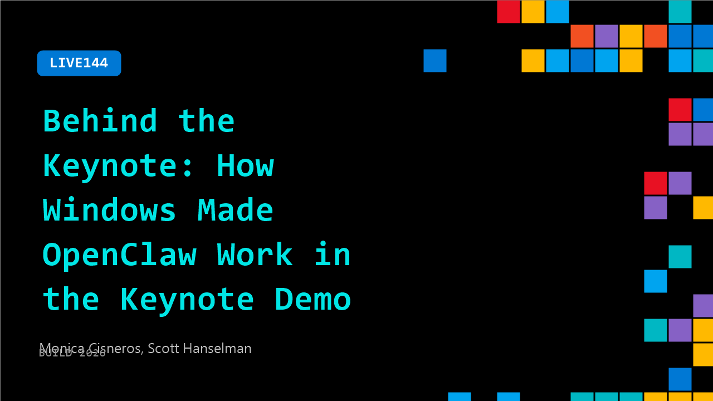

# LIVE144: Behind the Keynote: How Windows Made OpenClaw Work in the Keynote Demo

**Session code:** LIVE144  
**Date:** Tuesday, June 2, 2026 / 4:40 PM - 4:55 PM PDT (Duration 15 minutes)  
**Watch on-demand:** <https://build.microsoft.com/en-US/sessions/LIVE144>

---

## Speakers

- **Monica Cisneros** - Sr. Product Marketing Manager - Agents on Windows, Microsoft
- **Scott Hanselman** - VP, Member of Technical Staff for Microsoft/GitHub, Microsoft

## About the session

A candid 15 minute interview with Monica Cisneros and Scott Hanselman on what it took to get the OpenClaw keynote demo ready. Hear how teams across Windows aligned on platform work, runtime integration, and demo engineering to deliver a reliable live experience.

## AI summary

**Introduction and Collaboration Story:** The video begins with Monica Cisneros introducing herself as the Senior Product Marketing Manager for Windows, joined by Scott Hanselman (00:00:01). Monica recalls seeing Scott at the keynote, where he presented a conversation with Peter and asks him to describe how that collaboration evolved. Scott explains that open-source success rarely happens overnight — Peter had already created hundreds of innovative utilities and was recognized for his contributions within the open-source space (00:00:37). Seeing Peter’s project, Scott wanted to build a Windows counterpart that mirrored the Mac app, showing that collaboration can often start with a simple shared idea (00:01:15–00:01:22).

**The Essence of Open-Source Community:** Monica asks what makes the open-source community special (00:02:33–00:02:42). Scott explains that trust and familiarity are built through repeated encounters at meetups or online, noting that seeing people consistently contributes to feeling safe within the community (00:03:00). He describes the environment as collaborative and improvisational — similar to improv comedy where participants respond with “Yes, and…” instead of “No” (00:03:51). Scott emphasizes that open-source thrives on that positivity, where one person’s idea sparks contributions from others, resulting in cooperative building across different skills and energy levels (00:04:00–00:04:09).

**Working Philosophy and Agency:** Transitioning from community to workflow, Scott discusses the concept of “agency” in open-source production (00:04:35). He recounts Vincent Koch’s statement that he likes “high-agency people” who take initiative to fix issues rather than waiting for approval (00:04:50). This mindset, alongside robust testing and quality assurance, creates a safety net for experimentation within the Open Claw Foundation project. Scott encourages engineers to be bold — to take control, make changes confidently, and rely on automated testing to ensure stability, a vital attitude for scalable AI-augmented software projects (00:05:12–00:05:44).

**Building the Windows Companion App:** When asked about engineering lessons learned from the Windows companion app effort, Scott explains that the project aimed for parity with the existing Mac application but soon explored what Windows could do differently (00:06:25). The team examined app packaging, permissions, and sandboxing unique to Windows, approaching the process as “coopetition” — improving all platforms through mutual advancement (00:06:51). He describes how Microsoft is adopting a faster iterative style while keeping stability for its massive user base, balancing innovation and scale to keep all users satisfied (00:07:40–00:07:52).

**Containers and Containment Concepts:** The conversation moves to Scott’s keynote remarks about containers and containment (00:07:53–00:08:02). He explains that containers enable isolated environments using technologies like Docker, but containment is a broader concept — defining boundaries around what software can access (00:08:29). With WSL-based container runtimes, Windows now supports these environments natively (00:09:01). Scott gives practical examples — isolating access between work applications — to illustrate how containment enforces responsible permissions, preventing unintended cross-app data access (00:09:20–00:09:40).

**Modern Developer Workflows and the Future of Agents:** Scott shares insights into modern workflows like Git work trees that allow multiple parallel branches and agents to operate simultaneously (00:11:05). This parallelism, coupled with tools such as the GitHub Copilot app integrated with Windows dev drives, enhances productivity and development speed (00:11:24). Discussing the future, Scott predicts dynamic policy engines that tailor containment and access on a per-tool-call basis (00:12:17). The goal is frictionless trust and control — agents that act proactively within clear boundaries invisible to users but governed by IT, ensuring security and efficiency (00:12:53). The video concludes with Monica thanking Scott for his intentional and impactful approach to advancing agent technology on Windows (00:13:10).

## Session tags

- **Session type:** Broadcast Stage
- **Location:** Gateway Pavilion, Level 1, Build Broadcast Stage
