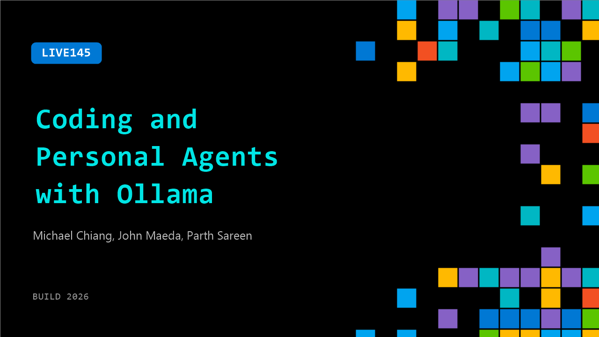

# LIVE145: Coding and Personal Agents with Ollama

**Session code:** LIVE145  
**Date:** Tuesday, June 2, 2026 / 4:55 PM - 5:10 PM PDT (Duration 15 minutes)  
**Watch on-demand:** <https://build.microsoft.com/en-US/sessions/LIVE145>

---

## Speakers

- **Michael Chiang** - Co‑founder, Ollama
- **John Maeda** - CVP Eng, Comp Design & Research, Microsoft
- **Parth Sareen** - Software Engineer, Ollama

## About the session

A live walkthrough of Ollama launch, showing how developers connect local and cloud open models to real-world applications in a single step. See Copilot CLI and OpenClaw set up live, switch between local and cloud models and connect the agent to web search and vision.

## AI summary

**Introduction and Overview:**
The conversation begins with enthusiastic introductions from the Microsoft Build stage, featuring Michael Chang and engineer Parth Serene from the O Llama team 00:00:00–00:00:20. The hosts joke about the audience’s love for the O Llama mascot before shifting to an explanation of O Llama’s purpose. Michael shares that O Llama provides developers the easiest way to run open models either locally or through the cloud 00:00:35–00:00:45. It caters to users who prefer full local privacy or those needing scalable compute in a cloud-based setup. This establishes the dual flexibility that defines O Llama’s mission in the open AI model ecosystem.

**Local Model Agents and Developer Adoption:**
The discussion moves to the evolving landscape of local AI models and how developers have embraced them 00:01:01–00:01:32. Michael notes that coding use cases exploded in 2023, and in the following year, powerful open models and agents became the norm. Parth explains how he uses O Llama agents for personal analyses, like reviewing his own bank statements—highlighting local models’ privacy advantages 00:01:46–00:02:26. The guests emphasize that developers appreciate how these agents can perform sensitive, private tasks locally and still deliver strong coding performance. Michael recalls the moment O Llama became an overnight sensation after launching publicly on GitHub, quickly becoming one of the fastest growing open-source AI projects 00:02:54–00:03:15.

**Scaling from Local to Cloud:**
Parth and Michael delve into how developers can seamlessly scale local workloads to the cloud 00:03:31–00:04:27. They describe scenarios where developers start with local models and later move to cloud infrastructure when handling extreme workloads or complex code tasks. O Llama’s design ensures the transition feels nearly identical to the user, maintaining consistency in experience. The team compares the flexibility to “reaching for the cloud,” humorously invoking Toy Story imagery 00:04:28–00:04:33. They demonstrate this hybrid model with an example using the Copilot CLI, showcasing how O Llama empowers developers to handle workflow, debugging, and GitHub issue management directly from their terminals without leaving their core environment 00:05:00–00:06:33.

**Developer Integrations and Real-World Uses:**
After the demo, the discussion highlights O Llama’s vast integration ecosystem, supporting VS Code, Hermes, and OpenClaw among others 00:06:33–00:06:50. The hosts liken O Llama’s hybrid operation to a hybrid car—switching smoothly between local and cloud resources. Michael and Parth elaborate on the hardest parts of scaling AI apps and how developers commonly start locally before turning to O Llama’s cloud options 00:07:02–00:07:19. They express enthusiasm about local agents running personal tasks, managing emails, calendars, and daily planning—showing tangible impact on users’ lives 00:07:32–00:08:02. Parth adds that workloads with private data benefit most from local execution, while heavier coding workloads thrive on cloud models for efficiency and faster execution 00:08:09–00:09:01.

**Open Source and Future Outlook:**
The conversation transitions toward how local models fit into the open-source movement 00:09:05–00:09:50. Parth explains that the evolution of open models is guided by user trends such as personal agents and privacy-guarded applications. The team previews an upcoming breakout session showcasing live demos and more agentic task examples 00:10:00–00:10:12. Michael predicts the AI world will continue blending local and cloud models—similar to how personal computers coexist with powerful cloud services—to balance privacy and robust computation 00:10:21–00:10:34. His advice to new developers is simple: choose a model, start experimenting, and explore open tools to quickly familiarize themselves with this hybrid AI approach 00:10:53–00:11:16.

**Design Philosophy and Closing Remarks:**
In the final moments, attention turns to O Llama’s design aesthetic and origin story. Michael shares that the product was intentionally built to be visually minimal—monochromatic and unobtrusive—emphasizing simplicity and developer empowerment 00:11:25–00:11:56. Parth recounts how his initial admiration for O Llama led him to join the team full-time after building a startup that relied on the tool 00:12:02–00:12:23. The segment closes on a heartfelt note, describing how Michael’s wife designed the O Llama mascot—crafted to be simple, lovable, and easily recognizable, following principles of great logo design 00:12:31–00:13:32. The hosts conclude with appreciation for O Llama’s creative spirit and its dedication to making AI accessible, private, and delightful for developers everywhere.

## Session tags

- **Session type:** Broadcast Stage
- **Location:** Gateway Pavilion, Level 1, Build Broadcast Stage
