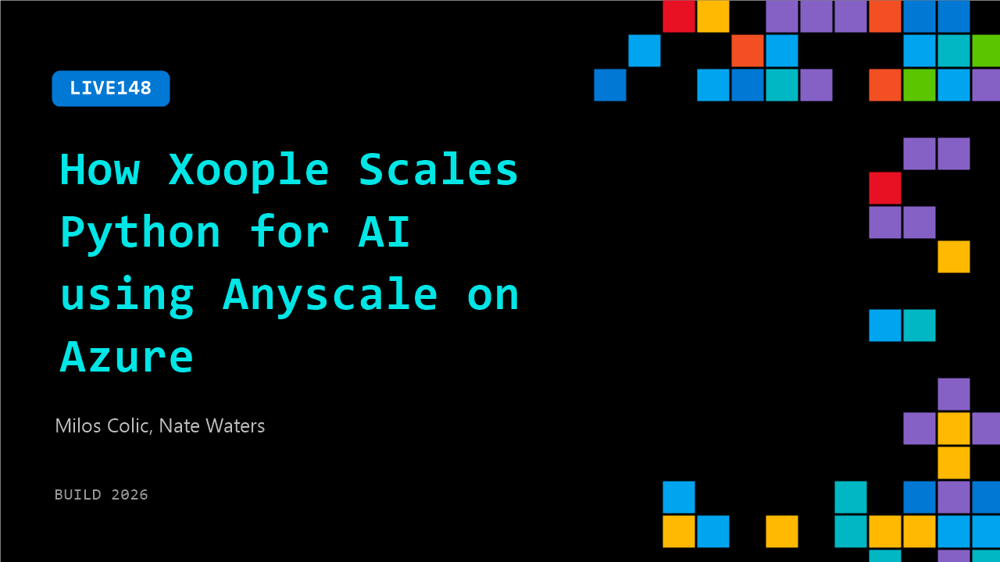

# LIVE148: How Xoople Scales Python for AI using Anyscale on Azure

**Session code:** LIVE148  
**Date:** Tuesday, June 2, 2026 / 5:10 PM - 5:25 PM PDT (Duration 15 minutes)  
**Watch on-demand:** <https://build.microsoft.com/en-US/sessions/LIVE148>

---

## Speakers

- **Milos Colic** - VP of Engineering, Xoople
- **Nate Waters** - Sr. Product Marketing Manager, Microsoft

## About the session

Python is the backbone of modern AI workflows, but scaling Python across data processing, training, and inference introduces real distributed systems challenges. In this customer conversation, Xoople’s VP of Engineering shares how their team moved from early distributed Python approaches to running production AI workloads with Ray on Azure.

## AI summary

**Introduction and Overview:** The video begins with host Nate Waters from Azure introducing himself and welcoming guest Milos Kolek from Zoople (00:00:00). They discuss that the focus of the conversation will be on scaling Python AI workloads on Azure (00:00:10). Milos explains that Zoople—more accurately pronounced “Zupal”—is a Spanish-based global startup building an “Earth system of record,” a foundational Earth data infrastructure designed for the AI era (00:00:31). The goal is to empower businesses to make better, high-stakes decisions using AI-driven reasoning based on real-world assets and environmental data.

**Company Background and Use Cases:** Milos details that Zupal’s customers span diverse industries such as agriculture, insurance, and critical infrastructure, all of which rely on physical assets exposed to environmental risk (00:01:29). Their AI platform enables these organizations to interpret satellite imagery and environmental data for decision-making. He gives an example of a large-scale infrastructure project—like a railway network—where satellite-observed changes such as vegetation overgrowth or unauthorized building can impact outcomes (00:02:08). Zupal helps businesses track and respond to these changes dynamically, combining logical and physical data to improve operational efficiency in a constantly evolving world.

**Technical Implementation with AnyScale on Azure:** Nate transitions to discuss Microsoft’s new announcement—“AnyScale on Azure” (00:02:56). Built on Azure Kubernetes Service, it integrates the open-source distributed compute framework Ray into Azure to simplify scaling AI workloads. Milos explains how Zupal uses this to handle data ingestion, training, and inference (00:03:18). Their system leverages hybrid compute—combining CPUs for data preparation and GPUs for large model computation, including processing multimodal satellite imagery reaching trillions of pixels. A key example is using IBM and NASA’s foundational model, “Teramind,” to classify land use via embeddings and clustering (00:04:18).

**Engineering Strategy and Performance:** Discussing build-versus-buy tradeoffs, Milos emphasizes Zupal’s choice to adopt managed services like AnyScale on Azure instead of building distributed systems infrastructure from scratch (00:05:31). This decision allows their engineers to focus on solving domain-specific problems rather than managing clusters. Milos highlights strong collaboration with forward-deployed engineers from AnyScale and Azure, which helped Zupal achieve GPU utilization rates as high as 80–90% efficiency (00:07:05). The tight integration between CPU data handling and GPU processing in Azure pipelines optimized their end-to-end performance, exemplifying successful partnership-driven development.

**Best Practices and Future Outlook:** Turning to advice for other developers, Milos advises approaching scalability by breaking problems into “smallest solvable units” that can be parallelized—a key to performance and roadmap efficiency (00:08:06). He emphasizes starting with clear problem definitions rather than focusing prematurely on models or metrics, echoing the philosophy “fall in love with the problem, not the solution” (00:12:38). He envisions the future of AI and engineering evolving toward “hypervelocity,” where generative AI and agent-based systems augment human engineers. Zupal already employs AI-powered tools like GitHub Copilot on Azure to enhance productivity, allowing engineers and product teams to collaborate more closely and iterate faster (00:11:06).

**Conclusion and Partnership Reflections:** In closing, Milos praises the deep collaboration between Microsoft and AnyScale, describing Zupal as a “partner-first” company that thrives when technology vendors strengthen their integration (00:13:26). The conversation concludes with Nate thanking Milos for joining Microsoft Build and encouraging viewers to explore AnyScale on Azure, which is now available in public preview (00:14:06). The interview wraps up on a positive note celebrating the fusion of open-source toolchains, managed cloud infrastructure, and applied AI innovation for scaling global data workloads efficiently.

## Session tags

- **Session type:** Broadcast Stage
- **Location:** Gateway Pavilion, Level 1, Build Broadcast Stage
