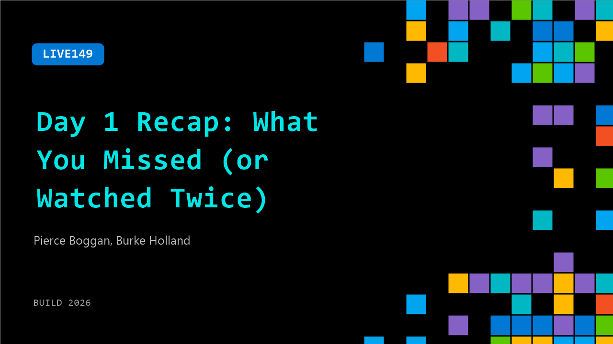

# LIVE149: Day 1 Recap: What You Missed (or Watched Twice)

**Session code:** LIVE149  
**Watch on-demand:** <https://build.microsoft.com/en-US/sessions/LIVE149>

---

## Speakers

- **Pierce Boggan** - VS Code, Microsoft
- **Burke Holland** - Distinguished Vibe Coder, GitHub

## About the session

Yesterday packed a lot in. We hit the biggest announcements, best demos, and moments worth coming back to before day two gets going.

## AI summary

**Opening and Introductions:** The session begins with a warm welcome to day two of Microsoft Build by Burke, who lightheartedly encourages audience participation and energy 00:00:00–00:00:12. He introduces himself and his colleague Pierce, clarifying their roles within Microsoft. Pierce explains that he works on the Visual Studio Code (VS Code) team focusing on GitHub Copilot, Copilot CLI, and related apps 00:00:23–00:00:29. Burke adds that he also contributes to Copilot and VS Code, creating YouTube videos and engaging with the developer community. The tone is informal and friendly, setting up a conversational discussion for the remainder of the session.

**Announcements and Community Engagement:** Following introductions, Burke outlines several announcements and event highlights for attendees 00:00:43–00:00:52. He notes that Windows-related sessions will begin later in the day and acknowledges both in-person and online audiences watching through Microsoft Developer, GitHub, and VS Code’s social channels 00:01:00–00:01:14. They joke about the “live coding booth” on the Expo floor—a glass-enclosed space likened to a fish tank—where developers code live while attendees watch 00:01:20–00:01:35. Pierce amusingly reveals he will be “locked in” for a live coding session later, continuing the playful banter.

**Sessions and Fun Events:** Burke then promotes upcoming sessions including the “VS Code team’s AI adoption story” led by Pierce and Josh 00:01:47–00:02:01. They explain that rather than being about integrating AI into the product, the talk focuses on how the VS Code team itself uses AI in daily work 00:02:04–00:02:16. Next, they preview the “Copilot Game Show” happening on the keynote stage, co-hosted by Kent Dodds, where participants will attempt fast-paced live coding with Copilot in just 45 minutes 00:02:18–00:02:42. They emphasize that the event will be entertaining and interactive, inviting attendees to join. Additionally, Burke notes the monthly VS Code release live streams as a great way for users to keep up with continuous updates, joking that even those working on the product struggle to track all the changes 00:02:43–00:03:09.

**Feature Highlights from Day One:** Moving into technical discussions, Pierce and Burke recap key highlights from Build day one 00:03:20. They begin with the new GitHub Copilot App, describing it as a native desktop experience designed to manage development “agents” and workflows rather than being an editor or CLI tool 00:03:27–00:03:39. Pierce explains that unlike traditional tools managing single sessions, this app handles multiple concurrent agents, helping developers triage tasks, perform builds, and complete workflows efficiently 00:03:52–00:04:10. They discuss real-world usability, suggesting that while some power users run numerous agents simultaneously, most developers can reasonably handle only three or four before losing track of tasks 00:04:35–00:05:14. The focus, Pierce adds, should be outcome-driven rather than performative productivity—whether the tool achieves the intended results 00:05:19–00:05:46.

**Copilot SDK and Developer Tools:** The conversation then turns to the GitHub Copilot SDK 00:06:11. Pierce clarifies that the SDK exposes the “agent loop” — the logic powering prompts, tools, and context within all Copilot products — allowing developers to integrate those capabilities into their own applications 00:06:21–00:06:47. This lets teams package the Copilot runtime and experiment with building customized assistants. They encourage attendees with Copilot subscriptions to try one-shot experiments using the SDK 00:07:03–00:07:16. The presenters note that few developers yet use open-source agents like Hermes or OpenClaw, but this SDK could expand experimentation in that space. The section underscores Microsoft’s focus on enabling developers to personalize and extend Copilot integration across tools.

**New Coding Model and Closing Remarks:** The final topic introduces Microsoft’s new coding model named “Mai Code 1 Fast” 00:07:20. Pierce explains that it is the first coding model built entirely in-house at Microsoft, optimized for GitHub Copilot 00:07:32–00:07:49. Trained on Copilot’s internal tools and agent trajectories, it offers high efficiency and adaptive responses based on prompts 00:07:58–00:08:11. The team expresses excitement about its rollout to VS Code developers, encouraging feedback as adoption expands through the model picker and Auto features 00:08:42–00:08:51. Burke closes the session by thanking Pierce, inviting applause, and reminding attendees to catch his breakout session 00:08:52–00:09:03, ending on an upbeat, collegial note.

## Session tags

- **Session type:** Broadcast Stage
