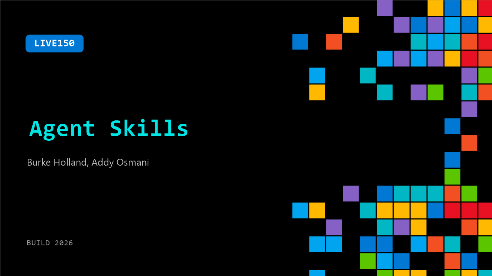

# LIVE150: Agent Skills

**Session code:** LIVE150  
**Watch on-demand:** <https://build.microsoft.com/en-US/sessions/LIVE150>

---

## Speakers

- **Burke Holland** - Distinguished Vibe Coder, GitHub
- **Addy Osmani** - Director, Google Cloud AI, Google

## About the session

In this session, Addy joins us to talk about what agent skills actually are, how they encode senior engineering judgment into workflows any AI agent can follow, and how to use them to get consistent, production-quality results out of your coding tools.

## AI summary

**Introduction and Guest Overview:** The video opens at 00:00:06 with a friendly reunion between the host and Addy Osmani, Director at Google Cloud AI and best-selling author. The host reminisces about Addy’s presence in an AI Bloomberg segment and their long history going back to jQuery and web performance discussions. Addy is introduced as an expert in AI developer and user experience, here to talk about his recent work on agent skills, a project that has appeared multiple times on Hacker News. This sets the stage for an in-depth look at his skill-based AI engineering approach and a practical demo.

**Concept of Agent Skills and Primer:** At 00:01:17–00:02:37, Addy explains the notion of agent skills — standardized modular packages of expertise that expand an AI agent’s capabilities. He relates them to developer "dot files" or "magic tricks," reusable personalized tools that others can learn from or copy. Skills, he notes, are reusable across projects and can load dynamically based on the agent’s needs. He introduces a humorous “Clippy” demo — a playful Windows desktop simulation inside a browser — to illustrate how structured skill definitions with a name and description guide the loading process. These standardized skill files allow agents to perform workflows repeatedly across tasks at Google Cloud.

**Project Background and Skill Architecture:** Beginning around 00:04:14–00:07:50, Addy discusses his open-source initiative, Agent Skills, inspired by prior frameworks like Gary Tan’s G-Stack. He slowed his open-source activity for some years but decided to release his perspective aligned with the software development life cycle (SDLC). The project organizes skills following stages like define, plan, build, verify, review, and ship. Addy’s approach reflects disciplined agentic engineering, emphasizing quality verification and structured development. Examples include definition skills that clarify ideas, planning and building skills for UX and APIs, and verification skills for automatic browser testing and debugging. Review and shipping stages integrate security, code simplification, CI workflows, and documentation — all embodied as agent-driven skill files. Each skill file includes rationalizations, red flags, and verification criteria to help ensure agents act correctly and efficiently.

**Live Demo: Building with Agent Skills:** Between 00:08:11–00:27:00, Addy demonstrates building a “Streak” habit tracker entirely via agent skills using VS Code’s Copilot and Gemini 3.5 Flash. He begins with a raw prompt for a GitHub-inspired tracker and uses the “refine” command to gather clarifying questions, audience definitions, feature constraints, and success criteria. Through iterative refinement, the agent produces validated MVP directions. Addy then moves to “spec,” where a detailed technical specification emerges automatically. Using the “plan” skill, the agent breaks the project into executable tasks with acceptance criteria, mirroring agile development practice. Addy walks through the testing cycles based on TDD principles — red/green test patterns — demonstrating how agents scaffold logic and UI progressively while he explains balancing automation with manual understanding and cognitive load management. The conversation touches productivity philosophies, code review loops, and the trade-offs between speed and discipline in agent-assisted engineering.

**Verification, Review, and Security Discussion:** From 00:31:00–00:37:00, Addy shows the “verify” and “review” phases in action. The agent runs automated browser tests to confirm functionality and UI integrity, then performs multi-pass code reviews covering performance, readability, accessibility, and security. Using skills, Addy encodes best practices to avoid vulnerabilities such as XSS or API leaks. The discussion deepens into reflections on deterministic verification in AI-assisted coding and the industry’s need for stronger security gates. Addy recommends leveraging encoded red flags and deterministic validation to ensure safe deployment. He emphasizes encoding quality standards — accessibility, security, and performance thresholds — directly into skill definitions so agents automatically uphold software reliability.

**Q&A and Closing Remarks:** In the final segment at 00:40:00–00:45:40, audience questions explore multi-model workflows between Gemini Flash and Pro, using lighter models for planning and robust models for implementation. Addy and the host discuss MCP (Model Context Protocol) integration, authentication, CLI alternatives, and the advantages of progressively-loaded skills for context efficiency and token savings. They conclude that skills offer scalable, modular, and economical AI workflow management. The host thanks Addy for an insightful walkthrough on agent skills and practical AI engineering at scale, wrapping up the session with appreciation and an invitation for attendees to converse further after the talk.

## Session tags

- **Session type:** Broadcast Stage
