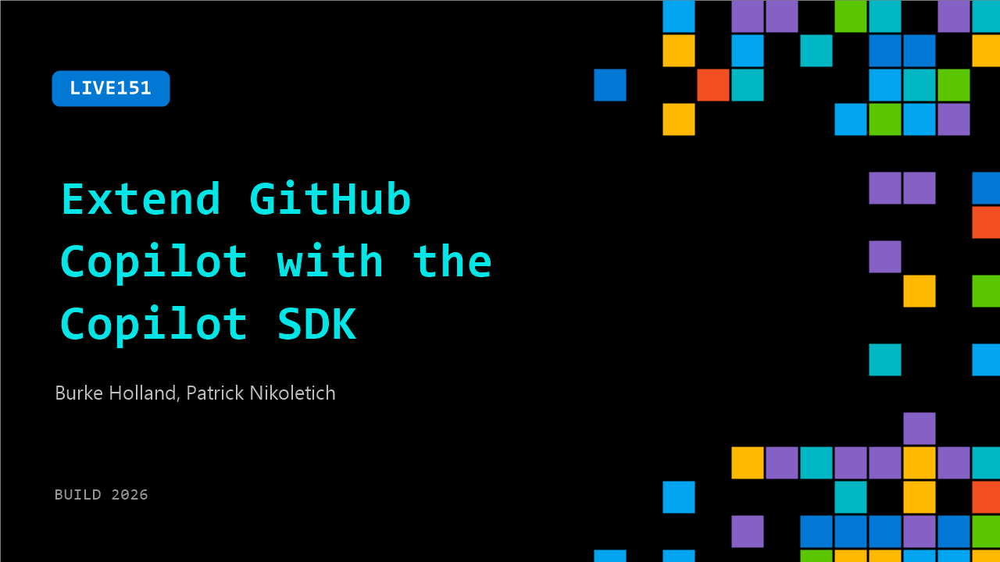

# LIVE151: Extend GitHub Copilot with the Copilot SDK

**Session code:** LIVE151  
**Watch on-demand:** <https://build.microsoft.com/en-US/sessions/LIVE151>

---

## Speakers

- **Burke Holland** - Distinguished Vibe Coder, GitHub
- **Patrick Nikoletich** - Distinguished Product Manager, Microsoft

## About the session

The Copilot SDK lets you extend, customize, and build your own agentic experiences using the same runtime that powers GitHub Copilot. See it in action.

## AI summary

**Introduction and Event Context:** The video opens with the host greeting viewers from Build 2026 and introducing Patrick Nicoletich, a lead on the Copilot SDK team 00:00:02–00:00:14. They share a lighthearted conversation about the event’s large venue before transitioning to the topic of the Copilot SDK. Patrick notes the SDK’s general availability (GA) status, announced just the day before, marking a major milestone for developers across Microsoft and its subsidiaries like LinkedIn, Xbox, and GitHub. The SDK’s 1.0 release represents a stable, production-ready version that supports developers in integrating Copilot capabilities into various applications 00:00:59–00:01:33.

**SDK Launch and Technical Overview:** Patrick explains that the Copilot SDK, first introduced in technical preview, now supports six languages including Rust and Java 00:02:23–00:02:36. The SDK functions as a lightweight client over the Copilot CLI server, enabling developers to embed the Copilot experience directly into custom software. It extends the same infrastructure powering GitHub’s Copilot into broader applications. Ongoing improvements focus on performance, including a rewrite of the runtime in Rust to reduce memory usage from approximately 120MB to under 10MB while increasing portability across environments 00:03:11–00:03:42.

**Performance Evolution and Engineering Goals:** Discussion turns to internal testing that highlights clear performance improvements from the Rust runtime, showing better efficiency and scalability across multiple devices 00:04:00–00:04:05. The speakers note how GitHub teams embraced experimental approaches to evaluate these changes, using large-scale model interactions to push boundaries and develop adaptable, “agentic” workflows. They reflect on how advancements in Copilot have redefined development culture—encouraging exploration, reducing friction between idea and outcome, and freeing teams from computational constraints like limited tokens 00:04:44–00:05:20.

**Demonstration of “Whim” Personal Assistant:** For a practical example, Patrick demonstrates his own Copilot SDK-based app, called “Whim,” designed as a personal productivity assistant for PM work 00:05:46–00:06:16. The app uses a canvas-based interface instead of traditional chat interactions, allowing users to spawn, manage, and track agents visually. He shows how Whim automates writing, issue triage, and project management tasks through agents deployed in ephemeral cloud environments or secure local sandboxes. These agents operate autonomously but transparently, updating a shared workspace as progress unfolds 00:08:07–00:09:25. The demonstration highlights how multi-agent orchestration can blend seamlessly into everyday workflows.

**Adoption, Usability, and Broader Reflections:** The conversation moves toward how real-world developers can use the SDK to build personal tools instead of relying on generalized AI systems 00:11:11–00:11:45. Patrick emphasizes that grounding experiments in clear, communicable use cases demystifies AI and makes it more practical. New SDK features like remote access, ephemeral cloud sandboxes, and local sandbox environments are now available for preview, offering developers flexibility to prototype without heavy setup 00:12:01–00:12:19. Both speakers encourage viewers to start small—automating daily tasks, learning model behavior, and evolving trust with their AI agents over time.

**Conclusion and Future Sessions:** In concluding remarks, they discuss their preferred models—GPT 5.5 for implementation tasks and Opus for creativity—describing their complementary strengths 00:14:12–00:15:03. Patrick invites attendees to his upcoming session from 4:00–5:00 PM in Breakout 1 for a deeper technical dive into the Copilot SDK’s future and cross-Microsoft integration 00:15:08–00:15:25. The host wraps up by reaffirming the transformative potential of building tailored AI workflows, thanking Patrick for the insights and promising viewers more live conversations ahead.

## Session tags

- **Session type:** Broadcast Stage
