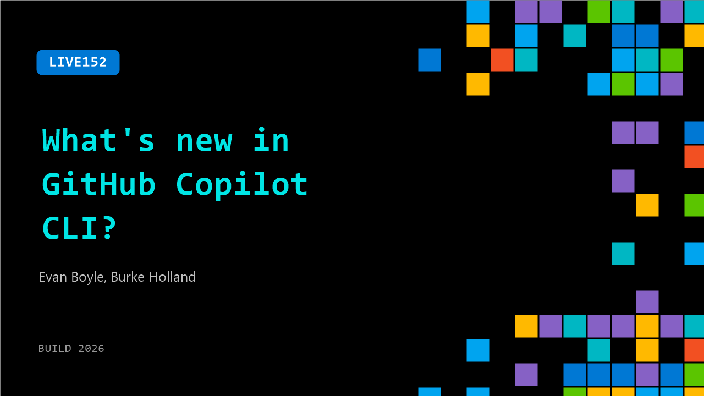

# LIVE152: What's new in GitHub Copilot CLI?

**Session code:** LIVE152  
**Watch on-demand:** <https://build.microsoft.com/en-US/sessions/LIVE152>

---

## Speakers

- **Evan Boyle** - Principal Manager - Software Engineering, GitHub
- **Burke Holland** - Distinguished Vibe Coder, GitHub

## About the session

This session walks through what's new, including a redesigned terminal interface, Rubber Duck for second opinions, recurring prompts with /every, and hands-free voice mode, so you know what to go try today.

## AI summary

**Introduction and Guest Overview:** The session opens with greetings as the hosts confirm they are live (00:00:06). Evan Boyle from the GitHub Copilot CLI team is introduced as a guest and described as both an engineering manager and hands-on developer passionate about developer tools (00:00:34). He explains that his team builds several components of Copilot including the core agent loop, SDK, CLI, and the newly released GitHub app, which were also highlighted during a keynote presentation. The atmosphere is casual and collaborative, as they recall working late nights preparing demos at GitHub HQ prior to the event (00:01:08).

**Copilot CLI Demonstration:** Evan transitions into demonstrating Copilot CLI, prompted by a conversation with someone who asked what it was (00:01:21). He walks through a live example using a GitHub repository that was built interactively with the community during a previous session (00:01:50). The audience submitted about sixty issues, and the Copilot CLI was used to analyze them and select one for implementation. That issue resulted in an Electron app featuring an animated Octocat called “goblin mode” that reacts to Git operations with emojis and sounds (00:02:57). He showcases how the CLI’s plan mode automates project building while interacting with user feedback live, demonstrating that the tool can rapidly generate creative projects based on open-source collaboration.

**Working in Terminals and Session Management:** After the demo, they discuss the appeal of terminal-based development and explain why the CLI runs there instead of inside an editor (00:04:43). Evan emphasizes the focus and simplicity of the terminal environment — no distractions, real-time logging, and the ability to feel “like a hacker.” He explains how Copilot CLI now supports multiple parallel sessions through commands like slash new and slash sessions (00:05:27), enabling users to manage different tasks simultaneously. The functionality is demonstrated as he closes issues in one session while researching others in a backgrounded session (00:06:01). This multi-session runtime models efficiency for developers managing complex workflows directly in the terminal.

**Team Velocity and Slash Commands:** The discussion then shifts to GitHub’s rapid internal development culture (00:09:07). Evan highlights that the team ships thousands of PRs monthly across multiple components, which means the codebase evolves quickly. He then introduces favorite Copilot CLI features that rely on slash commands, like slash review for multi-model code reviews using different AI engines (00:10:14). The CLI showcases its ability to intelligently prompt users when ambiguity exists, performing “elicitation” to clarify intent before running reviews (00:11:14). The conversation explores how developers can customize verbosity levels for AI responses, balancing detailed output versus concise summaries, and even modify “copilot instructions” using voice input for personal workflow configurations (00:13:14).

**Voice Mode and Workflow Personalization:** Evan demonstrates the CLI’s voice mode capabilities, enabled through slash voice and local language models (00:14:00). He explains that these models, provided locally and running offline, allow real-time voice interactions without cloud dependency. The hosts discuss user comfort levels with speaking aloud to AI agents and reflect on how voice input activates different cognitive processes than typing (00:15:03). Evan mentions learning from developer Scott Hanselman, who uses voice mode extensively. He shares that he personally uses a remote control to pace around his office and dictate tasks — illustrating an evolving, natural workflow between humans and AI agents that merges technology with typical thought processes (00:15:57).

**Closing and Next Steps:** As the session concludes, Evan announces upcoming talks, including one later that day on the GitHub app with Mario and another recorded deep dive with Cassidy on Copilot CLI (00:16:25). He encourages viewers to experiment with Copilot CLI firsthand, emphasizing how surprisingly smooth and productive it feels despite any initial skepticism (00:16:53). The hosts wrap up with thanks and final encouragement to try and explore these emergent AI-driven development tools. The broadcast closes warmly, pointing developers toward hands-on adoption as the next step (00:17:22).

## Session tags

- **Session type:** Broadcast Stage
