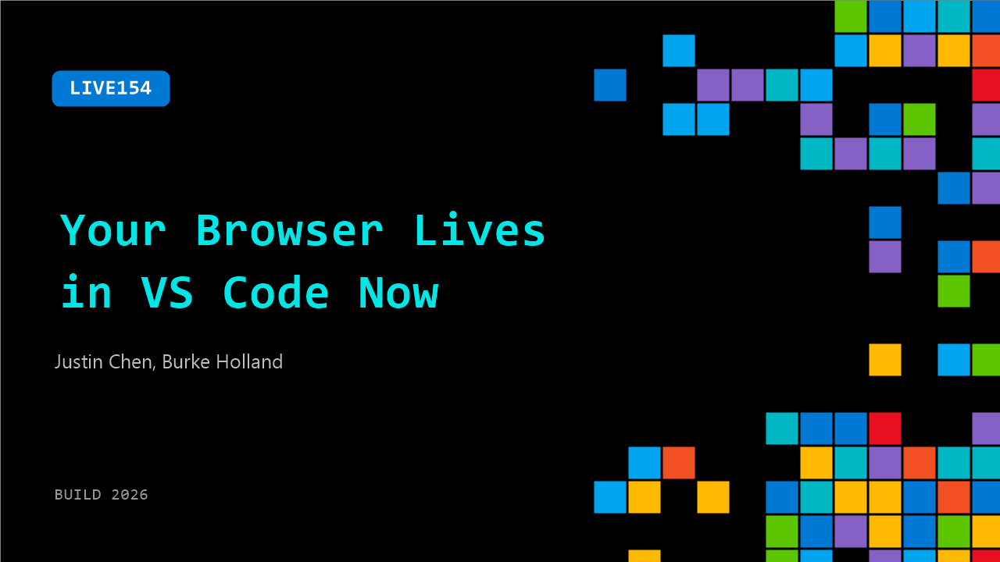

# LIVE154: Your Browser Lives in VS Code Now

**Session code:** LIVE154  
**Date:** Wednesday, June 3, 2026 / 12:45 PM - 12:55 PM PDT (Duration 10 minutes)  
**Watch on-demand:** <https://build.microsoft.com/en-US/sessions/LIVE154>

---

## Speakers

- **Justin Chen** - Software Engineer, VS Code
- **Burke Holland** - Distinguished Vibe Coder, GitHub

## About the session

The integrated browser is not just a preview pane. Agents can share tabs as context, read page content, interact with elements, run Playwright scripts, validate changes in real time, and debug with breakpoints without ever leaving the editor. This session shows what that actually looks like in a real development workflow.

## AI summary

**Session Introduction:** At 00:00:00–00:00:19, the speaker welcomes both online and in-person audiences at Build, expressing appreciation for attendees who have stuck around throughout the event. He introduces Justin from the Visual Studio Code (VS Code) team, setting the stage for a discussion focused on new features developed for the popular editor. The atmosphere feels casual and friendly, with light banter between the host and audience before diving into the technical content.

**Overview of the Integrated Browser:** Beginning at 00:00:25–00:01:09, Justin introduces the main topic—the integrated browser feature inside VS Code. He explains that the goal was to improve local development by providing in-editor browsing capabilities, removing the need to switch to external browsers. This tool can host local websites, log in to external sites, and enable developers to preview projects directly within VS Code. Built from the simple browser extension about a year ago, the integrated browser now allows seamless workflow by letting developers test and interact with their projects in one environment.

**Feature Demonstration:** Around 00:01:27–00:03:05, the demonstration begins as Justin shares his screen and opens the integrated browser through the command palette. He shows how it can open websites like GitHub and locally hosted apps, including a personal Pokémon-themed application he developed. Humor and casual commentary punctuate the demo as the host jokes about Pokémon references while Justin emphasizes the functionality of browsing and testing sites directly in the editor. This section highlights the integrated browser’s flexibility, user authentication, and instant project launch features.

**Deep Dive into Development Tools:** From 00:03:08–00:05:09, Justin explores advanced capabilities like adding DOM elements into a chat interface and capturing screenshots with contextual metadata (such as element path, URL, and outer HTML). He explains that users can customize included data—for instance, disabling CSS if unnecessary. The integrated browser also embeds full Chrome DevTools, allowing developers to inspect elements, execute JavaScript in the console, and emulate mobile devices. The newly added emulation toolbar provides preset screen dimensions and device profiles, making it easier to test mobile responsiveness within VS Code.

**Integration with AI Agent and Playwright:** At 00:05:51–00:08:09, the speakers demonstrate how VS Code’s integrated agent can control the browser without additional tools like Playwright or external integration. By clicking "share with agent," a glowing border indicates the browser is under agent control, enabling automated navigation and testing. The team discusses challenges such as token efficiency in AI use, advising precise element selection to reduce resource costs. The agent executes tasks like navigating tabs and running end-to-end tests, though occasional debugging is required when the agent struggles to locate specific page elements.

**Playwright Integration and Conclusion:** Finally, at 00:09:00–00:10:00, Justin elaborates on the Playwright integration, showing how tests can automatically run across different viewports and device sizes using built-in browser emulation. He emphasizes that developers do not need to install anything extra—this capability is included for free with VS Code. The session ends with lighthearted banter and thanks as the host wraps up, celebrating the integrated browser as a powerful, accessible tool that merges coding, testing, and automation directly in one editor.

## Session tags

- **Session type:** Broadcast Stage
- **Location:** Gateway Pavilion, Level 1, Build Broadcast Stage
