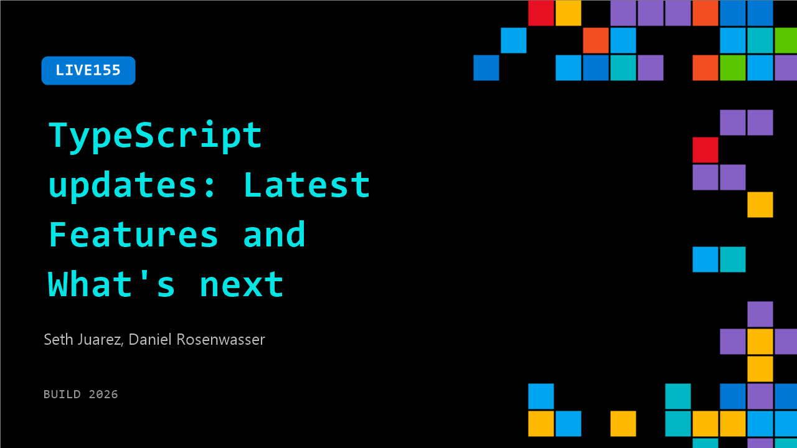

# LIVE155: TypeScript updates: Latest Features and What's next

**Session code:** LIVE155  
**Date:** Wednesday, June 3, 2026 / 11:15 AM - 11:30 AM PDT (Duration 15 minutes)  
**Watch on-demand:** <https://build.microsoft.com/en-US/sessions/LIVE155>

---

## Speakers

- **Seth Juarez** - Staff Developer Advocate, Microsoft
- **Daniel Rosenwasser** - Principal Product Manager, Microsoft

## About the session

From improved type inference to performance wins, TypeScript keeps evolving. Daniel Rosenwasser joins Seth Juarez to walk through what's new in the language and what the team is building next.

## AI summary

_No AI summary available._

## Session tags

- **Session type:** Broadcast Stage
- **Location:** Gateway Pavilion, Level 1, Build Broadcast Stage
