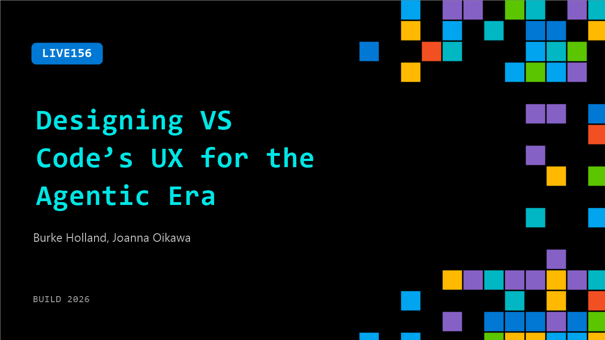

# LIVE156: Designing VS Code’s UX for the Agentic Era

**Session code:** LIVE156  
**Date:** Wednesday, June 3, 2026 / 1:25 PM - 1:40 PM PDT (Duration 15 minutes)  
**Watch on-demand:** <https://build.microsoft.com/en-US/sessions/LIVE156>

---

## Speakers

- **Burke Holland** - Distinguished Vibe Coder, GitHub
- **Joanna Oikawa** - Design Lead, VS Code + Visual Studio, Microsoft

## About the session

Joanna will pull back the curtain on how VS Code's design team is quietly retooling the editor for the agentic era — not with a big rewrite, but with hundreds of small, deliberate UX shifts. She'll share real examples, the tradeoffs behind them, and a few things her team got wrong along the way. It's a candid look at evolving a product millions of developers already love.

## AI summary

**Introduction and Team Overview:** At 00:00:00–00:00:07, the host welcomes viewers and introduces Joanna, the design lead for Visual Studio Code (VS Code). Joanna explains that VS Code’s design and UX engineering group is a small but powerful team of around forty-four designers. The discussion highlights how design and UX work hand-in-hand with engineering, enabling rapid iteration and unified product ownership. Joanna describes the vibrant UX design channel within the team, where prototypes and experiments often never reach production but inspire creative discussions among designers and engineers. This collaborative atmosphere allows ideas to emerge quickly and efficiently, with UX deeply integrated across the engineering culture.

**Design Evolution and Decision Challenges:** Beginning around 00:01:26–00:02:18, Joanna walks through examples of prototype work around the development of the “Agents Window,” describing how the team iterated on multiple designs in Figma starting back in December. They experimented with search menus, full-screen interfaces, and different approaches to display information across multiple workspaces. The conversation at 00:02:45 reveals that these decisions are informed by user research and telemetry, focusing on how developers engage with sessions and projects. Joanna underscores the complexity of designing for evolving user modalities and the challenge of balancing existing patterns with new workflows. Rather than having one person make a final call, the team places early prototypes in Insider builds and continuously updates based on feedback, refining the product over time until it feels right.

**Design and Development Integration:** Around 00:04:30–00:06:11, Joanna discusses how VS Code’s design practices have advanced through tighter integration between Figma and actual code. With modern tools like Figma plugins and Microsoft’s component system, design elements move seamlessly between the design environment and the codebase. Designers actively submit pull requests, contributing directly to the product’s source code—a transformation from earlier workflows. Joanna shows prototypes of experimental themes and color refreshes, explaining that even if some concepts don’t ship, interactive prototypes make it easier to solicit feedback from engineers. Details such as panel shadows and the flashing update icon demonstrate how small visual details evolve through iterative refinement based on user responses.

**Shifting Roles and AI-Enabled Breadth:** The discussion around 00:06:27–00:08:19 explores the changing nature of team roles. Joanna agrees that the boundaries between designers, engineers, and product managers have blurred—everyone now contributes code, and everyone considers user experience. She introduces the concept of “depth versus breadth”: while her depth is in UX and visual design, AI tools now enable her to expand her breadth into areas like analytics and telemetry. Using Microsoft’s Kusto query language, she can efficiently analyze user data and make informed design decisions without depending entirely on specialized data analysts. This represents a shift toward multidimensional roles powered by AI, allowing team members to operate across traditional discipline boundaries while maintaining their core expertise.

**Design Taste, Validation, and Continuous Improvement:** At 00:08:56–00:11:00, the conversation turns philosophical. The host jokes about “AI psychosis” and the illusion of taste created by AI-generated visuals, emphasizing that authentic design requires human judgment. Joanna agrees, noting that deep experience and feedback loops remain critical for refining taste and ensuring products solve real user problems. She stresses the importance of validation—testing whether quick fixes and new features actually serve their purpose rather than just adding noise. By holding themselves accountable for removing features that fail or distract users, the team maintains VS Code’s reputation for clean and effective design even amid complex technology shifts and rapid AI-driven development.

**Focus, Balance, and Conclusion:** In the final segment from 00:11:28–00:12:55, Joanna explains how the “Agents Window” design embodies restraint and intentional focus. The team reevaluated every element on screen to ensure it enhanced clarity rather than distraction, prioritizing navigation and multi-agent management while preventing cognitive overload. This iterative refinement highlights the principle that good design sometimes means pulling back, not adding more. The host closes by expressing appreciation for the VS Code design team and thanking Joanna for her insights. The segment wraps with applause and a lighthearted transition to the next video topic, leaving viewers with a deeper appreciation of the collaboration, craft, and ongoing evolution behind VS Code’s user experience.

## Session tags

- **Session type:** Broadcast Stage
- **Location:** Gateway Pavilion, Level 1, Build Broadcast Stage
