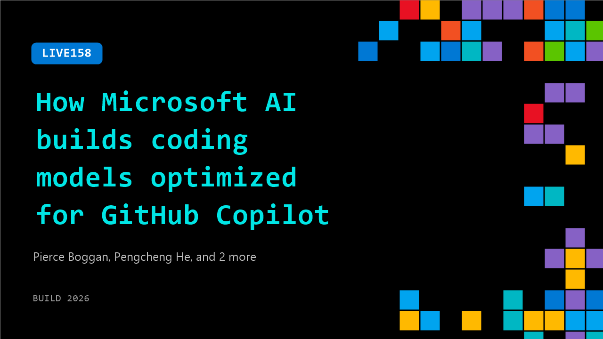

# LIVE158: How Microsoft AI builds coding models optimized for GitHub Copilot

**Session code:** LIVE158  
**Date:** Wednesday, June 3, 2026 / 10:55 AM - 11:15 AM PDT (Duration 20 minutes)  
**Watch on-demand:** <https://build.microsoft.com/en-US/sessions/LIVE158>

---

## Speakers

- **Pierce Boggan** - VS Code, Microsoft
- **Pengcheng He** - Member of Technique Staff, Microsoft
- **Seth Juarez** - Staff Developer Advocate, Microsoft
- **Yang Liu** - Member of Technical Staff, Microsoft

## About the session

Go behind the scenes with Microsoft AI to learn how to build and optimize coding models for GitHub Copilot. This session will explore what makes code-focused models different—from training and evaluation to performance, safety, and real-world developer feedback. You’ll hear how Microsoft AI is advancing model quality for the workflows developers care about most, and how those innovations show up in GitHub Copilot experiences used by millions of developers.

## AI summary

**Introduction and Overview:** The video opens with a friendly welcome from the host at 00:00:12, expressing excitement about the AI innovations announced at Microsoft Build. He notes that seven models were released and highlights one that particularly interests him as a developer — "Mai Code Flash." He introduces two researchers, Young and Hunter, who lead work on the model and explains that the conversation will explore what makes this code model unique, especially its integration with GitHub Copilot and developer workflows. This sets the stage for a technical deep dive into how it was built and optimized specifically for coding assistance in Visual Studio Code.

**Purpose-Built Design for GitHub Copilot:** At 00:00:55–00:01:22, the researchers discuss that Mai Code Flash was not adapted from a general-purpose model but designed from the ground up for GitHub Copilot usage. Peng explains that this approach enables it to understand developers’ intentions, handle context, and make targeted edits quickly. The team optimized it for real user workflows, ensuring smooth interactions in VS Code where the model can assist with programming tasks and understand coding context rather than just generating snippets. They emphasize that this intentional grounding in developer tooling makes it responsive and accurate within real coding environments.

**Training Process and Reinforcement Learning:** The video then moves into an explanation of how Mai Code Flash was trained at 00:02:46–00:05:01. The researchers describe a multi-stage process involving supervised fine-tuning followed by reinforcement learning. They start by teaching the model to follow user instructions on simple coding tasks and progressively increase complexity. Eventually, reinforcement learning aligns the model’s behavior through real interactions, using GitHub and VS Code environments as realistic training harnesses. This makes evaluation and production share the same workflow. The result is a model that behaves naturally for developers, improving as if it’s “going to school” — learning coding fundamentals before tackling advanced tasks. Customized benchmarks mirror real developer environments to verify performance during each stage.

**Model Architecture and Efficiency:** Around 00:05:27–00:07:20, the discussion shifts to the model’s architecture. The researchers explain that Mai Code Flash uses a Mixture of Experts (MoE) approach. While the total capacity reaches 137 billion parameters, only 5 billion are active per inference, providing high efficiency and reducing token usage. This structure achieves a balance between intelligence, speed, and cost. Each expert network handles relevant parts of a task, enabling fast computation and low latency. They highlight that token efficiency and smart activation make it "a beast at its size" — powerful yet lightweight for daily coding needs, allowing superior speed compared to similarly intelligent models.

**Demonstrations and Real-World Application:** In the middle section of the video at 00:09:20–00:11:20, the team presents live demos of Mai Code Flash in VS Code. The first demo shows the model building a front-end web app within seconds, responding efficiently and generating clean results. A second demo features creation of a simple AI-based game, showcasing enhanced UI generation ability. They note that the model is being gradually rolled out to users and visible via the “model picker” in Copilot. Discussions follow on testing and continuous refinement through A/B experiments, ensuring user engagement and minimal cancellation during interaction. Results show the model performs comparably to large frontier models for most coding tasks, providing a fast, reliable developer experience.

**Integration, Future, and Closing Thoughts:** In the final portion, starting around 00:14:35 and continuing to 00:16:15, they demonstrate how Mai Code Flash integrates with other Mai models — including Mai Transcribe and Mai Voice — enabling multi-agent collaborative coding environments where AI agents execute real development tasks. The researchers attribute this to natural synergy among the seven released Mai models. When asked what developers should take away, they emphasize imagination and continuous improvement. Users are encouraged to provide feedback to refine future “powerful beasts.” The host concludes enthusiastically, thanking the team and urging developers to stay tuned for upcoming iterations, applauding the innovation that merges efficiency, intelligence, and practical coding application.

## Session tags

- **Session type:** Broadcast Stage
- **Location:** Gateway Pavilion, Level 1, Build Broadcast Stage
