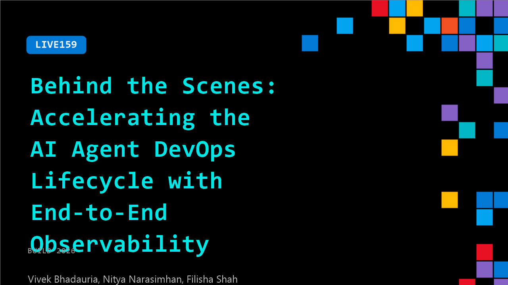

# LIVE159: Behind the Scenes: Accelerating the AI Agent DevOps Lifecycle with End-to-End Observability

**Session code:** LIVE159  
**Date:** Wednesday, June 3, 2026 / 2:10 PM - 2:20 PM PDT (Duration 10 minutes)  
**Watch on-demand:** <https://build.microsoft.com/en-US/sessions/LIVE159>

---

## Speakers

- **Vivek Bhadauria** - Partner Software Engineer, Microsoft
- **Nitya Narasimhan** - Senior Developer Advocate, Core AI, Microsoft
- **Filisha Shah** - Senior Product Manager, Microsoft

## About the session

In this interview we unpack what it really took to deliver our end‑to‑end “observe → evaluate → optimize” flow covering the end-to-end Agent DevOps lifecycle from inner‑loop offline signals to continuous improvement in production. We’ll share hard-earned lessons on (1) simplifying the getting started experience with out of the box observability powered by context-specific eval rubrics, (2) streamlining the developer experience with guided skill-based flows and (3) leveraging the complete set of inner and outer loop signals for continuous improvement.

## AI summary

**Introductions and Session Overview:** The session opens with greetings and introductions as the host, Nithya, welcomes the audience and her co-presenters Felicia and Vivek 00:00:02–00:00:14. Both Felicia and Vivek are members of the Foundry Observability team, and the conversation begins by setting the stage for a discussion on agent optimization—an advanced topic within AI development. Nithya expresses excitement about diving into why agent optimization is challenging and how the Foundry platform helps make the process more efficient for developers managing complex, stateful, and adaptive software agents 00:00:25.

**Challenges in Agent Optimization:** Vivek explains that agents differ from traditional software because they are stateful, long-horizon systems capable of planning, adapting, and interacting dynamically with their environment 00:00:35–00:00:49. This flexibility makes agents powerful but also very difficult to debug, test, or reproduce reliably. Foundry’s Agent platform provides an integrated environment where users can build, run, trace, evaluate, and optimize their agents within a single unified system 00:01:16–00:01:27. Nithya and Felicia emphasize how essential observability is across an agent’s development pipeline—from planning through deployment—to ensure developers can understand why models behave as they do and can iteratively improve performance.

**Evaluators and Evaluation Rubrics:** The discussion transitions into how Foundry introduces evaluators, tools designed to enable consistent testing of non-deterministic systems 00:02:00. Felicia explains that evaluators act as a new form of test-driven development for AI—allowing agents to be assessed using automated, data-driven criteria. These evaluators can be applied both in the development phase (inner loop) and in production environments (outer loop), offering developers continuous feedback on performance. The group then explores “Eval Rubrics” 00:02:52–00:03:25, a multidimensional assessment framework built by Foundry. Eval Rubrics enable weighted and domain-specific evaluations that help quantify an agent’s reliability, adaptability, and decision accuracy, thus serving as powerful guardrails for complex behaviors.

**Continuous Optimization and Production Readiness:** The conversation turns to how agents evolve after entering production 00:03:45. Vivek describes how developers can apply continuous optimization using Foundry’s “Agent Optimizer” tool 00:05:21, which ensures that agents keep improving based on live data and real-world interaction traces. The process involves maintaining high-quality “golden datasets” and consistent evaluators to detect regressions before updates are deployed. Over time, as agents run more sessions and collect more operational data, they become smarter and more robust. The panel notes that “Agent Optimizer” is currently in gated preview and will soon be available in public preview 00:05:49–00:05:57, inviting developers to try it and provide feedback.

**Advanced Evaluation and Trace Tools:** Nithya highlights additional Foundry capabilities like Foundry Skills, support for multi-turn conversational evaluation, and user simulation tools that allow developers to diagnose failed traces or unexpected outputs quickly 00:06:10–00:06:39. Features like Trace Replace simplify navigating complex interaction logs and reproducing issues efficiently. Collectively, these advancements demonstrate Foundry’s end-to-end observability model—spanning from agent creation to adaptive optimization—strengthening confidence in large, intelligent systems operating at scale.

**Reflections and Closing Remarks:** As time runs out 00:07:08, Nithya invites the panelists to share their personal takeaways from the Build event. Vivek reflects on how energizing it is to engage directly with developers and see how Foundry’s tools address real-world challenges 00:07:19, while Felicia expresses appreciation for the in-person collaboration and the vibrant atmosphere. The session closes with a reminder for viewers to check out breakout session “BRK 252” to see a live demo of Agent Optimizer in action 00:08:29–00:08:36, wrapping up a rich discussion on how Foundry is helping developers continuously build, monitor, and evolve their AI agents.

## Session tags

- **Session type:** Broadcast Stage
- **Location:** Gateway Pavilion, Level 1, Build Broadcast Stage
