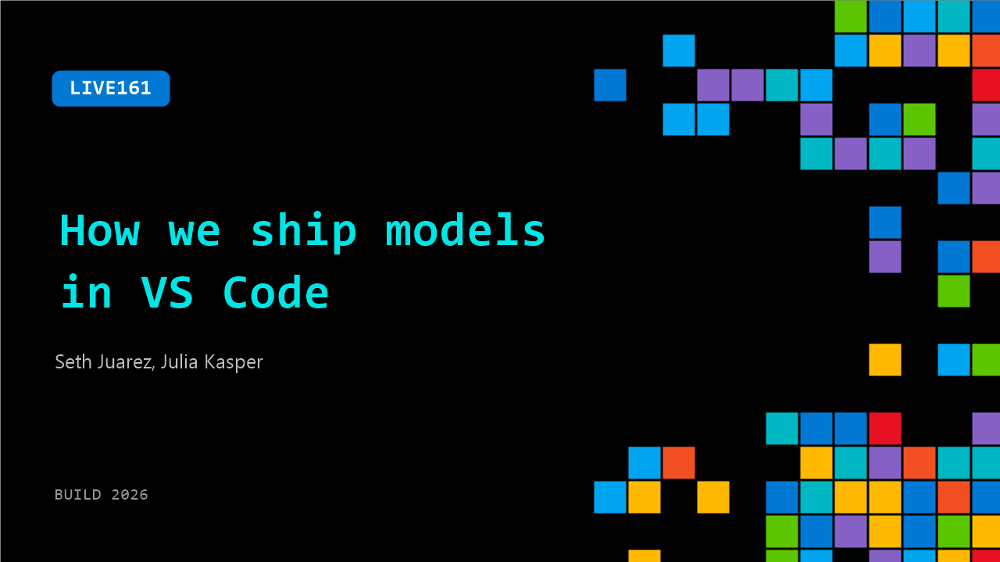

# LIVE161: How we ship models in VS Code

**Session code:** LIVE161  
**Watch on-demand:** <https://build.microsoft.com/en-US/sessions/LIVE161>

---

## Speakers

- **Seth Juarez** - Staff Developer Advocate, Microsoft
- **Julia Kasper** - Product Manager, Microsoft

## About the session

Shipping the right AI model for each task requires a lot of testing and evaluation. Get an inside look at how the VS Code and Copilot teams assess model quality, decide when to roll out updates, and balance capability with reliability.

## AI summary

_No AI summary available._

## Session tags

- **Session type:** Broadcast Stage
