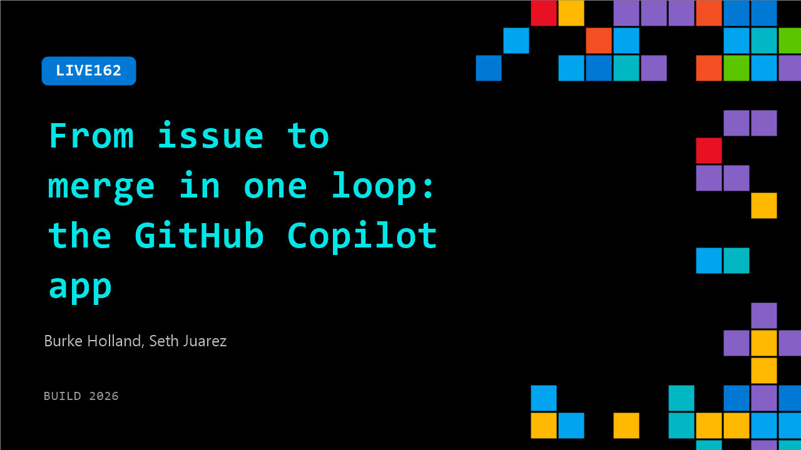

# LIVE162: From issue to merge in one loop: the GitHub Copilot app

**Session code:** LIVE162  
**Date:** Wednesday, June 3, 2026 / 12:30 PM - 12:45 PM PDT (Duration 15 minutes)  
**Watch on-demand:** <https://build.microsoft.com/en-US/sessions/LIVE162>

---

## Speakers

- **Burke Holland** - Distinguished Vibe Coder, GitHub
- **Seth Juarez** - Staff Developer Advocate, Microsoft

## About the session

What if you could hand off an issue, watch agents work it in real time, review the diff, and merge, all without leaving one screen? The GitHub Copilot app is a new desktop experience built for agent-driven development.

## AI summary

**Opening Banter and Setup:** The video begins with lighthearted chatter among the hosts as they prepare to go live. There is a casual exchange about stale doughnuts and the lack of lunch invitations, setting an informal tone (00:00:08–00:00:36). The hosts joke about not being invited to community events or GitHub meetups, and one recounts showing up to an MVP gathering without being officially invited (00:00:49–00:01:07). This playful beginning transitions into formal discussion topics where Seth introduces that they have “official business” to cover and will talk about GitHub Copilot and agents (00:01:10–00:01:18).

**Introducing GitHub Copilot and Workflow Contexts:** The hosts shift to explaining how GitHub Copilot fits into different developer workflows. They categorize the development tools into the command line interface (CLI), Visual Studio Code, and the GitHub Copilot app (00:02:10–00:02:19). Seth explains that each tool aligns with a specific level of focus — CLI for working on one isolated task, VS Code for project-level attention and seeing code details, and the Copilot app for broad, multi-project context (00:02:32–00:03:50). He demonstrates how the Copilot app acts as a “click stop up,” showing multiple repositories at once and giving developers a way to start their mornings with an overview of pending tasks and security issues (00:04:01–00:04:17).

**Holistic Decision-Making and Ideation with Copilot:** The conversation deepens as Seth describes code as “the easy part” — emphasizing that the real complexity is deciding what needs to be done and when. He demonstrates how the GitHub Copilot app supports that level of decision-making by giving a holistic overview of projects, enabling users to see releases, dependencies, and tasks before focusing in on writing code (00:05:00–00:06:04). The app filters to only what the user is working on, unlike GitHub’s broad notification system, helping streamline task management (00:06:36–00:07:09). They highlight “quick chat,” a tool in the app that supports ideation outside a specific project, where ideas can evolve without changing files, before being intentionally connected to a concrete project later (00:07:12–00:09:11).

**App Integration and Development Structure:** Seth explains that he builds various helper apps — such as CutReady, Snipse, and Allusum — which support presentations and workflow automation using technologies like Tauri and Rust. He humorously mispronounces “Tauri,” clarifies its nature as a lightweight web app framework, and discusses using shared infrastructure among these tools (00:09:19–00:09:52). By leveraging GitHub Copilot’s “quick chat,” he identifies repeating patterns and explores consolidating code for efficiency across projects (00:10:02–00:10:47). The team discusses how they can connect ideation sessions to real code bases once decisions become actionable, comparing this dynamic to how their dinner plans would be “disconnected until connected” (00:10:47–00:10:59).

**Key Productivity Enhancements and Canvas Feature:** Transitioning to new features, Seth praises the Copilot app’s project onboarding simplicity — being able to instantly open GitHub repositories without manually cloning or configuring work trees (00:11:20–00:11:46). He calls this “the single best feature of any app.” With minutes remaining, the hosts discuss the “Canvas” feature, which introduces a new way to interact visually with large language models beyond text chat (00:12:00–00:12:20). Canvas lets users build interactive diagrams with their agents, explore repositories, inspect components, and visualize divergences among branches or project dependencies. Seth describes using this in his Elusum app to click visual elements and prompt explanations directly from the agent (00:12:29–00:13:48).

**Closing Remarks and Humor:** The session wraps with reflections on how rapidly and meaningfully AI and developer tools are evolving. They celebrate simplicity and accessibility, joking that everything now moves “so slowly and it’s so easy to understand all the new features” (00:14:01). The hosts end with laughter, light jokes about exhaustion, and farewells, thanking each other and the audience before signing off and promising to be “right back” (00:14:07–00:14:15).

## Session tags

- **Session type:** Broadcast Stage
- **Location:** Gateway Pavilion, Level 1, Build Broadcast Stage
