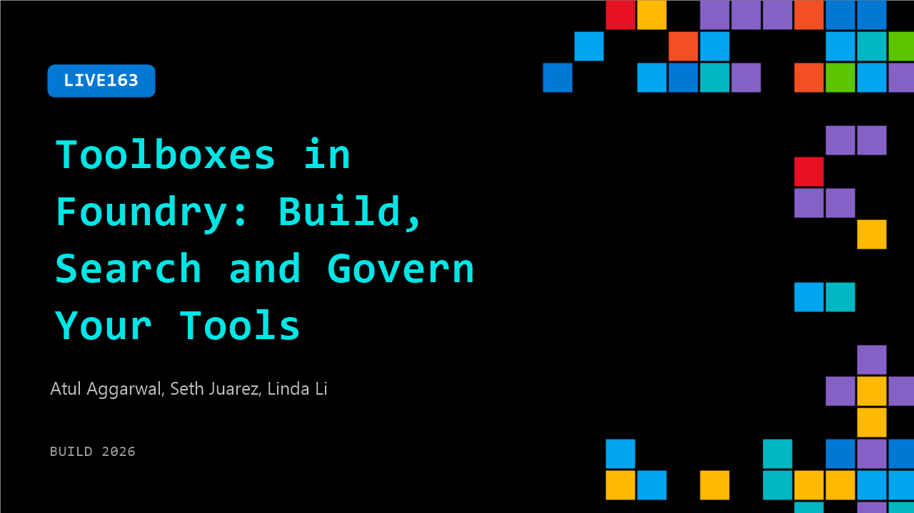

# LIVE163: Toolboxes in Foundry: Build, Search and Govern Your Tools

**Session code:** LIVE163  
**Date:** Wednesday, June 3, 2026 / 12:15 PM - 12:30 PM PDT (Duration 15 minutes)  
**Watch on-demand:** <https://build.microsoft.com/en-US/sessions/LIVE163>

---

## Speakers

- **Atul Aggarwal** - Partner Software Eng Manager, Microsoft
- **Seth Juarez** - Staff Developer Advocate, Microsoft
- **Linda Li** - product manager, Microsoft

## About the session

Today, each agent often wires tools directly, with its own authentication, credentials, and integration code. Toolboxes in Foundry are a new way to build, search and govern all tool types across all of your AI agents without rewiring them every time, powered by runtime tool search, unified endpoint and guardrail integration.

## AI summary

**Introduction and Setup:** The video opens with Seth welcoming viewers back to the Build stage and introducing his colleagues Linda and Atul 00:00:00–00:00:06. Seth admits that earlier, when Linda mentioned the new Microsoft Foundry Toolbox, he was skeptical about its utility. However, he confesses that he was proven wrong because the Toolbox played a key role in the keynote demo they delivered successfully 00:00:27–00:00:39. Linda introduces herself as a product manager at Microsoft Foundry, and Atul describes his role as a partner engineering manager 00:00:43–00:00:50. Seth then invites them to discuss the main problems that Toolbox aims to solve.

**Challenges Addressed by Toolbox:** Linda outlines the key issues developers face when building AI agents at scale: authentication complexity, multiplicity of tools, and governance 00:00:58–00:02:21. As developers connect agents to many tools (often hundreds), each with different APIs and protocols, they must write extensive custom code for authentication and authorization. Additionally, exposing too many tools to the model inflates token usage and clutters context windows. Governance adds more difficulty, since each tool may require unique policy enforcement, making code reuse and scaling inefficient. Atul further explains that Toolbox tackles these problems by providing a unified structure for tool management, policy application, and context optimization 00:02:22–00:02:43.

**How Toolbox Works for Developers:** Atul demonstrates how easy it is to start using Toolbox, showing that developers first curate their suite of required tools and then plug them into the Toolbox 00:02:45–00:04:18. Toolbox outputs a unified MCP-compatible endpoint that agents can call directly, simplifying tool invocation. This design reduces context bloat and token cost because Toolbox smartly routes each query to the correct tool without exposing unnecessary metadata to the model. Governance guardrails from Foundry can also be linked to Toolbox for automatic enforcement during every invocation, ensuring data safety. Seth highlights how this setup prevents procedural memory pollution within the LLM context space and asks about search capabilities within Toolbox.

**Tool Search and Automation:** Linda elaborates on Toolbox’s "tool search" capability, which dynamically retrieves the most relevant tools based on a user’s prompt 00:04:51–00:06:14. Users can also "ping" tools to ensure they remain accessible to the agent at all times or let Toolbox automatically learn usage patterns and "auto-ping" frequently used tools. Seth and Atul clarify that when tool search is active, only two meta tools—search and call—are exposed to the model, greatly simplifying memory footprint. This design further supports efficient procedural control while still enabling parameter bindings and preconfigured credentials for tools, which can be set up just once by developers 00:06:35–00:07:01. Developers can also access individual tools or create combinations within Toolbox as needed.

**Demo and Advanced Features:** Linda presents a live Toolbox demo that includes a custom MCP server for inventory lookup and other tools such as knowledge bases and APIs 00:08:40–00:10:24. Toolbox supports multiple custom combinations, letting users build multiple boxes for different tasks. Linda explains that skills complement tools by teaching agents "how" to use them, addressing customer needs like private skill catalogs and auto-discovery features. Seth realizes that Toolbox’s integration of both tools and skills provides stronger procedural guidance for LLMs. Linda shows how to attach a Toolbox as an MCP endpoint to any agent framework, reducing thousands of lines of integration code 00:11:00–00:12:04. Atul adds that this approach enables multiplexing, where multiple agents can share optimized tool collections with minimal processing overhead.

**Optimization, Future Plans, and Closing:** The conversation concludes with a deeper dive into Toolbox’s internal mechanisms. Atul explains that Toolbox uses algorithms like BM25 for tool search today and will introduce LLM-enhanced search soon 00:12:26–00:12:53. Seth compares the system to retrieval-augmented generation (RAG), noting that Toolbox operates like RAG but for procedural tools instead of documents. Linda announces that Toolbox is currently in public preview and will achieve general availability later this month 00:13:17–00:13:34. New governance dashboards will soon allow customers to monitor tool usage, token consumption, ROI, and security controls, minimizing risks like prompt injection and data leakage. Seth wraps up by applauding Linda and Atul for their work on this innovative solution and thanks viewers for joining the session 00:13:57–00:14:03.

## Session tags

- **Session type:** Broadcast Stage
- **Location:** Gateway Pavilion, Level 1, Build Broadcast Stage
