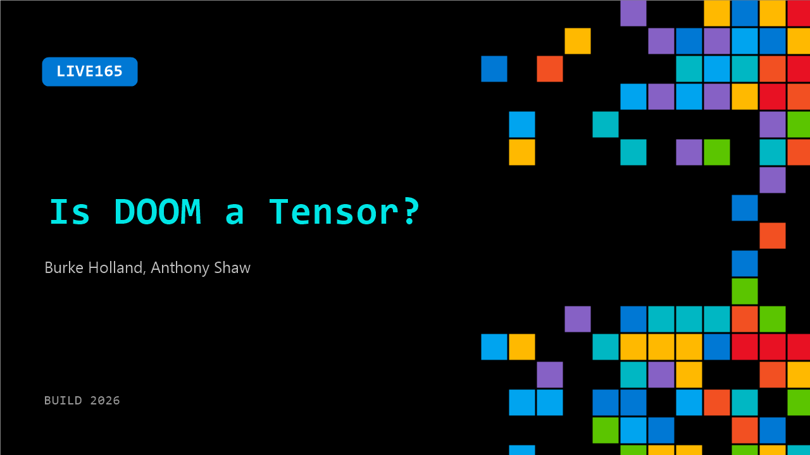

# LIVE165: Is DOOM a Tensor?

**Session code:** LIVE165  
**Date:** Wednesday, June 3, 2026 / 1:40 PM - 2:00 PM PDT (Duration 20 minutes)  
**Watch on-demand:** <https://build.microsoft.com/en-US/sessions/LIVE165>

---

## Speakers

- **Burke Holland** - Distinguished Vibe Coder, GitHub
- **Anthony Shaw** - Technical Advisor, Microsoft

## About the session

Every model you use runs on tensors. But what actually is a tensor, where does DOOM fit in, and why does it matter when you are trying to get Copilot to optimize your code? Anthony Shaw breaks down how machine learning models work under the hood and what knowing that changes about how you write prompts that actually get results.

## AI summary

**Introduction and Setup:** The session opens with friendly banter between the hosts as they reintroduce themselves at 00:00:04–00:00:13. Anthony Shaw is introduced as a technical advisor and former Python advocate at Microsoft, having contributed to Python-related work for several years. The topic quickly shifts to the intriguing and humorous premise of the segment—asking, “Is Doom a tensor?” (00:00:43–00:00:47). Although initially unclear, the speakers promise to make sense of the question by connecting concepts from Python, machine learning, and Onnx models within the next 15–20 minutes.

**Explaining Tensors and Machine Learning Models:** Shaw begins defining what a tensor is around 00:01:23, describing it as data with size and shape — commonly represented as matrices. He provides an example of a simple machine learning operation that sums array items (00:01:32–00:01:49). The discussion then introduces Netron, a tool to visually inspect and understand AI models (00:02:17–00:02:25). They explore a specific model called “Harrier,” noting how tokens and attention masks form part of its input. Shaw explains that machine learning models consist of both weights and executable instructions — not just static data — illustrating how models execute layers to transform input sequences into tokenized outputs (00:03:12–00:03:21).

**Connecting ONNX Models and Hardware Optimization:** Around 00:03:24, conversation turns to hardware optimization and the Onnx platform’s flexibility. Shaw references working with NVIDIA on projects involving new Surface Ultra devices and notes that Onnx is Turing complete—meaning, theoretically, anything computable could be represented within it. This idea sparks the question: if Onnx supports complex logic, could it run the video game Doom? (00:04:11–00:04:17). Burk playfully doubts this, leading Shaw to reference the famous “Potato Doom” experiment, where potatoes were used to power a device that ran the game (00:05:28–00:05:38). Shaw then outlines three potential methods for running Doom in an Onnx environment: compiling its source code into Onnx, creating a CPU emulator, or utilizing other creative methods. The audience votes, and option two – emulating a CPU – is chosen (00:06:15–00:06:28).

**Building and Running Doom in Excel and Onnx:** Shaw explains that he used the RISC-V architecture as a baseline to emulate a CPU within Onnx nodes (00:06:42–00:07:00). He then demonstrates compiling Doom from source into machine code, and surprisingly, shows that machine code can be read and partially executed in Microsoft Excel formula logic (00:08:07–00:08:20). Shaw confirms that Excel is Turing complete and describes building a spreadsheet CPU that can interpret Doom’s code line by line — only limited by Excel’s one-million-row maximum. Despite performance challenges, this playful experiment becomes part of Microsoft Build 2026’s announcements, showing “Doom runs in Excel” in a retro AI-generated promotion. In another demo using Netron, Shaw presents the Onnx-based CPU graph with tensors acting as RAM and registers (00:10:32–00:11:11). The system indeed renders a Doom frame — taking approximately six hours per single frame, equating to a 2 kHz CPU speed (00:12:03–00:12:18).

**Optimizing Performance and Lessons Learned:** From 00:12:26 onward, Shaw transitions the conversation toward meaningful lessons in performance tuning and AI optimization. He shares how Copilot assisted in iteration but struggled with caching and computational overhead. He emphasizes standard approaches for improving AI model speed—caching outputs, reducing work, and scaling hardware. Despite limited success (progressing from 2 kHz to 4 kHz CPU speed), he illustrates that optimization requires iterative improvement and hardware consideration (00:13:04–00:13:47). Shaw also describes how to “coach” AI agents to improve speed by using benchmarks and rubber-duck debugging within Copilot CLI. The final accelerated demo shows Doom’s playback simulated via Onnx outputs converted to GIF frames, though without sound or keyboard input (00:15:01–00:15:19).

**Conclusion and Key Insights:** As the talk closes around 00:15:54–00:17:09, Shaw humorously confirms that “Doom is a tensor” but clarifies that while the experiment proved theoretical completeness, it is not practical or efficient. The key takeaway is that AI model nodes and instructions must be optimized per hardware configuration to maximize performance. He cautions that downloading models from repositories should include checking compatibility with the user’s CPU or GPU due to differing tensor implementations. The hosts conclude with appreciation and laughter, noting the educational depth and humor of the session. The segment ends as they thank viewers and sign off.

## Session tags

- **Session type:** Broadcast Stage
- **Location:** Gateway Pavilion, Level 1, Build Broadcast Stage
