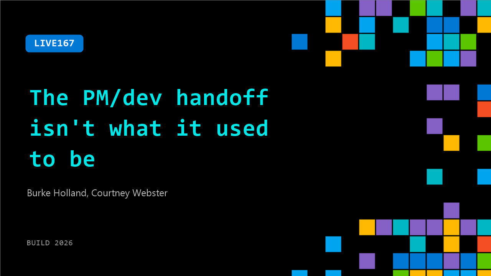

# LIVE167: The PM/dev handoff isn't what it used to be

**Session code:** LIVE167  
**Date:** Wednesday, June 3, 2026 / 12:55 PM - 1:10 PM PDT (Duration 15 minutes)  
**Watch on-demand:** <https://build.microsoft.com/en-US/sessions/LIVE167>

---

## Speakers

- **Burke Holland** - Distinguished Vibe Coder, GitHub
- **Courtney Webster** - Product Manager, Microsoft

## About the session

The PM to dev handoff used to mean a document nobody loved reading and a long wait to find out if the idea actually worked. When agents can take a vague idea to a working pull request in a day, the whole loop changes. This session is about what that means for how product and engineering work together now and what a faster, prototype-first culture actually looks like on a team shipping weekly.

## AI summary

_No AI summary available._

## Related sessions

- BRK204

## Session tags

- **Session type:** Broadcast Stage
- **Location:** Gateway Pavilion, Level 1, Build Broadcast Stage
