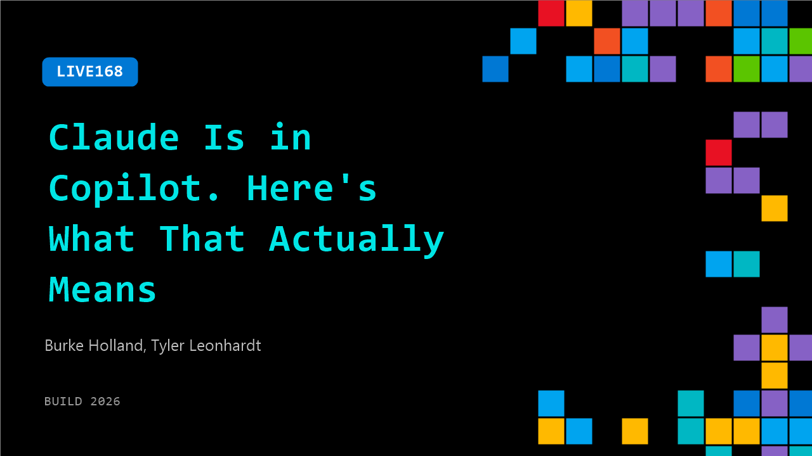

# LIVE168: Claude Is in Copilot. Here's What That Actually Means

**Session code:** LIVE168  
**Date:** Wednesday, June 3, 2026 / 1:10 PM - 1:25 PM PDT (Duration 15 minutes)  
**Watch on-demand:** <https://build.microsoft.com/en-US/sessions/LIVE168>

---

## Speakers

- **Burke Holland** - Distinguished Vibe Coder, GitHub
- **Tyler Leonhardt** - Senior Software Engineer, Microsoft

## About the session

Claude runs as a coding agent inside GitHub Copilot in VS Code. But what does that actually look like at the code level? How is context assembled? What tools does Claude have access to? What happens when you pick Claude in the model picker versus letting Copilot run? Tyler Leonhardt goes inside the integration so you know exactly what you are working with.

## AI summary

**Opening and Introduction:** The session begins with a lighthearted welcome as the hosts re-engage the audience at 00:00:01. They check in energetically with attendees, ensuring everyone remains alert and enthusiastic despite the late afternoon timing. After setting an upbeat tone, the host introduces Tyler from the Visual Studio Code (VS Code) team. The conversation quickly pivots toward the main topic — exploring new features in VS Code that incorporate Claude agents, signaling a shift from the more familiar Copilot focus at 00:00:30.

**Claude Agent Integration in VS Code:** Tyler explains that the Claude Agent integration is based on Anthropic’s Agent SDK, which works similarly to the Copilot SDK but allows users flexibility with their existing Copilot subscriptions (00:01:04). This integration lets developers choose between multiple AI “harnesses” — Claude, Copilot CLI, local configurations, and Codex. The design offers freedom without requiring different billing or account setups. Tyler highlights that enterprises constantly test different AI harnesses, so this compatibility reduces friction as technologies evolve (00:01:25–00:02:05).

**Conversation on Real-World Use and Demonstration Setup:** Adding personality to the discussion, Tyler reveals he organizes local improv events and demonstrates using Copilot and Claude together to generate a website for an event called "Compliment Fest" (00:03:39). He shows how Claude Agent in VS Code automates web creation tasks using visual and design guidance from a flyer PDF. Confetti animations and fun visuals are included, adding humor and human touch to the demo. This practical showcase illustrates the fluid integration between Claude and Copilot while tying back to creative real-world use cases that go beyond code writing.

**Exploring Agent Architecture and Protocols:** The talk becomes more technical as Tyler introduces the “agent host protocol” for managing connections between AI agents and user environments (00:06:23). He explains that this protocol enables remote communication so that agents can run on a host machine while users interact from other clients — including web browsers and mobile devices. Demonstrations show VS Code’s ability to connect locally and remotely through VS Code.dev, highlighting secure access via authentication. This flexibility supports seamless transitions from desktop to browser work environments and provides a vision of decentralized AI development workflows (00:07:11–00:09:00).

**Using Claude in the Cloud:** Tyler continues by showing how Claude can run as a cloud-based agent within VS Code’s settings (00:09:24). Users can toggle Claude or Codex coding agents for cloud execution — nicknamed humorously “Claude in the Cloud.” The demonstration sends test prompts to the agent, showing it performing lightweight actions like code suggestions and file edits directly in the cloud. The hosts joke that high-end computers are handling trivial requests, adding levity while underscoring how AI processes tasks seamlessly across environments. Tyler emphasizes that all customization options available in Claude Code also function within this setup (00:10:09–00:10:55).

**Wrap-Up and Acknowledgments:** As the session winds down, the hosts summarize the main takeaways — flexibility between Copilot and Claude agents, integration with existing subscriptions, and the benefits of remote accessibility (00:11:04). Tyler reiterates that developers gain “freedom of choice” across AI tools, allowing continuous customization in VS Code without new costs or barriers. The audience applauds, and the hosts thank Tyler warmly for the insightful demo and engaging delivery. They close playfully by hinting at more stories behind "Compliment Fest" before transitioning to the next session at 00:12:08.

## Session tags

- **Session type:** Broadcast Stage
- **Location:** Gateway Pavilion, Level 1, Build Broadcast Stage
