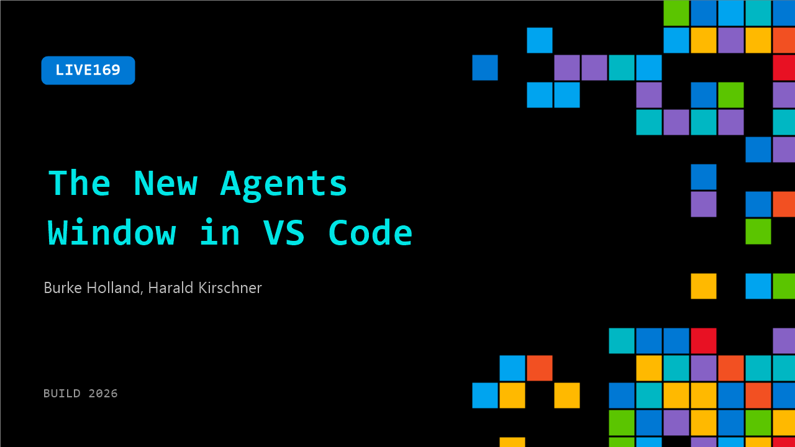

# LIVE169: The New Agents Window in VS Code

**Session code:** LIVE169  
**Date:** Wednesday, June 3, 2026 / 2:00 PM - 2:10 PM PDT (Duration 10 minutes)  
**Watch on-demand:** <https://build.microsoft.com/en-US/sessions/LIVE169>

---

## Speakers

- **Burke Holland** - Distinguished Vibe Coder, GitHub
- **Harald Kirschner** - Principal PM, Microsoft

## About the session

Agent sessions are more powerful than ever and the VS Code team has been building the visibility and efficiency to match. Harald Kirschner walks through the new Agents window, the token optimization work shipping across recent releases, and how to get the most out of every session.

## AI summary

**Introduction and Team Overview:** The discussion opens at 00:00:00 with Harold joining from the Visual Studio Code (VS Code) team. The host notes that nearly the entire VS Code team is present, mentioning members like Courtney, Joanna, Josh, and Tyler. Harold confirms his role as a "PM-ish" on the team, explaining that VS Code's project management culture is highly technical, with all new members—whether PMs, advocates, or documentation writers—required to create code extensions when they join 00:00:25. This sets the stage for a deep technical conversation about recent developments within VS Code.

**Introducing the Agent Window Concept:** The talk transitions at 00:01:02 to focus on the new "agent window," previously called the "agent sessions window." Harold describes how it evolved to streamline work with multiple coding agents and projects. Traditionally, developers switched between numerous VS Code windows, causing mental context loss and workflow overhead. The agent window unifies all open workspaces and agent processes—local or remote—into a single, centralized interface, improving continuous development and orchestration 00:01:19. Although it looks and feels like standard VS Code, the agent window integrates all extensions and themes, operating as a redesigned form factor within the same VS Code application environment.

**Demonstration of Multi-Workspace Capabilities:** Around 00:03:05, Harold demonstrates setting up agents across different repositories, explaining that workspaces can be local folders or remote ones hosted via GitHub or dev tunnels. He elaborates that VS Code tunnels allow users to open a web-accessible URL to their development environment on any machine 00:03:39, emphasizing it's a powerful but often overlooked feature of VS Code. This integration makes the agent window effective for developers juggling multiple open-source projects or pending pull requests, enabling real-time tracking of progress and context across environments. Harold describes the interface as an "agent orchestration control center" where all sessions—from docs to source code repos—appear in collapsible panes, promoting better task organization.

**Customization and Agent Feedback:** By 00:05:28, the conversation moves to how developers can manage notifications and customizations when agents complete tasks. Harold explains hooks for auditory feedback when an agent finishes running, addressing challenges of excessive alerts like constant "ding" sounds from concurrent agents. He shares his setup using VS Code customization hooks to trigger spoken summaries through local speech models when a task completes—his computer announces completion details aloud 00:06:33. This clever integration showcases how agent notifications can be made more intuitive and context-aware, bridging functionality from command-line autopilot operations with personalized system feedback.

**Cost Optimization and Model Routing:** Near the session’s close at 00:07:31, Harold introduces cost and performance improvements tied to new model usage in VS Code’s AI features. He explains that the “auto” model now routes requests dynamically based on task complexity, delivering roughly a 10% discount in token usage compared to fixed model runs. The recommended approach is to plan tasks using larger models before letting the auto model handle implementation, which smartly selects the most efficient computational route 00:08:13. This optimization helps developers saving tokens—essentially computing credits—while maintaining output quality. Future updates aim to display the exact token savings retrospectively, similar to retail-style "You saved X today" feedback, enhancing the sense of user efficiency and success.

**Closing Remarks:** The conversation wraps up around 00:09:24 with Harold reminding viewers to check release notes for ongoing improvements in pricing models and token savings. The host thanks Harold for his detailed explanations and insights, signaling the end of the session 00:09:29. The video concludes on an appreciative note, acknowledging the blend of engineering depth and user-focused innovation within the VS Code ecosystem.

## Session tags

- **Session type:** Broadcast Stage
- **Location:** Gateway Pavilion, Level 1, Build Broadcast Stage
