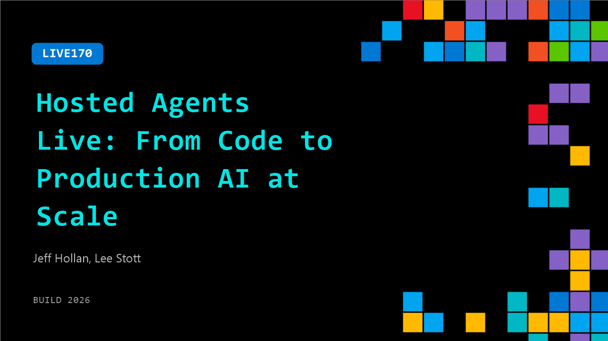

# LIVE170: Hosted Agents Live: From Code to Production AI at Scale

**Session code:** LIVE170  
**Date:** Wednesday, June 3, 2026 / 2:20 PM - 2:30 PM PDT (Duration 10 minutes)  
**Watch on-demand:** <https://build.microsoft.com/en-US/sessions/LIVE170>

---

## Speakers

- **Jeff Hollan** - Partner Director of Product, Microsoft
- **Lee Stott** - Principal Cloud Advocate, Microsoft

## About the session

Join us live from Build as we break down how developers are moving from coding agents to running production‑grade AI systems using hosted agents in Microsoft Foundry. We’ll show how to go from local prototyping to secure, scalable deployment—covering identity, isolation, evaluation, and lifecycle management—so you can ship real‑world agents with confidence.

## AI summary

**Introduction and Roles:** The video begins with greetings from Lee Star, Principal Cloud Advocate at Microsoft, who introduces his guest Jeff Holland, Partner Director for Foundry Agent 00:00:00–00:00:07. Jeff describes his responsibilities in Foundry's product management team, particularly focusing on enabling developers to build and deploy cloud-scale AI agents 00:00:16–00:00:34. He notes that his team supports builders with selecting models, hosting agents, and managing all necessary tools and evaluation components.

**Hosted Agents Overview:** The discussion moves to Hosted Agents, a recently launched preview product within Foundry 00:00:40–00:00:43. Jeff explains that unlike traditional prompt-based agents, Hosted Agents allow developers to bring their own agent code or harness. Users can leverage frameworks like Lang Graph, Microsoft Agent Framework, Anthropic Agent SDK, and GitHub Copilot SDK to define and test agents locally before Foundry hosts them in the cloud 00:01:09–00:01:49. This system connects agent logic to models, observability, and tooling to enable scalable deployment without sacrificing developer control.

**From Prototype to Production:** Jeff highlights the challenge of moving from prototype agents—quickly created with tools like Copilot—to production-ready reliable agents 00:02:11–00:03:28. Quality assurance is critical, with enterprises demanding accurate responses and strong evaluation metrics. He mentions observability, lifecycle management, versioning, and scalability as core considerations. The transition mirrors classical DevOps patterns with similar requirements for monitoring, testing, and continuous improvement 00:03:47–00:04:00.

**Identity, Security, and Governance:** Addressing one of the biggest developer challenges—agent identity and isolation—Jeff describes how Microsoft integrates robust identity management through Intra’s Agent Identity 00:04:12–00:05:05. These identities enable both standard managed authentication and delegated “on-behalf-of” access patterns, allowing secure interaction with user data while maintaining telemetry tracking. Foundry automatically provisions agent identities, simplifying configuration for developers 00:05:16–00:05:33. Jeff further elaborates on new Foundry role frameworks (user, contributor, observability) and efforts to define least-privileged access and guardrails for autonomous agents 00:05:58–00:06:56.

**Production Insights and Future Directions:** Reflecting on developer adoption, Jeff warns that many underestimate the potential of well-designed agents 00:07:08–00:07:49. He emphasizes balancing governance with autonomy, allowing agents sufficient flexibility to surprise users with useful outcomes. Modern agent harnesses like Open Claw, Hermes Agent, and GitHub Copilot CLI represent significant advances. By combining a strong harness with powerful models, developers can unlock unexpected value and innovation in production environments 00:08:01–00:08:24.

**Conclusion and Developer Call to Action:** As the conversation concludes, Jeff encourages developers to explore Microsoft Foundry by following its documentation and quick-start guides 00:08:33–00:09:00. He recommends reading blogs and trying out hands-on labs to rapidly learn Hosted Agents’ capabilities. Lee thanks Jeff for the insights, closing the video with enthusiasm about the growing possibilities of hosted AI agents and the Foundry ecosystem. The overall message is that now is the perfect time for developers to experiment and shape their future agent-driven solutions 00:09:00–00:09:04.

## Session tags

- **Session type:** Broadcast Stage
- **Location:** Gateway Pavilion, Level 1, Build Broadcast Stage
