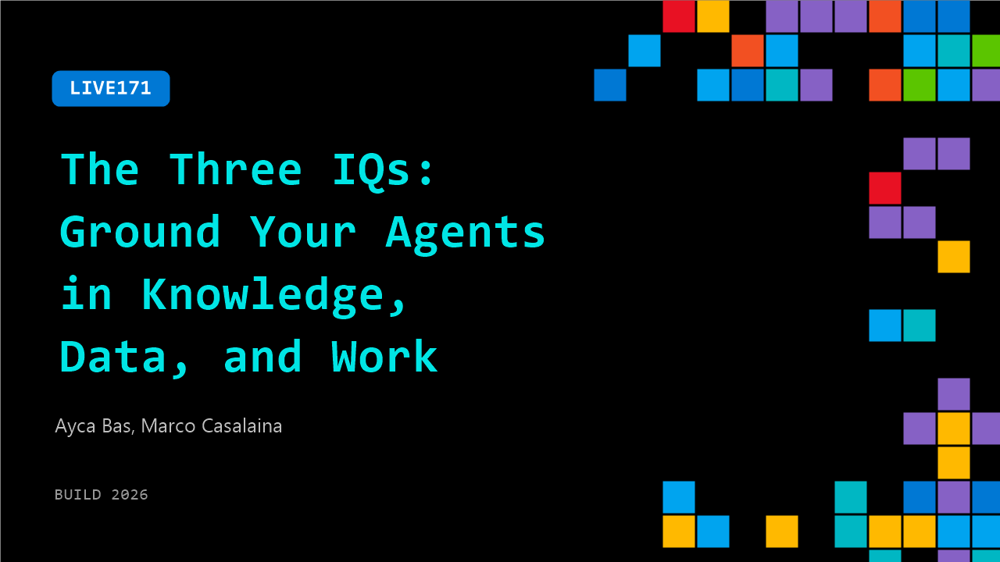

# LIVE171: The Three IQs: Ground Your Agents in Knowledge, Data, and Work

**Session code:** LIVE171  
**Date:** Wednesday, June 3, 2026 / 2:30 PM - 2:45 PM PDT (Duration 15 minutes)  
**Watch on-demand:** <https://build.microsoft.com/en-US/sessions/LIVE171>

---

## Speakers

- **Ayca Bas** - Senior Developer Advocate, Microsoft
- **Marco Casalaina** - VP Products and AI Futurist, Core AI, Microsoft

## About the session

Agents shouldn't hold all the context themselves — they should delegate. See how Foundry IQ (knowledge), Fabric IQ (data), and Work IQ (human context) let developers build grounded, enterprise-ready agents faster, with reusable intelligence instead of hand-wired pipelines. Live demo included.

## AI summary

**Introduction and Context:** The video opens with greetings and introductions from Marco Caslena, VP of Products at Core AI, and Aisha, a Developer Advocate at Microsoft (00:00:02–00:00:12). They introduce the topic — the “Four IQs,” a concept expanding from previously three IQs to four, which represent different capabilities for intelligent agents. The discussion begins by setting the stage at Microsoft Build, establishing IQs as a major topic and contextualizing them as components needed for real-world agent operations with complex data sources (00:00:27–00:00:37).

**Overview of the Four IQs:** Aisha and Marco outline the four distinct IQs — Web IQ, Foundry IQ, Fabric IQ, and Work IQ (00:00:52–00:00:58). Web IQ connects agents to web-based knowledge for accessing online data and services such as shipment tracking or local information (00:01:01–00:01:21). Work IQ integrates Microsoft 365 data like emails and Teams messages, enabling agents to interact with organizational contexts. Fabric IQ manages structured data, providing headless access for agents to structured sources such as Power BI reports. Foundry IQ handles unstructured data repositories — blob storage, SharePoint, and search indices — with advanced retrieval mechanisms beyond basic retrieval augmented generation (00:02:08–00:02:30).

**Early Development and Agent Instruction Optimization:** Marco and Aisha describe the process and challenges of integrating these IQs into working agents. While the individual IQ tools are new, teams are collaborating to align them effectively (00:03:08–00:03:18). They emphasize the importance of defining precise agent instructions to ensure optimal decision-making and tool selection. The conversation dives into the iteration of instruction sets and mappings for each IQ, including examples of JSON body requests and search or action behaviors tailored to Work IQ. This detailed configuration allows agents to consume IQ content appropriately and achieve high performance, not just basic functionality (00:03:30–00:04:48).

**Preventing Context Redundancy and Introducing Agent Templates:** The next section discusses how IQs help reduce “context rot,” meaning developers no longer need to overload agents with excessive contextual data (00:05:00–00:05:17). Even with IQs, defining the specific instructions for when and how to use each tool remains a developer’s task. Marco demonstrates the concept of “agent templates” — predefined agent structures that allow anyone to instantiate their own version within Microsoft 365 (00:06:03–00:06:11). Each instantiated agent possesses unique identity attributes like its own inbox and Teams presence. Marco illustrates this using a “refund processor agent” example that responds to emails in its own security context, reinforcing the practical value of dedicated agent identities (00:06:32–00:07:19).

**Security Context and Organizational Deployment Considerations:** Marco continues by explaining how agent identity contributes to secure organizational deployment (00:07:31–00:08:41). In contrast with “on behalf of” agents that act as users, certain agents should have separate permissions for cybersecurity reasons. He demonstrates this concept using an internal application, Copilot CLI, and shows how an agent that operates independently can have limited privileges (e.g., can send messages but cannot delete files). This design ensures that agent actions remain compliant and contained within their security posture, essential for enterprise-scale deployment.

**Demo Recap, Resources, and Closing:** Aisha concludes the video by showing trace logs that capture synchronized interaction among the IQs — Work IQ, Fabric IQ, and Foundry IQ — as they collaboratively processed a refund case for a customer (00:09:01–00:09:22). She encourages viewers to explore the dedicated IQ learning series at “aka.ms/IQ-series,” where each IQ is covered in depth, with Foundry, Work, and Fabric IQ episodes available and Web IQ to follow (00:09:41–00:10:04). Completing all modules and cookbooks grants participants a digital badge acknowledging their expertise. Marco closes by urging everyone to “use yourself some IQs” and wishes the audience a good day (00:10:06–00:10:13).

## Session tags

- **Session type:** Broadcast Stage
- **Location:** Gateway Pavilion, Level 1, Build Broadcast Stage
