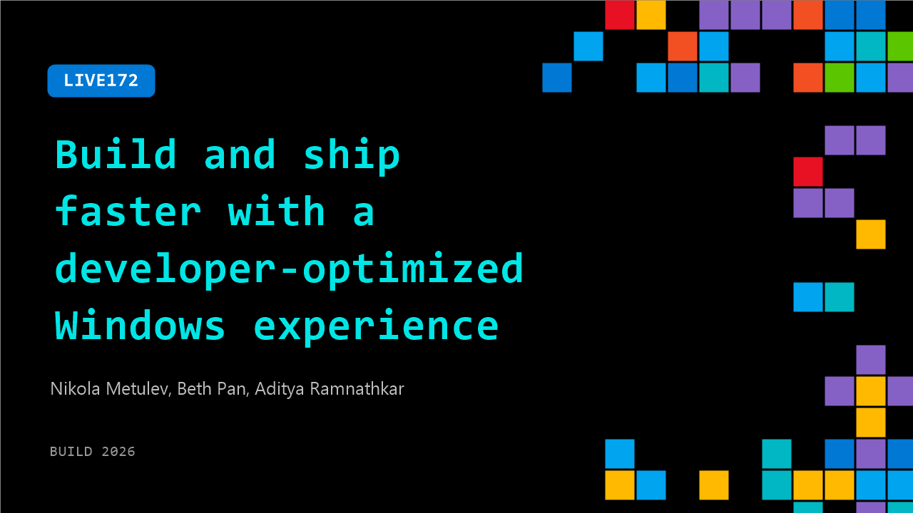

# LIVE172: Build and ship faster with a developer-optimized Windows experience

**Session code:** LIVE172  
**Date:** Tuesday, June 2, 2026 / 2:45 PM - 3:00 PM PDT (Duration 15 minutes)  
**Watch on-demand:** <https://build.microsoft.com/en-US/sessions/LIVE172>

---

## Speakers

- **Nikola Metulev** - Software Engineer, Microsoft
- **Beth Pan** - Software Engineer, Microsoft
- **Aditya Ramnathkar** - Product Marketing Manager, Microsoft

## About the session

Take a closer look at a developer-optimized Windows experience built to help you move faster. You’ll see how streamlined workflows across WSL, Terminal, WinGet, and your favorite tools reduce friction, leverage agents, build repeatable scenarios, and scale AI projects with confidence.

## AI summary

**Introduction and Windows Developer First Vision:** The session opens with Aditya Ramnathkar, joined by software engineers Beth Pan and Nicola Matulov, introducing themselves as members of the Windows Platform team at Microsoft Build 00:00:00–00:00:11. Aditya sets the stage by explaining that the focus of Windows 11 is to become the best operating system for developers — distraction-free, streamlined, and developer-first. He highlights a series of new improvements launched during Build: Core Utilities support, native Linux containers via WSL, an effortless one-command setup for developer environments, agent-augmented coding capabilities, an intelligent terminal, and next-generation AI-ready hardware for sustainable workloads 00:00:19–00:00:49. The goal is to help developers build and ship faster on Windows.

**Streamlined Developer Setup with Winget Configurations:** Beth continues the discussion by addressing a common pain point reported by developers: the difficult onboarding and frequent setup overhead when switching or refreshing machines 00:01:01–00:01:22. To solve this, Windows now provides an automated setup method using Winget configuration files that can install preferred tools like Python, Node.js, PowerToys, and more in a distraction-free environment 00:01:52–00:02:07. All configurations are hosted on a public GitHub repository for flexibility and easy customization. Developers can fork and modify these configurations as needed. Beth clarifies that the process eliminates repetitive steps such as enabling developer mode or manually toggling dark mode and visibility options in File Explorer. Winget configuration can instantly apply all preferences with a single command, offering ready-to-code systems out of the box on new devices or existing ones 00:03:08–00:03:44.

**Core Utilities and Native Linux Containers with WSL:** The discussion transitions to the integration of native UNIX/Linux tools within the Windows Terminal 00:05:00. Developers can now use familiar commands like `grep` and `netstat` directly without translation into PowerShell syntax. Scripts imported from UNIX or Mac systems work seamlessly, reducing friction when collaborating across environments. Following this, Nicola introduces “WSL Containers” — a new capability that enables containerized development natively on Windows via the WSLC binary 00:06:00–00:06:39. With WSLC, users can create, run, and manage Linux containers directly from Windows without additional tools, supporting local dev workflows, AI/ML workloads, and enterprise testing. The update allows developers to run mixed environments — combining native Windows applications with Linux code – and even includes enterprise management controls for visibility and governance 00:07:15.

**Agent-Augmented Development and WinApp Tools:** Nicola then presents updates around AI-assisted development for Windows applications 00:07:39. Using GitHub Copilot and Windows development plugins, developers can leverage specialized agents and skills for tasks such as packaging, design, and quality checks through Win UI-specific capabilities 00:08:14. A new CLI tool named WinApp enables direct app packaging and identity assignment without requiring Visual Studio. This supports development across languages like Rust or .NET while providing access to Windows APIs for notifications and AI integration 00:09:20. Moreover, WinApp connects seamlessly with terminal workflows, letting developers inspect running applications, debug UI elements, and trigger visual changes or screenshots—all AI assisted. The ecosystem also introduces template generators for Win UI projects, empowering both human developers and coding agents to quickly generate and debug full Windows applications within one environment 00:10:31.

**Intelligent Terminal with Built-In Agents:** Building upon AI integration, Nicola highlights the new experimental Intelligent Terminal—a modified Windows Terminal featuring built-in agent capabilities and Copilot integration 00:12:13–00:12:18. The terminal can automatically detect and fix errors, suggest corrections for mistyped commands, and even execute automated recovery steps when permitted 00:12:43–00:12:53. It supports multiple AI models beyond Copilot and retains full transcription of command history for context-aware assistance. The Intelligent Terminal is optional, permission-based, and installable alongside the standard terminal. This creates a cohesive, productivity-focused development experience where everyday tasks like Git fix-ups, branching issues, and reset commands can be resolved instantly through natural interaction 00:13:04.

**AI Hardware and Closing Reflections:** The presentation closes with Aditya introducing the new Surface RTX Spark Dev Box 00:14:22, a purpose-built developer machine with NVIDIA RTX Spark GPU configured for local AI computation featuring up to 1 petaflop of performance and 128 GB of unified memory. This hardware arrives pre-optimized with all new developer tools and software configurations enabled. The hosts conclude by emphasizing the importance of continuous feedback through the "Voice of Developer" initiative 00:15:59–00:16:14. They encourage developers to explore these innovations, integrate them into workflows, and share insights for future improvements. The session ends on an optimistic note, reaffirming Microsoft's commitment to building a modern, AI-enabled, and developer-centric Windows ecosystem.

## Session tags

- **Session type:** Broadcast Stage
- **Location:** Gateway Pavilion, Level 1, Build Broadcast Stage
