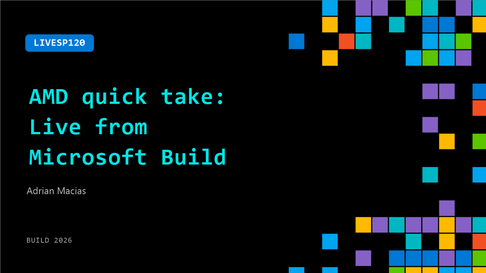

# LIVESP120: AMD quick take: Live from Microsoft Build

**Session code:** LIVESP120  
**Watch on-demand:** <https://build.microsoft.com/en-US/sessions/LIVESP120>

---

## Speakers

- **Adrian Macias** - Sr Director - Developer Acceleration Team, AMD

## About the session

Get a sneak peek of the latest from AMD featuring Microsoft’s Karuana Gatimu and Adrian Macias

## AI summary

**Introduction and Event Setting:** The video opens at the Microsoft Build conference in San Francisco, set against the bustling backdrop of the AMD booth on the show floor (00:00:04–00:00:12). The host expresses enthusiasm to speak with Adrian about the innovations empowering the global developer community. Adrian joins with equal excitement, acknowledging the rapid pace of change in the technology space and the wealth of developments taking place, setting the stage for a conversation about the partnership between Microsoft and AMD (00:00:21–00:00:27).

**Microsoft and AMD Partnership:** The discussion pivots to why the Microsoft-AMD collaboration matters for developers (00:00:30–00:00:35). Adrian explains that while technical innovations are important, they are incomplete without a strong and supportive ecosystem. This partnership focuses on cultivating a thriving developer community—one that encourages creativity and supports new initiatives. The companies are collaborating to enable a shared platform where technology and community growth fuel one another, reinforcing the broader goal of empowering developers through both tools and culture (00:00:37–00:00:48).

**Experimentation and Innovation:** The conversation then transitions to the unprecedented pace of technological change, which Adrian describes as transformative for how professionals approach work, platforms, and experimentation (00:00:48–00:00:56). He highlights that experimentation is now more accessible than ever, empowering developers to explore choices in technologies, infrastructure, and models. This environment encourages innovation because the barriers to testing new ideas are lower and the opportunities to iterate quickly are greater. Adrian emphasizes that this experimental freedom is a defining feature of the current era of software and hardware co-innovation (00:01:03–00:01:09).

**Cost Efficiency and Developer Empowerment:** Continuing on the theme of experimentation, Adrian notes the significant shift in cost management for developers (00:01:25–00:01:38). Previously, organizations had to commit capital and resources upfront before seeing results from their technology choices. Today, with cloud platforms and scalable architectures, the cost to explore new solutions has effectively dropped to near zero. This affordability enables developers and designers to stress-test ideas and deploy solutions at lower risk. While this flexibility can be overwhelming, Adrian frames it as an empowering shift that democratizes innovation and makes advanced computing resources accessible to a wider range of creators (00:01:38–00:01:45).

**Closing Remarks and Resources:** As the conversation wraps up, the host thanks Adrian and AMD for their continued partnership with Microsoft and their contributions to the developer community (00:01:50–00:01:57). To help viewers explore all the content presented at Build, the host directs them to AMD’s sponsor page on Build.Microsoft.com (00:02:03–00:02:08). There, attendees can find resources, additional sessions, and materials to continue learning and experimenting. The video concludes with an encouraging sign-off inviting developers to stay engaged and discover more innovations coming from the evolving Microsoft and AMD collaboration (00:02:09–00:02:17).

## Session tags

- **Session type:** Pre-recorded
