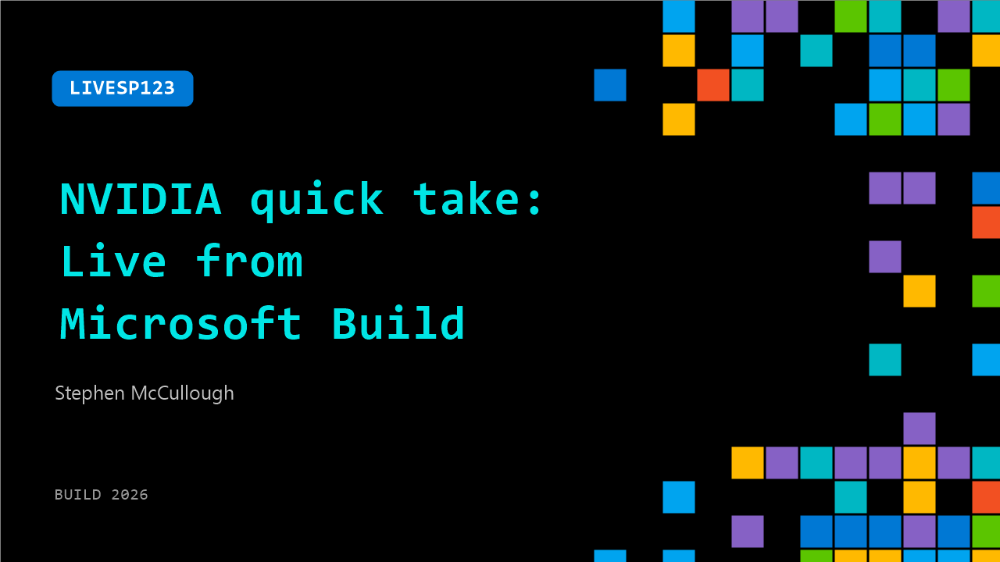

# LIVESP123: NVIDIA quick take: Live from Microsoft Build

**Session code:** LIVESP123  
**Watch on-demand:** <https://build.microsoft.com/en-US/sessions/LIVESP123>

---

## Speakers

- **Stephen McCullough** - AI Solutions Architect, NVIDIA

## About the session

Get a sneak peek of the latest from NVIDIA featuring Microsoft’s Karuana Gatimu and Stephen McCullough

## AI summary

**Introduction and Welcome:** The video opens with the host welcoming viewers to the Microsoft Build event 00:00:02. The host enthusiastically announces a special guest from NVIDIA, Steven, who will be sharing details about innovative projects his team has been developing. After a brief greeting exchange between Caruana and Steven 00:00:13, the host expresses excitement about learning what Steven has been building in partnership with Microsoft.

**Introduction to the Collaboration:** Steven begins by discussing the collaborative relationship between Microsoft and NVIDIA 00:00:30. He mentions that both companies have been building several exciting technologies together, many of which are being showcased at the Build event. One special focus of his work is the integration involving hosted agents, Nemotron, and Hermes Agent 00:00:41. Steven notes that a deeper look into this project will be featured in a talk by Joey Conway, encouraging the audience to attend that session 00:00:52.

**Highlighting the Technological Innovations:** The host responds with enthusiasm about the upcoming demonstration, emphasizing the value of seeing technology in action 00:00:57. Caruana stresses that tangible demonstrations help audiences better understand and appreciate the practical impact of new solutions. She prompts Steven to share what makes this new implementation important and why it matters for customers working with these integrations 00:01:04.

**Technical Deep Dive and Benefits:** Steven elaborates that the new setup solves many challenges customers face when managing agentic deployments 00:01:10. The first key benefit he mentions is improved control over agentic environments. Hosted agents provide strong opportunities for customization, while Nemotron contributes advanced intelligence and open-source flexibility 00:01:25. The Hermes Agent then ties everything together, orchestrating models efficiently to maximize their performance and value 00:01:37. Steven describes this combination as a "one-two-three punch" of innovation.

**Showcase and Closing Remarks:** Wrapping up, Steven expresses excitement about showcasing these technologies at the NVIDIA exhibit within the Build conference 00:01:47. The host encourages viewers to visit the NVIDIA showcase page to explore these projects firsthand 00:01:55. As the conversation concludes, Caruana thanks Steven for joining the session and expresses enthusiasm about reconnecting soon, while Steven reciprocates his appreciation before the session ends 00:02:02.

## Session tags

- **Session type:** Broadcast Stage
