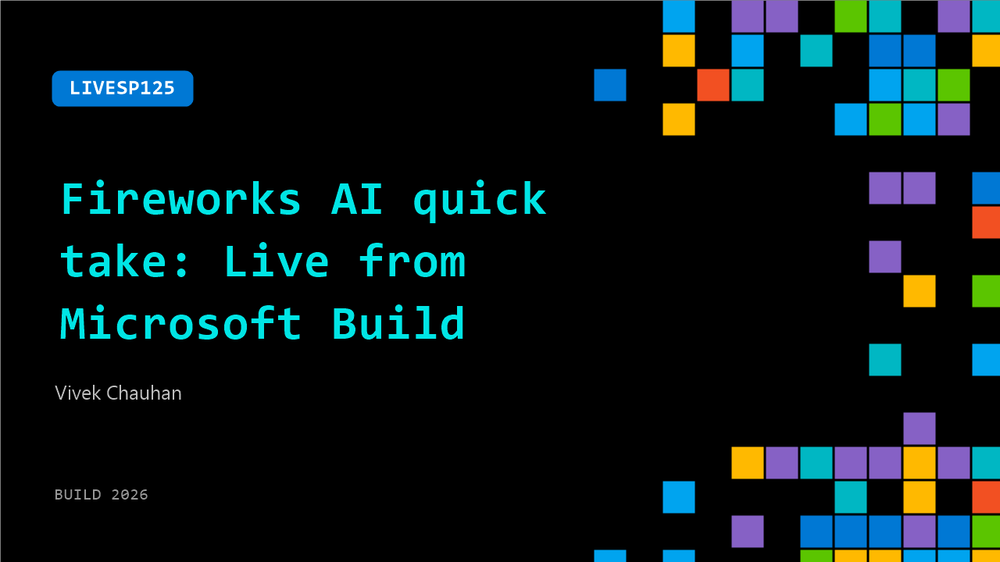

# LIVESP125: Fireworks AI quick take: Live from Microsoft Build

**Session code:** LIVESP125  
**Watch on-demand:** <https://build.microsoft.com/en-US/sessions/LIVESP125>

---

## Speakers

- **Vivek Chauhan** - Product Management, Fireworks AI

## About the session

Get a sneak peek of the latest from Fireworks AI featuring Microsoft’s Karuana Gatimu and Vivek Chauhan

## AI summary

**Introduction from the Microsoft Build Show Floor:** The video opens with the host welcoming viewers back to the show floor at Microsoft Build in San Francisco (00:00:01–00:00:05). The host introduces the Fireworks AI booth and expresses excitement about showcasing new innovations. Vivek, a representative from Fireworks AI, joins the conversation to discuss the company’s platform and its impact on artificial intelligence production environments (00:00:08–00:00:12).

**Overview of Fireworks AI’s Technology:** Vivek explains that Fireworks AI is a “production AI platform for open weight models,” designed to handle extensive real-world AI workloads (00:00:19). The platform processes over 30 trillion tokens each day and supports more than 10,000 enterprise customers globally, including major organizations like Cursor and Uber (00:00:23–00:00:35). These clients use Fireworks AI not only for inference but also to fine-tune models, embedding their proprietary data directly within applications. Vivek also references RL (reinforcement learning) capabilities used by products such as Cursor’s Composer 2 and 2.5 to scale their AI systems efficiently (00:00:44–00:00:52).

**Microsoft and Fireworks AI Partnership:** The discussion transitions to the strategic partnership between Microsoft and Fireworks AI (00:01:01). Vivek details how customers can now access Fireworks AI’s large-scale inference services directly through Azure Foundry (00:01:06–00:01:13). This integration allows users to benefit from Azure’s governance, reliability, and security while also enjoying simplified billing. Moreover, developers gain access to a broader selection of open weight models and can train on Fireworks AI while running inference seamlessly on Azure, bringing together the strengths of both ecosystems (00:01:25–00:01:31).

**Event Participation and Excitement:** The host notes that this is Vivek’s first time attending Microsoft Build (00:01:40). Vivek shares his enthusiasm about meeting fellow innovators and presenting at the event alongside his colleagues, who have scheduled talks later in the week (00:01:45–00:01:50). The positive tone reflects both excitement about the technology on display and the collaborative atmosphere of the conference.

**Conclusion and Viewer Engagement:** In closing, the host invites viewers to explore Fireworks AI demos available on their sponsor showcase page and encourages the digital audience to access links to sessions presented by Vivek and his team (00:01:52–00:02:03). The video ends with a note of appreciation to Vivek for joining and an invitation for viewers to stay tuned for more insights from Microsoft Build (00:02:03–00:02:05).

## Session tags

- **Session type:** Broadcast Stage
