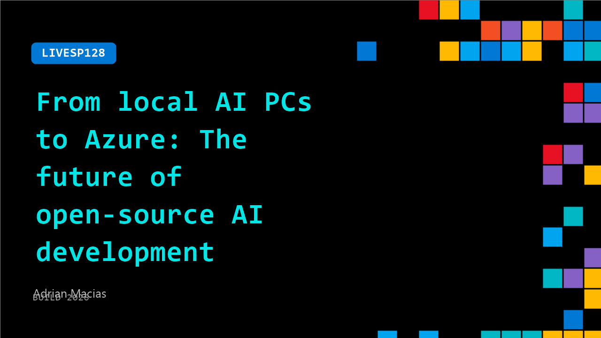

# LIVESP128: From local AI PCs to Azure: The future of open-source AI development

**Session code:** LIVESP128  
**Date:** Tuesday, June 2, 2026 / 2:30 PM - 2:45 PM PDT (Duration 15 minutes)  
**Watch on-demand:** <https://build.microsoft.com/en-US/sessions/LIVESP128>

---

## Speakers

- **Adrian Macias** - Sr Director - Developer Acceleration Team, AMD

## About the session

AI development workflows are changing rapidly as developers experiment with agentic AI, AI-assisted coding, and increasingly flexible deployment strategies. In this Microsoft Build conversation, AMD and Microsoft discuss how open-source AI ecosystems, Ryzen AI PCs, ROCm, and Azure infrastructure are enabling developers to experiment, adapt, and scale AI workloads with greater flexibility across evolving AI environments.

## AI summary

**Introduction and Setting:** The video opens with a welcome back to the broadcast stage at Microsoft Build in the vibrant city of San Francisco 00:00:07. The host sets the tone by highlighting the event’s focus on innovation at scale and speed and introduces Adrian, a returning guest known for his insights on developer experiences. The conversation begins with an emphasis on helping developers better understand what’s changing for them and providing actionable guidance 00:00:32.

**Transformation of the Developer Experience:** Adrian discusses the rapid acceleration of innovation over the past six months, noting that developers are experimenting in areas they previously couldn’t access 00:00:51. He identifies a convergence of technologies—software, hardware, and agentic AI—that is altering how problems are solved. Rather than focusing on deep expertise, developers now thrive as experimenters who embrace risk and novel solutions 00:01:25. The reduced cost to explore new ideas, Adrian explains, powers this sense of freedom and opens vast possibilities for innovation 00:02:05.

**AI and Machine Transformation:** A key idea in the discussion is that “the machine has fundamentally changed,” referring to how AI and especially agentic AI technologies transform coding and design flows 00:02:43. Adrian describes this shift as empowering developers to take more risks and iterate faster without penalty. The conversation draws parallels between creativity in engineering and “happy accidents” in art, as unexpected outcomes often lead to breakthroughs. He stresses the importance of fostering open ecosystems—open software and platforms—to support these innovations, which both AMD and Microsoft are investing heavily in 00:03:39.

**Exploring Modalities and Platforms:** Adrian outlines how developers can experiment with different modalities and execution environments 00:04:39. Developers can now run workloads on cloud, device, or hybrid setups, enabling local or distributed AI computing. He elaborates on advancements such as AI PCs with neural processing units 00:05:38 and expands on how multi-modal AI—combining speech, text, vision, and emotional recognition—creates more interactive experiences. The conversation encourages developers to join showcases and use online Microsoft Build sessions to deepen learning, emphasizing that these resources are freely available to a global audience 00:06:17.

**Future of Agentic AI and Developer Choices:** Looking ahead three to six months, Adrian predicts that agentic AI microservices will drive applications to become dynamic, adaptive, and personalized 00:07:06. Developers will increasingly consider orchestration among multiple intelligent agents interacting across systems 00:07:37. He explains how these systems make intelligent decisions based on cost, resource constraints, and quality, even determining whether to run tasks locally or in the cloud 00:08:24. Security plays a crucial role in this new landscape, with modern routing techniques ensuring personal data remains protected while still leveraging cloud AI foundations 00:09:25.

**Creativity, Announcements, and Conclusion:** Adrian reflects on how these technological changes unleash creativity in developers, stating that innovation is directly linked to iteration speed 00:10:20. The discussion highlights courage in experimentation and the partnership between Microsoft and AMD on the Win MLSDK project, which democratizes machine learning access and reduces development friction 00:11:07. They also explore evolving ideas of quality in AI—from simple accuracy to complex behaviors of intelligent agents 00:12:17. The session wraps up with gratitude, encouragement to visit AMD’s showcase and the Microsoft Build site for demos and resources, and a closing thank you to the audience 00:13:25.

## Session tags

- **Session type:** Broadcast Stage
- **Location:** Gateway Pavilion, Level 1, Build Broadcast Stage
