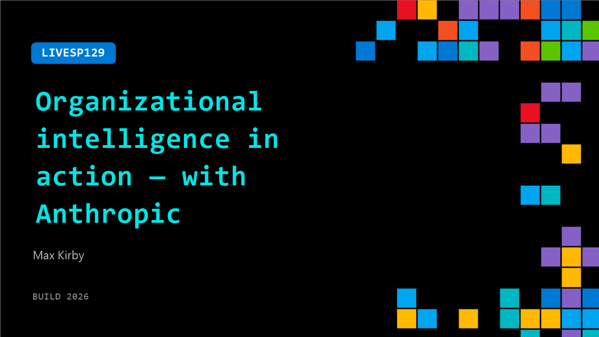

# LIVESP129: Organizational intelligence in action — with Anthropic

**Session code:** LIVESP129  
**Date:** Tuesday, June 2, 2026 / 4:05 PM - 4:20 PM PDT (Duration 15 minutes)  
**Watch on-demand:** <https://build.microsoft.com/en-US/sessions/LIVESP129>

---

## Speakers

- **Max Kirby** - Applied AI, Anthropic

## About the session

Join Karuana Gatimu in conversation with Anthropic’s Max Kirby to explore organizational intelligence in action. See how AI analyzes real usage to surface feature gaps and recommend what to build next, helping developers prioritize with confidence and deliver higher-impact solutions.

## AI summary

**Opening and Introductions:** The video begins with Kirwana welcoming viewers and introducing her guest Max from Anthropic 00:00:00–00:00:07. She offers greetings to both the live and digital audiences, expressing excitement for the session. Max introduces himself as someone who works at the intersection of research breakthroughs and enterprise applications 00:00:18–00:00:26, discussing how he collaborates with strategic customers to determine priorities for innovation. The two celebrate the partnership between Microsoft and Anthropic, noting the buzz and energy in San Francisco during the Microsoft Build event 00:00:39–00:00:55.

**Partnership Deep Dive:** Kirwana asks Max to elaborate on the collaboration between Microsoft and Anthropic 00:01:01–00:01:06. Max explains how they integrate at various layers of enterprise solutions, from infrastructure to intelligence, security, and governance 00:01:10–00:01:36. He emphasizes the flexibility that Claude provides, making sure customers can deploy AI wherever needed. The partnership has been successful so far, setting the stage for future innovations. This section transitions into discussions about Microsoft’s new “IQ” announcements—Work IQ, Foundry IQ, Fabric IQ, and Web IQ—which enable reasoning across multiple domains 00:02:10–00:02:21.

**Concept of Legibility and Transformation:** Max introduces the idea of “legibility,” describing it as the AI’s ability to understand what’s happening inside a business 00:03:00–00:03:06. He explains that AI can’t improve processes it can’t see, and legibility allows enterprises to make operations more transparent and interpretable. Using examples, Max highlights how many companies don’t have a full view of their own standard procedures or implicit know-how, stored within employees rather than documentation 00:03:39–00:04:00. By improving AI visibility, leaders can make better-informed decisions, bridging the gap between executive strategy and on-the-ground operations. This visibility then guides what technology should be built—a reversal from traditional development sequences that focused on building before observing 00:04:32–00:05:00.

**Demo and Technical Insights:** The demo segment follows 00:05:07–00:05:10, showcasing experiments around legibility where Claude identifies patterns from transcripts and user actions. Kirwana praises this new method of deriving actionable insights for development teams. Max explains two major focal areas for Claude—understanding complex codebases and showing empathy toward human users 00:06:04–00:06:21. Together, these make possible a new paradigm: “observe first, build second.” Instead of guessing what users need, developers can watch interactions to infer the next valuable solutions. Both express enthusiasm about how this insight-driven approach transforms productivity and user-value generation 00:07:02–00:07:34.

**Business Impact and Leadership Evolution:** Kirwana and Max discuss how AI can drive innovation rather than just efficiency, enabling businesses to grow and explore new possibilities 00:08:01–00:08:05. They highlight how high intelligence removes blockers and supports problem-solving, even to the extent that “asking Claude what to do next” becomes a viable business strategy 00:08:36–00:08:43. Kirwana emphasizes leadership traits required in the AI era—courage and release of control—sharing her own experience of learning to collaborate with AI tools like Copilot. Max agrees, noting that vulnerability and openness from senior leaders in using AI lead to greater organizational adoption. Demonstrating real-world AI use within teams helps inspire trust and drives higher transformation rates across enterprises 00:10:02–00:10:42.

**Conclusion and Forward Outlook:** As the session wraps up 00:11:22–00:11:27, Max and Kirwana reflect on the compatibility and future potential of their partnership. They discuss how earlier AI adoption involved manual steps like copy-paste, evolving toward tool-based automation and now toward intelligent context sharing with technologies like MCP 00:12:01–00:12:16. Both agree that their joint “North Star” should be enabling data-driven root cause analysis and improvement. Kirwana closes by encouraging viewers to explore deeper demos on the event showcase page and to engage within the developer community 00:12:28–00:13:03. She ends with the belief that AI development is a “team sport,” emphasizing collaboration and continuous learning among all builders and enterprise leaders as the key to maximizing the benefits of artificial intelligence.

## Session tags

- **Session type:** Broadcast Stage
- **Location:** Gateway Pavilion, Level 1, Build Broadcast Stage
