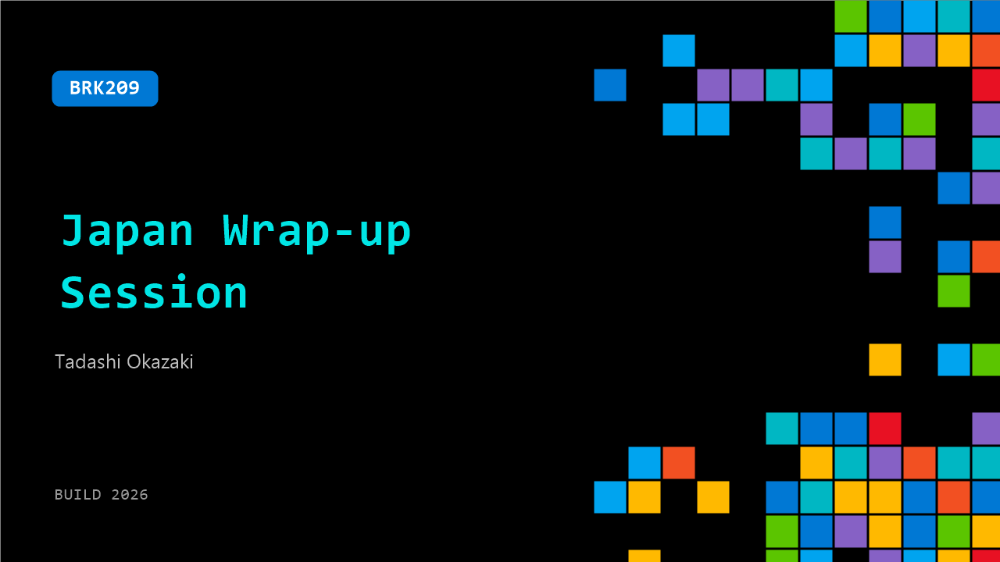

# BRK209: Japan Wrap-up Session

**Session code:** BRK209  
**Date:** Wednesday, June 3, 2026 / 5:15 PM - 6:00 PM PDT (Duration 45 minutes)  
**Watch on-demand:** <https://build.microsoft.com/en-US/sessions/BRK209>

---

## Speakers

- **Tadashi Okazaki** - GM Cloud & AI Solutions, Microsoft

## About the session

本セッションは、日本からご参加の方向けに、Microsoft Buildの主要なアナウンスについて日本語で解説を行います。

In this session, we will deliver a focused recap of the key announcements and technical insights from the 2 days of Microsoft Build, tailored for developers joining from Japan. You will leave with a clear understanding of the technical direction revealed at Build, how it applies to your products and teams, and the concrete next steps to consider as you move toward frontier transformation.

This session will be delivered in Japanese and will include Japanese captions.

Seating for this session is first-come, first-served. Add it to your schedule to plan your day and arrive early to secure a spot.

## AI summary

**Session Introduction and Objectives:** The session begins with greetings and an overview of the event, marking the start of the Japan Wrap-Up session for Microsoft Build 2026 (00:00:00–00:00:24). The host explains that this 45-minute session will summarize the most important announcements from Build 2026 and present them clearly in Japanese for both livestream and local attendees (00:00:25–00:01:00). The goal is to provide attendees with concise insights and business takeaways, covering three key areas: cloud and AI, Windows and developer tools, and new frontier innovations (00:01:03–00:01:18). Experts from different fields at Microsoft Japan are introduced, and the first speaker, Executive Officer Okazaki, takes the stage to discuss Build 2026’s primary themes and announcements.

**Global Developer Focus and Infrastructure Innovation:** Okazaki contextualizes Build 2026 within Microsoft’s broader mission to create an ecosystem powered by frontier AI and autonomous agents (00:02:00–00:03:33). He highlights the physical event’s festival-like atmosphere with 2,500 attendees onsite and about 150,000 online participants, underscoring global developer enthusiasm. Key innovations introduced by Satya Nadella and team focus on optimizing AI infrastructure performance and cost efficiency (“performance equals tokens”). Microsoft introduced new chipsets—Maia 200 and Cobalt 200—designed to enhance energy efficiency and AI workload processing across cloud and edge (00:05:29–00:06:04). Database breakthroughs, like Azure’s HorizonDB public preview and GPU-accelerated Fabric Data Warehouse, were showcased to strengthen enterprise-scale data operations (00:06:45–00:07:23). Additionally, Microsoft reinforced its Copilot and agent safety standards through technologies like the Microsoft Execution Container and Host Agent for secure, scalable deployment (00:09:00–00:10:06).

**Frontier Agents, Microsoft Scout, and AI Model Ecosystem:** Moving into Microsoft’s frontier vision, Okazaki explains how autonomous systems, exemplified by Microsoft’s new Scout agent (00:12:00–00:13:14), demonstrate practical automation across everyday tasks like business expense processing. Scout’s secure-human-in-the-loop design emphasizes safe execution while leveraging long-context frontier models that can process extended reasoning tasks with high accuracy (~80% correctness rate). Okazaki highlights advancements in model tuning (“frontier tuning”) that tailor AI models such as My Thinking King One to enterprise data and values, alongside collaboration with partners like Anthropic and Fireworks AI for model diversity. Microsoft’s multiverse of AI models now spans over 11,000 variants through the Microsoft AI Fund, covering text, vision, and reasoning capabilities (00:15:00–00:16:28). These innovations aim to help organizations continuously refine agents’ intelligence and integrate AI securely into human workflows.

**Windows, Local AI, and Developer Tools Evolution:** The next segment by Okawa focuses on Windows and the local AI development environment (00:22:41–00:24:39). Microsoft positions Windows as the essential platform for both cloud and edge AI developers. New ARM-based Surface devices with GPU/NPU integration can now execute large language models locally (“foundry local AI”) for latency-sensitive or private applications (00:24:01–00:25:08). Updates such as Windows AI APIs, WebNN support for browser-based inference, and expanded GPU/CPU compatibility enable developers to accelerate AI workloads natively. Developer convenience was enhanced through WSL containers, streamlined environment setup via Dev Configuration, and the introduction of the powerful Windows 365 Cloud PC for scalable development (00:26:41–00:28:09). GitHub Copilot has also evolved—its new desktop app and Canvas collaboration feature allow multiple human and AI agents to co-develop, automate code reviews, and implement continuous integration pipelines through the Copilot SDK GA (00:29:20–00:33:26).

**Cloud AI Platform, Observability, and Optimization Tools:** Nitta introduces updates to the cloud-side agent platform. Key product releases include “IQ Serverless,” enabling serverless AI search with elastic scaling (00:34:11–00:34:52), and enhancements to Microsoft Execution Container (MXC), which now provides a secure runtime foundation for multi-agent applications. Observability tools were expanded through “Rubric Evaluator” and “Agent Optimizer,” which automatically assess conversational quality, continuously refine prompts, and measure cost-to-value efficiency via ROI Agent analytics (00:38:04–00:39:26). These capabilities help enterprises monitor and improve AI governance. Yamamoto later discusses infrastructure scaling, highlighting Microsoft’s AI data center expansion focused on sustainability (Fairwater project), modernization support through Azure migration Copilot for mainframe-inclusive architectures, and the unveiling of Layfin—a framework that allows rapid AI-powered backend construction for production-ready applications (00:41:04–00:45:03).

**Closing Remarks and Community Engagement:** The wrap-up concludes by encouraging attendees to share feedback via survey forms (00:46:30), participate in follow-up networking at the Japan dinner event, and look forward to future Microsoft conferences like Ignite in November and next year’s Build (00:46:40–00:46:59). The presenters reaffirm Microsoft’s commitment to collaboration, innovation, and the AI-agent ecosystem, thanking the audience for their active participation and contributions throughout the session.

## Session tags

- **Session type:** Breakout
- **Level:** (200) Intermediate
- **Topic:** Agents & apps
- **Tags:** Azure, Security, GitHub, Windows, Microsoft Foundry, Data, DevTools
- **Location:** Festival Pavilion, Breakout 1
