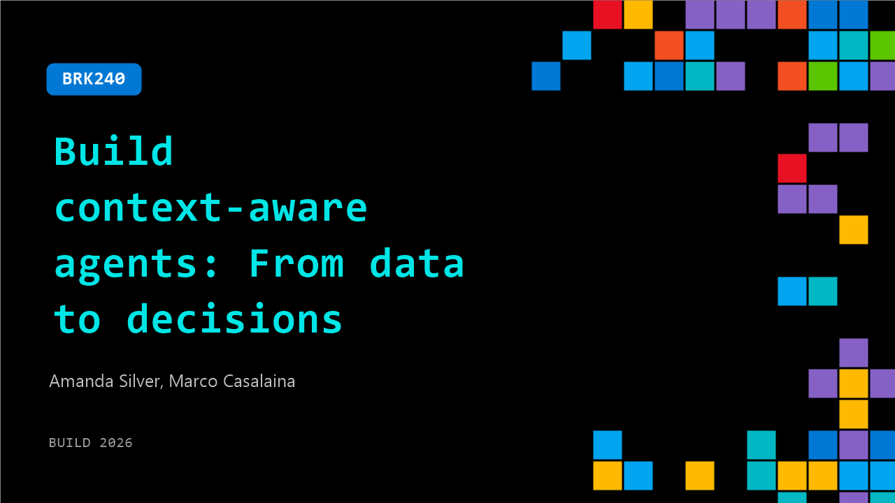

# BRK240: Build context-aware agents: From data to decisions

**Session code:** BRK240  
**Date:** Tuesday, June 2, 2026 / 5:00 PM - 5:45 PM PDT (Duration 45 minutes)  
**Watch on-demand:** <https://build.microsoft.com/en-US/sessions/BRK240>

---

## Speakers

- **Amanda Silver** - CVP M365 Core & WorkIQ, Microsoft
- **Marco Casalaina** - VP Products and AI Futurist, Core AI, Microsoft

## About the session

High performance agents are built on intelligence that brings together context, enterprise data, orchestration, and governance. Learn how Foundry IQ, Fabric IQ, and Work IQ provide the enterprise intelligence layer for AI agents. Design agents that can search across organizational knowledge, reason over business data, and operate with awareness of people and work signals. Take action within trusted boundaries, providing a practical foundation for building scalable and reliable agents.

Seating for this session is first-come, first-served. Add it to your schedule to plan your day and arrive early to secure a spot.

## AI summary

**Introduction and Industry Shift:**
At the opening of the session 00:00:00–00:00:06, Amanda Silver welcomes attendees and introduces Marco Castelan. Amanda reflects on her two decades at Microsoft, describing a major transformation where software is evolving from human-driven applications to intelligent agents defined by intent and measured by outcomes. These agents can reason, retrieve context, make decisions, and act for users 00:00:27. However, she notes a challenge — over 40% of agentic AI projects fail not because of weak models but due to missing context. Developers often must integrate fragmented data and permissions manually, leading to brittle, unreliable experiences 00:01:00. This sets the stage for the discussion on Microsoft’s new approach to solving this gap.

**Introducing Microsoft IQ:**
Amanda transitions to explaining Microsoft IQ 00:02:43 as a context layer for the agentic web. IQ unifies four distinct sources: Work IQ for organizational context, Fabric IQ for business knowledge, Foundry IQ for enterprise knowledge and policy, and Web IQ for global, real-world data. Together, they provide agents a shared understanding of the enterprise and external environments 00:03:08. When organizations get this right, she says, agents act with precision and reliability—akin to seasoned employees—because they operate with a holistic awareness of people, workflows, and data. Amanda then introduces Marco’s demo to illustrate how IQ works in practice.

**Demo: Building and Grounding Agents with IQs:**
Marco begins his demonstration 00:03:35, starting with Work IQ within Copilot CLI, where an email from Amanda triggers a plan to build a refund agent. The demo encounters initial network setbacks, showing real developer challenges. Despite that, Marco highlights how Work IQ enables authorization and contextual e-mail retrieval. Later, Amanda elaborates on Web IQ 00:06:24, which connects agents to real-time verified web information at high speed and efficiency. She cites NASDAQ’s use of Web IQ for real-time executive decision-making as a proof point. Amanda continues with Foundry IQ 00:10:01, explaining how it unifies enterprise data sources and enriches information, reducing engineering overhead while maintaining security. Sitecore’s example shows how Foundry IQ powers consistent marketing intelligence across teams.

**Fabric IQ and Context Delegation:**
The discussion shifts to Fabric IQ 00:16:21, which gives agents real-time understanding of business operations through unified data layers, semantic models, and ontologies. Marco demonstrates how ontologies help translate business entities (like packages or customers) into meaningful structures for agents to reason over. Even through technical difficulties, he illustrates that ontologies define relationships and verbs that agents can interpret semantically, connecting these through Fabric Data Agents for context delegation 00:26:00. Amanda adds examples like Q Cells, which use Fabric IQ to manage energy optimization in AI data centers, keeping human oversight integral while empowering autonomous optimization.

**Work IQ and Agent Autonomy:**
Amanda brings focus back to Work IQ 00:27:25, describing it as the people and collaboration layer of Microsoft IQ. It draws knowledge from M365 communication channels—emails, Teams, and documents—so agents understand business context and roles. She explains its core features: chat, text, tools, and workspaces 00:30:19. These enable conversation, contextual retrieval, and long-running collaboration among agents and users. Work IQ operates securely within M365, using existing permissions rather than copying data, making agents naturally governance-ready. She highlights Miro’s integration with Work IQ, enabling seamless collaboration without data copies. Marco later resumes his demo, now successful, showing a refund processor agent with its own Teams identity and secure permissions that can read and reply to emails autonomously 00:35:35.

**Conclusion and Call to Action:**
In closing 00:39:52, Amanda summarizes the four IQ layers—Work, Fabric, Foundry, and Web—as the foundation of agentic intelligence and trustworthy automation. She emphasizes that the future lies in providing agents the right context efficiently, not just more data. Microsoft IQ ensures identity, security, and governance are built-in so agent decisions remain explainable and compliant at scale 00:42:00. Amanda concludes by inviting developers to start building with Microsoft IQ through labs, GitHub, and an Agents League hackathon 00:43:18, encouraging innovators to turn ideas into agentic applications. Marco thanks the audience, ending on a light note about overcoming demo obstacles and celebrating the dawn of a new era in intelligent software.

## Session tags

- **Session type:** Breakout
- **Level:** (200) Intermediate
- **Topic:** Agents & apps
- **Tags:** Agents, GitHub Advanced Security, Foundry IQ, Microsoft Foundry, Governance, Work IQ, Scaling, Context Engineer, Grounding, Enterprise, Production Systems
- **Location:** Gateway Pavilion, Level 1, Cowell Theater
