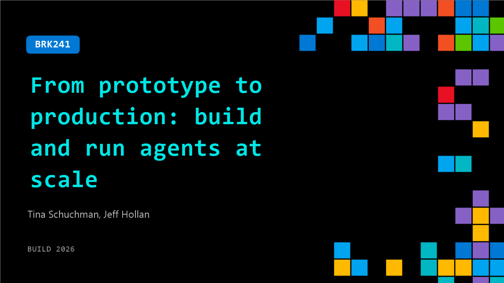

# BRK241: From prototype to production: build and run agents at scale

**Session code:** BRK241  
**Date:** Tuesday, June 2, 2026 / 3:45 PM - 4:30 PM PDT (Duration 45 minutes)  
**Watch on-demand:** <https://build.microsoft.com/en-US/sessions/BRK241>

---

## Speakers

- **Tina Schuchman** - CVP, Foundry Agents Platform, Microsoft
- **Jeff Hollan** - Partner Director of Product, Microsoft

## About the session

AI agents are transforming how developers build software—but shipping production-grade agents demands more. This session walks through the end-to-end lifecycle of building AI agents with Foundry Agent Service and Microsoft Agent Framework. See how to go from local prototyping to enterprise-grade hosted deployment with identity, secure networking, evaluations, and lifecycle management. Learn how coding agents like GitHub Copilot integrate directly into the workflow.

Seating for this session is first-come, first-served. Add it to your schedule to plan your day and arrive early to secure a spot.

## AI summary

**Introduction and Vision for AI Agents:** The video begins with Tina Schackman and Jeff Holland introducing themselves and outlining the session’s purpose—showing how to build, deploy, and operate enterprise-level AI agents using Microsoft Foundry (00:00:00–00:00:27). Tina speaks on how we’ve entered a new era of AI agents where “building” is no longer the challenge, but reliable scaling and operation are (00:00:34–00:01:07). She emphasizes that today’s agents are not static bots but dynamic teammates that spawn new agents, acquire new skills, and continuously improve (00:01:15–00:01:33). The core premise presented is that enterprise success now comes from deploying interconnected, long-running agents across every business function—from supply chain to support—forming an adaptive AI operating system powered through Microsoft Foundry and its integration ecosystem of Azure, GitHub, and Microsoft 365 (00:02:02–00:03:00).

**Scenario and Demo Overview:** The session transitions into a practical demo scenario from Azure networking operations: a fiber cable outage near a data center triggers an autonomous agent system to resolve it quickly (00:04:39–00:05:21). Tina explains that their goal is to show how such a “fiber outage response agent” is built. This agent receives sensor alerts, verifies reliability data from Fabric IQ, supplier details from Work IQ, document data via Foundry content understanding, and dispatches field reps while tracking progress through D365 and Teams (00:05:32–00:06:23). The demo will follow the lifecycle phases—Build, Deploy, and Operate—demonstrating each step within Foundry’s integrated platform and how continuous learning occurs during production workloads (00:06:27–00:06:43).

**Building Local Agents with Foundry Toolkit:** Jeff begins the live demo in the Build phase using Visual Studio Code combined with GitHub Copilot and Foundry Toolkit (00:08:13–00:09:04). He shows how developers can start from sample scenarios or generate agents dynamically. The Foundry Toolkit now generally available helps developers integrate tracing, evaluations, and best practices directly in the coding environment (00:09:54–00:10:04). With the Microsoft Agent Framework in Python, Jeff demonstrates how harnesses securely execute shell commands and code within isolated runtime environments. He explains Foundry Toolbox as the unified endpoint for managing all tools, authenticating services like Foundry IQ, Fabric IQ, Teams, and document intelligence (00:11:25–00:13:33). He activates a local debug session, interacts with the agent through chat, and seamlessly adds voice capability—turning it into a voice-enabled agent that responds to field queries in real time (00:16:07–00:17:42). This section underlines how Foundry simplifies end-to-end local creation and testing.

**Deploying and Hosting Enterprise Agents at Scale:** Tina follows up announcing production-ready releases: Microsoft Agent Framework v1.0, Foundry Toolkit in VS Code, and upcoming Foundry hosted agents with secure sandbox isolation and long-running support (00:18:02–00:19:59). Jeff demonstrates deployment of those agents as autonomous “claw-like” systems using Foundry Routines—making them proactive operators rather than reactive bots (00:21:06–00:22:25). He shows how each hosted agent session runs in isolation yet maintains durable state via Microsoft Durable Task Scheduler and resumes after human approval, seamlessly continuing long-running investigations (00:23:25–00:25:56). These agents can be published directly into Teams and Microsoft 365 Copilot with their own identity and permissions, enabling enterprise users to interact natively through existing productivity ecosystems (00:26:15–00:27:06).

**Operating and Optimizing Production Agents:** Tina introduces the Operate phase—highlighting Foundry’s new tracing and evaluation capabilities for hosted agents (00:29:55–00:30:02). Jeff then demonstrates visibility and optimization workflows, including the “trace replay” view where developers can replay entire agent interactions to analyze model reasoning, tool usage, and token consumption (00:30:14–00:31:14). Foundry introduces Rubric, a LLM-powered evaluator generator that creates context-aware scoring criteria automatically based on agent roles such as voice-friendly responses (00:33:24–00:34:40). The demo continues with automatic agent optimization loops via the Azure Developer CLI, iterating on variables such as prompts, models, and tool configurations until improved candidate versions emerge (00:35:25–00:38:06). The improvements are quantifiable—like an 11% gain in evaluation performance—showing how Foundry continuously enhances agents through production feedback cycles. Tina closes this section describing procedural memory, enabling agents to learn across sessions without starting from scratch (00:39:45–00:40:11).

**Conclusion and Industry Adoption:** The final segment underscores Foundry’s enterprise maturity: over 80,000 customers already run production agents, with use cases from firms like Twilio and KPMG leveraging Foundry hosted agents for global operations and client engagement (00:40:16–00:41:16). Tina and Jeff then recap the demo journey—building a local fiber-outage agent, hosting it securely, publishing through Teams, and continuously optimizing its behavior in production (00:41:22–00:42:35). They reaffirm Microsoft Foundry’s core value: enabling developers to build seamlessly, deploy powerfully, and operate with trust on one unified enterprise platform. The presentation ends with encouragement to attend related Build sessions and explore the Foundry booth, inviting developers to experience firsthand how Foundry scales autonomous AI agents globally (00:42:58–00:43:21).

## Session tags

- **Session type:** Breakout
- **Level:** (300) Advanced
- **Topic:** Agents & apps
- **Tags:** Security, Developer, GitHub Copilot, Microsoft Foundry, Foundry Agents, Scaling, Evaluations, Enterprise, Identity, Production Systems
- **Location:** Festival Pavilion, Breakout 1
