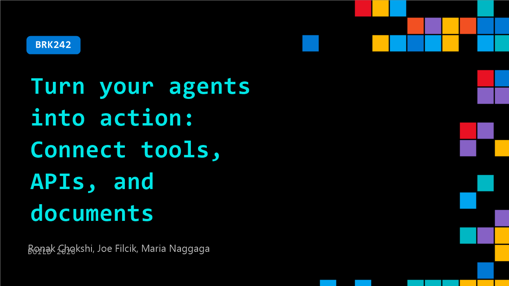

# BRK242: Turn your agents into action: Connect tools, APIs, and documents

**Session code:** BRK242  
**Date:** Wednesday, June 3, 2026 / 4:00 PM - 4:45 PM PDT (Duration 45 minutes)  
**Watch on-demand:** <https://build.microsoft.com/en-US/sessions/BRK242>

---

## Speakers

- **Ronak Chokshi** - Director of Product Marketing, Microsoft
- **Joe Filcik** - Principal Product Manager, Microsoft
- **Maria Naggaga** - Product Manager, Microsoft

## About the session

Tired of searching for the right tool(s) for your agents? Seeing your context window constantly blowing out of proportion? We are introducing a new product category that allows developers to choose the right toolset depending upon the agents' context, the use-case and functional boundaries, enabling efficient use of tools, with built-in governance.

Seating for this session is first-come, first-served. Add it to your schedule to plan your day and arrive early to secure a spot.

## AI summary

**Session Introduction and Agenda:** The video begins with Maria greeting the audience and apologizing for her faint voice due to a cold (00:00:01–00:00:15). She welcomes attendees to Build Day 2 and shares excitement about presenting “Turn your agents into action with tools, APIs and documents” (00:00:43). Alongside Joe Flick from Content Understanding, she outlines the agenda — announcements, demos, and closing remarks (00:00:53–00:01:04). She introduces Microsoft’s Agent Platform vision that integrates GitHub and Foundry to enable runtime optimization and lifecycle management from cloud to edge (00:01:13–00:01:49).

**Agent and Tool Ecosystem Challenges:** Maria explains that Foundry Tools provide a unified hub for enterprise-grade scalability and prebuilt tools (00:02:06). She highlights that the agent ecosystem faces issues of tool integration, discovery, and governance as tool types — skills, plugins, APIs — have exploded (00:03:07–00:03:22). Security becomes critical since tools access production code, APIs, and sensitive data (00:03:38–00:04:01). To address this, Foundry invests in components like the tool catalog, creation, discovery, and governance, emphasizing capabilities to publish, install, and govern securely (00:04:22–00:05:19).

**Introducing Toolboxes and Unified Endpoint:** Maria elaborates on the Foundry tool catalog launched in 2025 giving developers access to millions of tools in one place via Foundry and Azure API services (00:06:27–00:07:00). She introduces “Toolbox” — reusable bundles of managed tools accessible through a single consistent interface, allowing agents to integrate easily (00:09:09–00:10:08). The four Toolbox pillars are Build, Discover, Consume, and Govern, each representing how developers can create, publish and monitor tool usage across agent environments (00:10:13–00:11:20). The unified MCP-compatible endpoint enables authentication and visibility across agent runtimes and platforms, such as GitHub Copilot or Microsoft Copilot Studio (00:12:00).

**Live Demos of Toolbox and Browser Automation:** Maria walks through several demos, beginning with a manual MCP configuration example and then a simplified version using Toolbox, demonstrating dramatically reduced code and easier tool generation (00:13:01–00:14:12). She shows how “Tool Search” intelligently loads only required tools into context, conserving tokens (00:14:19). In Foundry, she uploads a reusable skill and introduces browser automation — a new capability for scraping and form filling built on Playwright (00:17:00–00:18:06). She then builds a Toolbox with multiple tools and skills, enables tool search, and runs a live work order demo that successfully processes tasks using the unified endpoint (00:19:46–00:21:03).

**Content Understanding and Real-World Applications:** Joe Flick takes over, introducing “Content Understanding” as the solution for agents handling complex multimodal content outside APIs such as documents, images, and videos (00:22:31–00:23:07). It converts messy input into structured, high-fidelity JSON and Markdown outputs (00:23:45). Real-world use cases include Wolters Kluwer for tax automation and DataSniper for financial audit workflows (00:24:32–00:25:24). Joe explains the pipeline stages — Parse, Classify, and Extract — now supporting multimodal files such as PDFs, videos, and emails (00:25:39–00:26:24).

**Deep Dive on Parsing, Extraction, and Advanced Agentic Reasoning:** Joe demonstrates improved capabilities, including advanced OCR parsing, multilingual document handling, and structured table and figure extraction to better ground data (00:27:04–00:27:54). He introduces “Agentic Mode,” an upcoming July enhancement for reasoning across documents to derive complex answers rather than just extracting values (00:31:01–00:33:18). Using a fiber optic cable failure case, Joe explains how the system identifies root causes and costs by iteratively reasoning through evidence (00:32:00–00:33:30). He completes a live demo of Foundry IQ showing that content understanding improves data accuracy, charts interpretation, and workflow automation across document types (00:35:00–00:40:01).

**Closing Remarks and Resources:** Maria rejoins to connect Toolbox and Content Understanding together within an Agent Framework application, demonstrating tool selection optimization and activity-level visibility (00:41:15–00:42:04). She encourages attendees to explore Foundry via Azure AI at 00:42:15, access demos at “aka.ms/fibi,” and join Foundry’s developer Discord for further experimentation (00:42:34–00:43:11). The session ends with appreciation for participation and a promise of ongoing updates in two to three months (00:43:08).

## Session tags

- **Session type:** Breakout
- **Level:** (200) Intermediate
- **Topic:** Agents & apps
- **Tags:** API, Agents, Developer, Microsoft Foundry, Governance, MCP
- **Location:** Festival Pavilion, Breakout 2
