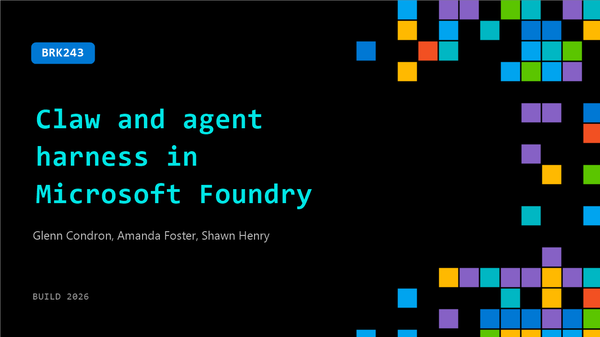

# BRK243: Claw and agent harness in Microsoft Foundry

**Session code:** BRK243  
**Date:** Wednesday, June 3, 2026 / 11:30 AM - 12:15 PM PDT (Duration 45 minutes)  
**Watch on-demand:** <https://build.microsoft.com/en-US/sessions/BRK243>

---

## Speakers

- **Glenn Condron** - Builder, Microsoft
- **Amanda Foster** - Product Manager, Microsoft
- **Shawn Henry** - Product Manager, Microsoft

## About the session

Go deep on multi-agent systems built on Microsoft Foundry, featuring Claw agent patterns and the hosted agents architecture. Explore long-running agents with triggers, state management, and file access—all natively supported on Foundry. See how coding agents built with GitHub Copilot SDK and Claude Agent SDK integrate into multi-agent workflows using Microsoft Agent Framework. Learn how to coordinate, host, and operate these systems with observability and continuous evals.

Seating for this session is first-come, first-served. Add it to your schedule to plan your day and arrive early to secure a spot.

## AI summary

**Introduction and Session Overview:** At 00:00:00, Sean Henry opens Day 2 of Build, joined by Glenn and Amanda from Microsoft Foundry, the company’s AI platform for building intelligent applications and agents. He outlines that this session will dive deeper than Tina and Jeff’s earlier overview, focusing on advanced agent deployment concepts such as claws and agent harnesses. Sean explains Foundry’s layered architecture—comprising the intelligence layer with available models, the runtime layer for hosting and managing agents, and the human-agent collaboration layer enabling integration with tools like Teams and M365 Copilot. He emphasizes that all of this is supported by strong trust, security, and observability fundamentals within Foundry. Sean concludes this part by previewing that the team will focus on the runtime and collaboration aspects and later explore deployment of more advanced agents beyond simple prompt-based ones.

**Defining Agent Harnesses and Core Architecture:** Beginning at 00:03:39, Sean introduces the concept of “agent harnesses,” describing them as the outer shell or platform layer surrounding an agent, allowing it to handle long-running and complex tasks. He likens the harness to a car that houses the motor—the core intelligence or “agent loop.” This loop continues until the agent achieves its goal by iteratively processing context, acting through tools, and refining responses. Foundry’s harness manages context growth, compaction, and enrichment through prompts, skills, and messages. Sean points out that agents can perform human-like tasks when given access to computer tools such as file systems and code execution environments. The harness also enables orchestration of specialized agents, memory management across sessions, lifecycle hooks for integration, and human-in-the-loop capabilities for oversight of risky operations. This section builds the foundation for understanding robust, extensible agent design before transitioning into demonstrations of harness deployment.

**Hermes Demonstration and Foundry Integration:** Glenn takes the stage at 00:08:01 to demonstrate deploying the Hermes agent, a claw-like architecture built around autonomous, persistent agents. He explains how Hermes integrates memory, tools, and autonomy, running within sandboxed environments or VMs while maintaining constant communication through platforms like Slack or Telegram. Glenn showcases Hermes running on his terminal, backed by Foundry-hosted agents using Azure credentials and Foundry models. He walks through connecting to SharePoint via MCP tools and highlights the concept of “routines” (00:13:55), automated maintenance tasks that manage skills and backups, allowing agents to self-sustain even when not running continuously. Glenn emphasizes the importance of agent state and sandbox persistence, illustrating how each Hermes instance creates unique environments that improve with use but require thoughtful state recovery strategies. Through this live demo, he shows the balance between autonomy, cost optimization, and resilience when deploying claws-style agents at scale within Foundry.

**Building Custom Agents with Microsoft Agent Framework:** At 00:21:21, the next segment demonstrates how to create custom harnesses using Microsoft Agent Framework, which supports Python and C#. Sean elaborates on its components: the agent loop, workflows, and harnesses. The agent loop allows integration with models and tools from Foundry as well as third-party providers like OpenAI, Anthropic, or Gemini. Workflows enable multi-agent systems that can sequence duties or use supervisory planning, and harnesses add common tools for file access, code execution, context management, and planning. Sean presents a coding demo (00:26:05) showing how easily developers can wrap a harness around an agent, customize capabilities, and visualize operations through a console UI. He further illustrates deployment options—running agents in GUIs via AGUI integration, connecting them to Copilot Kit interfaces for interactive data visualizations, and deploying directly to Foundry where monitoring and evaluation tools track performance. This section underscores Foundry’s flexibility and developer control for building deeply customized AI workflows.

**Human Collaboration and Autopilot Agents:** Beginning around 00:35:01, Amanda transitions to how agents appear and operate in collaborative environments. She demonstrates Foundry’s simplified publishing of agents directly into Teams or M365 Copilot, explaining that creators can use a one-click process to configure and share agents enterprise-wide. Amanda then introduces a new generation called “Autopilot agents” (00:39:46), which act autonomously with their own user identities, allowing them to send messages, manage documents, and perform independent actions traditionally limited to human accounts. She showcases a “work stream manager” autopilot sample with onboarding, access controls, and group chat behaviors—agents can respond intelligently to permitted users and manage ongoing discussions. This represents Foundry’s evolution toward persistent, collaborative AI agents seamlessly integrated into everyday productivity tools, bridging individual assistance and organizational automation.

**Conclusion and Call to Action:** Sean returns at 00:44:03 to wrap up the session. He summarizes the three core demonstrations: deploying Hermes as an off-the-shelf harness, building custom harnesses with Microsoft Agent Framework, and publishing agents through Foundry for enterprise collaboration. The team directs attendees to GitHub for code samples and invites them to join the ongoing Agent League Hackathon (00:45:00), highlighting the opportunity to apply these techniques creatively. Sean encourages developers to visit the Foundry booth, connect with the speakers, and share ideas about future agent-building projects. As the presentation closes, the group emphasizes Foundry’s expanding toolkit for developers—from harness design and runtime management to human-AI collaboration—reflecting Microsoft’s vision for scalable, secure, and intelligent agent applications in production environments.

## Session tags

- **Session type:** Breakout
- **Level:** (400) Expert
- **Topic:** Agents & apps
- **Tags:** Agents, GitHub Copilot, Microsoft Foundry, MCP, OSS, Agent Observability, Claws, Openclaw, Evaluations
- **Location:** Gateway Pavilion, Level 1, Cowell Theater
