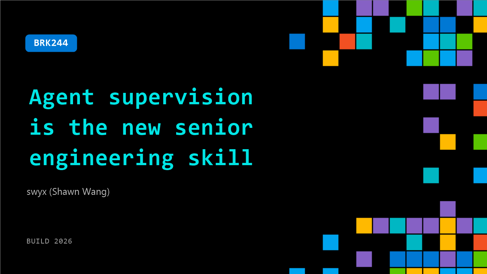

# BRK244: Agent supervision is the new senior engineering skill

**Session code:** BRK244  
**Date:** Wednesday, June 3, 2026 / 10:15 AM - 11:00 AM PDT (Duration 45 minutes)  
**Watch on-demand:** <https://build.microsoft.com/en-US/sessions/BRK244>

---

## Speakers

- **swyx (Shawn Wang)** - founder, Latent Space

## About the session

As AI agents start shipping code, the bottleneck becomes trust. This talk argues “agent supervision” is the new senior skill: scoping agent work, setting constraints, designing checkpoints, and reviewing outputs for correctness and security. Learn practical patterns to catch silent failures and build workflows where humans stay accountable and agents stay fast.

Seating for this session is first-come, first-served. Add it to your schedule to plan your day and arrive early to secure a spot.

## AI summary

**Introduction and Industry Context:** At 00:00:01, Swix opens his talk with observations on current developments in the AI engineering landscape, humorously referencing the launch and rebranding of the GitHub Copilot app as emblematic of a wider trend in “agent command centers.” He notes that competing tools like Cursor, Windsurf, and Codex have adopted similar interfaces, converging toward a standard form factor for managing AI agents. This convergence, described around 00:00:27–00:01:02, mirrors natural evolution in technology design, which he compares to “everything becoming a crab.” The speaker sets the stage for his broader argument that this evolution signals an agreed direction for how developers will interact with intelligent systems going forward.

**Agent-Centric Coding and Community Dynamics:** By 00:01:18, Swix shifts into examining how agent tools are reshaping developer workflows, referencing Cognition’s recent product that introduces a local-to-cloud handoff for managing multiple agents. He reflects on his own chaotic development environment and how such tools aim to simplify complex AI orchestration. Then, at 00:02:19–00:03:07, the focus turns to the explosive growth of the global AI engineering community across cities like Paris, London, and Singapore. He highlights six recurring themes shaping this growth, including the shift from “model worship” to combining models with harnesses, resulting in a more developer-centric environment. Swix introduces the concept of “format fear of missing agent time,” describing the pressure engineers feel to constantly run or update agents, capturing the intensity and transformative nature of the field.

**Evolution of Coding Agents and Development Cycles:** Around 00:06:17, Swix discusses how longer autonomous task capabilities in models have created new UX requirements and workflows. GitHub and others are seeing exponential increases in AI-generated code, with cloud-based code commits rising from roughly 4–5% early in the year to an expected 50% by year-end. He references a 14,000× growth in commit activity reported by GitHub’s CEO (00:07:14–00:07:19). These developments, he argues, are spreading beyond coding into general computer use, browsing, and design. As seen in projects merging Codex into ChatGPT (00:16:17), Swix concludes that the paradigm of multi-agent orchestration is expanding across all domains of digital work.

**Software Development Life Cycle and the Dark Factory:** Beginning near 00:09:00, the conversation moves to redefining the software development life cycle (SDLC) in the age of autonomous agents. Traditional pull requests could evolve into “prompt requests,” allowing maintainers to adapt intent instead of reviewing human code. Swix details concepts like the “dark factory,” in which AI agents design, code, and review software with minimal to zero human oversight (00:10:15). He answers audience questions about hardening validation and change management, emphasizing a layered control model using specifications, strong test suites, progressive rollouts, and online evaluation loops. Discussion of Ryan Le Papolo’s “harness engineering” work (00:13:45) illustrates the scale of these autonomous systems—shipping billions of tokens daily without human review—while stressing the need for better communication bandwidth between humans and agents to maintain alignment.

**Compute Infrastructure and Emerging Research Directions:** From 00:22:00 onward, Swix delves into the computational layer enabling large-scale inference. He contrasts historical GPU-heavy workloads (8:1 ratios) with new CPU-heavy demands (approaching parity), forecasting a CPU shortage as AI tasks scale. Examples such as Talos’ 17,000 tokens per second demo foreshadow breakthroughs leading to 300,000 tokens per second inference speeds (00:23:22). The speaker situates this within a longer-term hardware and model evolution, where open-weight models and optimized inference extend chip life cycles from three to eight years (00:28:22). He then transitions to upcoming AI research priorities (00:30:29): real-time responsiveness, memory and continual learning, and interactive micro-batching aimed at human-machine “mind melds.” This vision includes video generation driven by orchestrating agents and the rise of world models capable of predicting user preferences and intentions.

**Conclusion and Reflections on the AI Engineering Frontier:** In his closing remarks at 00:34:57–00:35:34, Swix introduces the “agent work paradox”—even as agents take over more tasks, engineers are working harder than ever to manage them. He normalizes this tension as a sign of progress, framing AI engineering as “the last job” that will automate all others. Despite the stress and accelerated pace, he expresses optimism: developers today are living the future first, laying groundwork for automation across knowledge work, creativity, and infrastructure. The presentation concludes on a motivational note, encouraging engineers to embrace their role at the forefront of this transformative era in human-machine collaboration.

## Session tags

- **Session type:** Breakout
- **Level:** (200) Intermediate
- **Topic:** Agents & apps
- **Tags:** Azure, OSS CI/CD Libraries, Visual Studio
- **Location:** Building B, Level 3, BATS Improv
